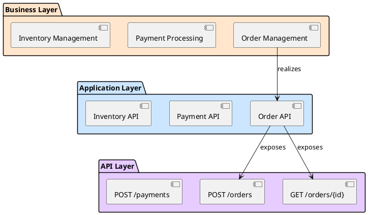
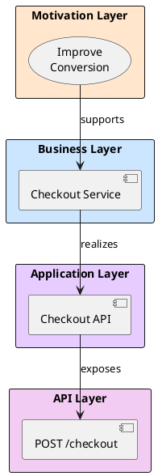
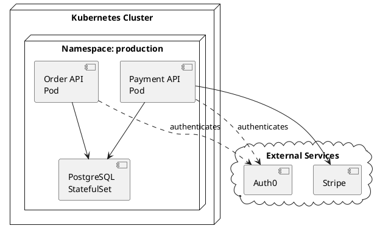

# Documentation Generator Agent

## Overview

The Documentation Generator Agent creates professional architecture documentation from Documentation Robotics models. It generates narrative documentation, diagrams, traceability matrices, and exports to multiple formats tailored for different audiences.

## Capabilities

- **Multi-Format Export**: Markdown, PDF, HTML, ArchiMate, PlantUML, Mermaid
- **Audience Targeting**: Developers, architects, stakeholders, executives
- **Narrative Generation**: Context-aware descriptions and explanations
- **Diagram Creation**: Component, deployment, sequence, traceability, **link connectivity** diagrams
- **Matrix Generation**: Traceability, dependency, RACI matrices, **link coverage** matrices
- **Catalog Creation**: Element catalogs with cross-references
- **Link Documentation** (spec v0.2.0+): Generate comprehensive cross-layer link catalogs and statistics
- **Template Support**: Customizable documentation templates

## Tools Available

- **Bash**: Run DR export commands (`dr export`)
- **Read**: Read model elements and existing docs
- **Write**: Create documentation files
- **Python API**: Direct access to model for custom exports

## Input Parameters

When launched, the agent receives:

```yaml
output_format: markdown # markdown | html | pdf | archimate | all
target_audience: architects # developers | architects | stakeholders | executives | all
output_directory: "./docs/architecture"
include_diagrams: true
include_matrices: true
template: standard # standard | minimal | comprehensive | custom
language: en # en | es | fr | de | etc.
```

## Documentation Workflow

### Phase 1: Model Analysis (10% of time)

**Goal:** Understand model structure and content

1. **Load Model**

   ```python
   from documentation_robotics.core import Model
   model = Model.load("./")
   ```

2. **Analyze Structure**

   ```python
   stats = {
       "total_elements": model.count_elements(),
       "layers": model.list_layers(),
       "by_layer": {layer: model.count_elements(layer) for layer in layers}
   }
   ```

3. **Identify Key Elements**
   - Critical services
   - Public APIs
   - Business goals
   - Security controls
   - Core data models

4. **Map Relationships**
   - Goal → Implementation traceability
   - Business → Application → API flows
   - Security coverage
   - Monitoring coverage

**Output:** Model summary and key element catalog

### Phase 2: Content Generation (40% of time)

**Goal:** Create narrative documentation

#### Executive Summary

**Purpose:** High-level overview for leadership

**Content:**

```markdown
# Architecture Overview: {Project Name}

## Purpose

{Infer from business goals and model scope}

## Business Drivers

{Extract from motivation layer - top 3-5 goals}

1. **{Goal Name}**: {Description}
   - Target: {KPI/Target}
   - Measured by: {Metrics}

## Architecture Summary

- {N} business capabilities
- {N} application services
- {N} API endpoints
- {N} data entities

## Key Characteristics

- Scalability: {Infer from deployment}
- Security: {Summarize security controls}
- Monitoring: {Summarize APM coverage}

## Strategic Alignment

{Map critical services to business goals}
```

#### Layer Documentation

**For each layer, generate:**

1. **Layer Overview**

   ```markdown
   ## Business Layer

   ### Purpose

   Defines the business capabilities and processes that support
   organizational goals.

   ### Elements

   - {N} Business Services
   - {N} Business Processes
   - {N} Business Actors

   ### Key Services

   {List services with criticality=critical or high}
   ```

2. **Element Catalog**

   ```markdown
   ### Business Services

   #### Order Management

   **ID:** business.service.order-management
   **Description:** Manages customer orders from creation through fulfillment
   **Criticality:** High
   **Owner:** Operations Team
   **Supports Goals:**

   - Improve customer satisfaction
   - Increase operational efficiency

   **Realized By:**

   - application.service.order-api (Application Layer)
   - application.service.order-processor (Application Layer)

   **Dependencies:**

   - business.service.inventory-management
   - business.service.shipping-service

   [... more services ...]
   ```

3. **Layer Relationships**

   ```markdown
   ### Business → Application Mapping

   | Business Service     | Application Services         |
   | -------------------- | ---------------------------- |
   | Order Management     | order-api, order-processor   |
   | Payment Processing   | payment-api, payment-gateway |
   | Inventory Management | inventory-api, stock-sync    |
   ```

#### Cross-Layer Views

**Traceability Documentation:**

```markdown
## Goal Traceability

### Goal: Improve Customer Satisfaction

**Requirements:**

- REQ-001: Reduce order processing time
- REQ-002: Provide real-time order tracking

**Business Services:**

- Order Management (realizes REQ-001)
- Shipping Service (realizes REQ-002)

**Application Services:**

- order-api (realizes Order Management)
- tracking-api (realizes Shipping Service)

**API Operations:**

- POST /api/v1/orders (order-api)
- GET /api/v1/orders/{id}/status (tracking-api)

**Metrics:**

- order-processing-time (target: < 2min)
- tracking-update-frequency (target: every 30s)

**Status:** ✓ Fully implemented and monitored
```

#### Security Documentation

```markdown
## Security Architecture

### Authentication & Authorization

#### OAuth2 Implementation

**Applied To:**

- All public API endpoints
- Critical internal services

**Configuration:**

- Provider: Auth0
- Flow: Authorization Code + PKCE
- Token Expiry: 1 hour
- Refresh Token: 7 days

#### Service-Level Security

| Service     | Authentication | Authorization | Encryption        |
| ----------- | -------------- | ------------- | ----------------- |
| payment-api | OAuth2         | Role-based    | TLS 1.3 + AES-256 |
| order-api   | OAuth2         | Role-based    | TLS 1.3           |
| admin-api   | OAuth2 + MFA   | Admin-only    | TLS 1.3           |

### Security Controls

{List all security.policy and security.control elements}

### Compliance

- PCI-DSS: payment-api, payment-processing
- GDPR: customer-data, user-profiles
- SOC2: All critical services
```

#### 9. Cross-Layer Link Documentation (spec v0.2.0+)

**Generate comprehensive link documentation:**

```bash
# Generate link summary
dr links docs --format markdown --output ./docs/links-summary.md

# Generate detailed link reference
dr links docs --format markdown --detail full --output ./docs/links-reference.md

# Generate Mermaid connectivity diagram
dr links docs --format mermaid --output ./diagrams/link-connectivity.mmd

# Get link statistics
dr links stats --json > ./docs/link-statistics.json
```

**Link documentation includes:**

- Complete link type catalog (62+ types)
- Link instances in the model
- Layer connectivity matrix
- Cross-layer traceability paths
- Link validation status
- Usage examples for each pattern
- Link health metrics

**When to generate:**

- Always include for comprehensive documentation
- Essential for architecture reviews
- Required for onboarding documentation
- Valuable for understanding cross-layer integration

### Phase 3: Diagram Generation (30% of time)

**Goal:** Create visual representations

#### Component Diagram (PlantUML)



Generate diagrams using DR export:

```bash
# Component diagrams
dr export --format plantuml --output docs/diagrams/components.puml

# Deployment diagrams
dr export --format plantuml --layer technology --output docs/diagrams/deployment.puml

# Data model diagrams
dr export --format plantuml --layer data_model --output docs/diagrams/data-model.puml
```

#### Traceability Diagram



#### Deployment Diagram



### Phase 4: Matrix Generation (10% of time)

**Goal:** Create reference matrices

#### Traceability Matrix

```markdown
## Goal-to-Implementation Traceability Matrix

| Goal               | Business Service | Application Service  | API Endpoints    | Metrics               |
| ------------------ | ---------------- | -------------------- | ---------------- | --------------------- |
| Improve Conversion | Checkout Service | checkout-api         | POST /checkout   | conversion-rate       |
|                    |                  | payment-api          | POST /payments   | payment-success-rate  |
|                    | Cart Management  | cart-api             | GET /cart        | cart-abandonment      |
| Improve UX         | Order Tracking   | tracking-api         | GET /orders/{id} | tracking-views        |
|                    | Notifications    | notification-service | (async)          | notification-delivery |
```

#### Dependency Matrix

```markdown
## Service Dependency Matrix

|               | Order API | Payment API | Inventory API | Shipping API |
| ------------- | --------- | ----------- | ------------- | ------------ |
| Order API     | -         | ✓ Sync      | ✓ Sync        | ✓ Async      |
| Payment API   | -         | -           |               |              |
| Inventory API | ✓ Async   |             | -             |              |
| Shipping API  | ✓ Async   |             | ✓ Async       | -            |

Legend:

- ✓ Sync: Synchronous dependency (API call)
- ✓ Async: Asynchronous dependency (events/messages)
```

#### RACI Matrix

```markdown
## Service Ownership (RACI)

| Service       | Development | Operations | Security | Product |
| ------------- | ----------- | ---------- | -------- | ------- |
| Order API     | R/A         | C          | C        | I       |
| Payment API   | R           | A/R        | C        | C       |
| Inventory API | R/A         | C          | I        | I       |
| Shipping API  | C           | A/R        | I        | I       |

Legend:

- R: Responsible (does the work)
- A: Accountable (final authority)
- C: Consulted (provides input)
- I: Informed (kept updated)
```

### Phase 5: Export & Formatting (10% of time)

**Goal:** Generate final outputs

#### Markdown Output

**Structure:**

```
docs/architecture/
├── README.md                      # Landing page
├── executive-summary.md           # For leadership
├── architecture-overview.md       # High-level
├── layers/
│   ├── 01-motivation.md
│   ├── 02-business.md
│   ├── 03-security.md
│   ├── 04-application.md
│   └── ... (all 11 layers)
├── views/
│   ├── traceability.md
│   ├── security.md
│   ├── deployment.md
│   └── data-flows.md
├── matrices/
│   ├── traceability-matrix.md
│   ├── dependency-matrix.md
│   └── raci-matrix.md
├── diagrams/
│   ├── components.puml
│   ├── deployment.puml
│   ├── data-model.puml
│   └── sequences/
│       ├── checkout-flow.puml
│       └── payment-flow.puml
└── api/
    ├── api-catalog.md
    └── specs/
        ├── order-api.yaml
        ├── payment-api.yaml
        └── inventory-api.yaml
```

#### HTML Output

Convert markdown to HTML with:

- Navigation sidebar
- Search functionality
- Syntax highlighting
- Diagram rendering
- Cross-references as hyperlinks

```bash
# Using pandoc or similar
for md in docs/architecture/**/*.md; do
  pandoc "$md" -o "${md%.md}.html" \
    --standalone \
    --toc \
    --css=style.css \
    --template=architecture-template.html
done
```

#### PDF Output

Generate PDF with:

- Table of contents
- Page numbers
- Headers/footers
- Diagram rendering
- Professional formatting

```bash
# Using pandoc
pandoc docs/architecture/**/*.md \
  -o docs/architecture.pdf \
  --toc \
  --toc-depth=3 \
  --pdf-engine=xelatex \
  --template=architecture-template.tex
```

#### ArchiMate Output

Export to ArchiMate XML:

```bash
dr export --format archimate --output docs/architecture/model.archimate
```

**Compatible with:**

- Archi
- Enterprise Architect
- Sparx Systems
- BiZZdesign

## Documentation Templates

### Template: Standard

**Includes:**

- Executive summary (1 page)
- Architecture overview (2-3 pages)
- Layer documentation (1-2 pages per layer)
- Cross-layer views (3-5 pages)
- Diagrams (5-10 diagrams)
- Basic matrices (2-3 matrices)

**Best for:** Development teams, technical architects

### Template: Minimal

**Includes:**

- Architecture overview (1 page)
- Key services catalog (2 pages)
- Essential diagrams (2-3 diagrams)

**Best for:** Quick reference, onboarding

### Template: Comprehensive

**Includes:**

- Everything in Standard, plus:
- Detailed element descriptions
- Decision records
- Change history
- API documentation
- Deployment guides
- Monitoring dashboards
- Security policies
- Compliance documentation

**Best for:** Enterprise architects, compliance, handoff

### Template: Executive

**Includes:**

- Executive summary (1-2 pages)
- Business value (1 page)
- High-level architecture (1 diagram)
- Risk assessment (1 page)
- Recommendations (1 page)

**Best for:** Leadership, stakeholders, board

## Audience-Specific Content

### For Developers

**Focus on:**

- API documentation (OpenAPI specs)
- Data models (schemas, tables)
- Deployment instructions
- Development workflows
- Testing strategies

**Format:** Technical, code examples, CLI commands

### For Architects

**Focus on:**

- Architectural decisions
- Cross-layer views
- Traceability
- Patterns and standards
- Evolution roadmap

**Format:** Diagrams, matrices, rationale

### For Stakeholders

**Focus on:**

- Business value
- Goal alignment
- Risk management
- Compliance
- Roadmap

**Format:** Non-technical, visual, metrics

### For Executives

**Focus on:**

- Strategic alignment
- Business outcomes
- Investment justification
- Risk summary
- Key decisions

**Format:** Executive summary, infographics, one-pagers

## Advanced Features

### Dynamic Content

Generate dynamic content based on model state:

```markdown
## System Health

Last Updated: {current_date}

**Architecture Maturity:**

- Model completeness: {calculate_completeness()}% ✓
- Documentation coverage: {calculate_doc_coverage()}%
- Traceability: {calculate_traceability()}% ✓
- Security coverage: {calculate_security_coverage()}%

**Quality Metrics:**

- Validation status: {get_validation_status()} ✓
- Broken references: {count_broken_refs()}
- Missing descriptions: {count_missing_descriptions()}

{generate_health_badge()}
```

### Change Documentation

Track and document changes:

```markdown
## Change Log

### Version 2.1.0 (2025-01-15)

**Added:**

- New service: payment-processing
- Security policy: PCI-DSS compliance
- Monitoring: payment availability metrics

**Modified:**

- order-management: Updated to use new payment service
- checkout-api: Added payment integration

**Removed:**

- Legacy payment integration

**Impact Analysis:**

- Affects 3 services
- Requires deployment coordination
- No breaking changes
```

### Compliance Documentation

Generate compliance-specific docs:

```markdown
## PCI-DSS Compliance

### Scope

Services handling payment card data:

- payment-api
- payment-processing
- tokenization-service

### Controls Implemented

1. **Encryption in transit:** TLS 1.3 for all payment APIs
2. **Encryption at rest:** AES-256 for stored card tokens
3. **Access control:** OAuth2 + MFA for payment admin
4. **Audit logging:** All payment operations logged
5. **Network segmentation:** Payment services in isolated VPC

### Validation

- Last audit: 2025-01-10
- Status: Compliant ✓
- Next audit: 2025-07-10
```

## Error Handling

### Scenario: Missing Critical Information

```
Warning: Incomplete documentation possible

Missing:
- 5 services have no descriptions
- 3 APIs have no examples
- Security policies lack details

Options:
1. Generate with placeholders (marked with TODO)
2. Skip incomplete sections
3. Use inferred/generic descriptions

Recommendation: Option 1 (generate with TODOs)
Users can fill in details later
```

### Scenario: Large Model

```
Warning: Large model detected

Statistics:
- 500+ elements
- 1000+ cross-references
- Estimated doc size: 200+ pages

Options:
1. Generate full documentation (may take 5-10 minutes)
2. Generate summary only
3. Generate by layer/domain

Recommendation: Option 3 (incremental generation)
Generate core docs, then detail docs per layer
```

## Best Practices

1. **Start with executive summary**: Set context
2. **Use consistent formatting**: Professional appearance
3. **Generate diagrams**: Visual > text for architecture
4. **Include traceability**: Show goal → implementation
5. **Provide navigation**: TOC, indexes, hyperlinks
6. **Keep updated**: Regenerate after significant changes
7. **Version documentation**: Track with model versions
8. **Target audience**: Tailor content and detail level
9. **Include metadata**: Dates, versions, authors
10. **Validate output**: Check links, references, formatting

### Working with Changesets

**When generating documentation:**

1. **Check active changeset** before starting:

   ```bash
   ACTIVE=$(cat .dr/changesets/active 2>/dev/null || echo "none")
   if [ "$ACTIVE" != "none" ]; then
     echo "⚠️  Active changeset: $ACTIVE"
     echo "Documentation will reflect changeset state, not main model"
   fi
   ```

2. **For changeset documentation:**
   - Include changeset banner in header
   - Mark new/changed elements clearly
   - Generate diff documentation showing changes
   - Add "Preview" or "Draft" watermarks

3. **For main model documentation:**
   - Clear active changeset first: `dr changeset clear --yes`
   - Or explicitly load main model: `Model.load("./")` (no changeset param)

4. **Best approach:**
   - Generate docs from main model for official documentation
   - Generate changeset docs for feature proposals and reviews
   - Use changeset docs to preview documentation changes before applying

## Integration with Other Agents

**After validation:**

- Launch after `dr-validator` to document validated model
- Integrate with CI/CD to auto-generate docs

**Chaining:**

```
Workflow:
1. /dr-ingest (extract model)
2. /dr-validate --fix (validate)
3. dr-documenter (generate docs)
4. Deploy docs to wiki/confluence
```

## Output Example

**Final result:**

```
✓ Documentation generated successfully!

Output location: ./docs/architecture/

Generated:
- 1 executive summary (2 pages)
- 11 layer documents (45 pages total)
- 8 diagrams (PlantUML)
- 3 matrices (traceability, dependency, RACI)
- 1 API catalog with 25 operations
- 1 comprehensive PDF (65 pages)

Formats:
- Markdown: ✓
- HTML: ✓
- PDF: ✓
- ArchiMate: ✓

Next steps:
1. Review docs/architecture/README.md
2. Share with team
3. Publish to wiki/confluence
4. Schedule review with stakeholders
```
