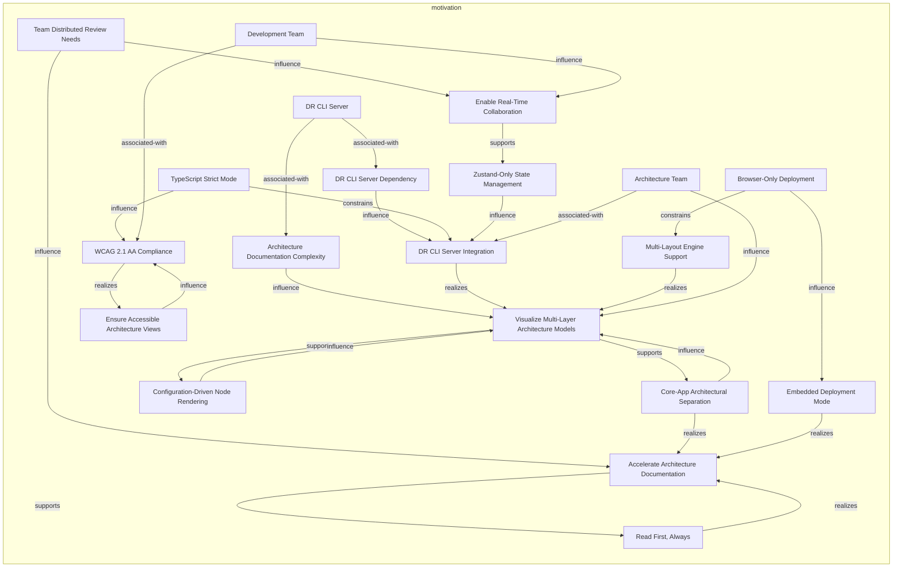
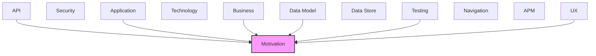

# Motivation

Goals, requirements, drivers, and strategic outcomes of the architecture.

## Report Index

- [Layer Introduction](#layer-introduction)
- [Intra-Layer Relationships](#intra-layer-relationships)
- [Inter-Layer Dependencies](#inter-layer-dependencies)
- [Inter-Layer Relationships Table](#inter-layer-relationships-table)
- [Element Reference](#element-reference)

## Layer Introduction

| Metric                    | Count |
| ------------------------- | ----- |
| Elements                  | 20    |
| Intra-Layer Relationships | 28    |
| Inter-Layer Relationships | 58    |
| Inbound Relationships     | 58    |
| Outbound Relationships    | 0     |

**Cross-Layer References**:

- **Upstream layers**: [API](./06-api-layer-report.md), [Application](./04-application-layer-report.md), [Business](./02-business-layer-report.md), [Data Model](./07-data-model-layer-report.md), [Testing](./12-testing-layer-report.md), [UX](./09-ux-layer-report.md)

## Intra-Layer Relationships

## Inter-Layer Dependencies

## Inter-Layer Relationships Table

| Relationship ID                                                                                    | Source Node                                                            | Dest Node                                                   | Dest Layer   | Predicate                | Cardinality  | Strength |
| -------------------------------------------------------------------------------------------------- | ---------------------------------------------------------------------- | ----------------------------------------------------------- | ------------ | ------------------------ | ------------ | -------- |
| `03823476-93f8-4ab4-8c51-cd93bf459ff0-realizes-59d25358-33d1-4c2d-b8fb-2a03ab216ae6`               | `03823476-93f8-4ab4-8c51-cd93bf459ff0`                                 | `59d25358-33d1-4c2d-b8fb-2a03ab216ae6`                      | `motivation` | `realizes`               | unknown      | unknown  |
| `13b1a5ff-1cea-4ca0-b557-81f4629f2736-satisfies-6ffaff00-8bf8-4580-98ff-8d2a612a9021`              | `13b1a5ff-1cea-4ca0-b557-81f4629f2736`                                 | `6ffaff00-8bf8-4580-98ff-8d2a612a9021`                      | `motivation` | `satisfies`              | unknown      | unknown  |
| `283a8b3d-01cb-4964-b4d0-f04e2df1f2bd-satisfies-1723e358-12bc-460d-ae1d-6d9420128c6a`              | `283a8b3d-01cb-4964-b4d0-f04e2df1f2bd`                                 | `1723e358-12bc-460d-ae1d-6d9420128c6a`                      | `motivation` | `satisfies`              | unknown      | unknown  |
| `29043f3a-16fd-4cb7-af1c-660b3aaa63c6-supports-goals-ef84b64d-883c-4471-9b56-a58574bac2b9`         | `29043f3a-16fd-4cb7-af1c-660b3aaa63c6`                                 | `ef84b64d-883c-4471-9b56-a58574bac2b9`                      | `motivation` | `supports-goals`         | unknown      | unknown  |
| `35295e18-08a8-4ca0-ada3-40a017cb4318-realizes-462e2931-4c7c-4051-a9ac-8817c270d650`               | `35295e18-08a8-4ca0-ada3-40a017cb4318`                                 | `462e2931-4c7c-4051-a9ac-8817c270d650`                      | `motivation` | `realizes`               | unknown      | unknown  |
| `35295e18-08a8-4ca0-ada3-40a017cb4318-satisfies-e748118c-b989-43fe-b0d2-9121e931fcd2`              | `35295e18-08a8-4ca0-ada3-40a017cb4318`                                 | `e748118c-b989-43fe-b0d2-9121e931fcd2`                      | `motivation` | `satisfies`              | unknown      | unknown  |
| `37a7eff0-e17f-40f8-ac76-ea230513fc63-fulfills-requirements-9df37bbd-8ffd-4d80-899f-9437aa03282a`  | `37a7eff0-e17f-40f8-ac76-ea230513fc63`                                 | `9df37bbd-8ffd-4d80-899f-9437aa03282a`                      | `motivation` | `fulfills-requirements`  | unknown      | unknown  |
| `37a7eff0-e17f-40f8-ac76-ea230513fc63-supports-goals-ef84b64d-883c-4471-9b56-a58574bac2b9`         | `37a7eff0-e17f-40f8-ac76-ea230513fc63`                                 | `ef84b64d-883c-4471-9b56-a58574bac2b9`                      | `motivation` | `supports-goals`         | unknown      | unknown  |
| `4e86c557-9c8e-435f-a770-651c0e238306-supports-goals-462e2931-4c7c-4051-a9ac-8817c270d650`         | `4e86c557-9c8e-435f-a770-651c0e238306`                                 | `462e2931-4c7c-4051-a9ac-8817c270d650`                      | `motivation` | `supports-goals`         | unknown      | unknown  |
| `52cfa9de-541d-44a0-9c21-34539c2e616c-fulfills-requirements-e748118c-b989-43fe-b0d2-9121e931fcd2`  | `52cfa9de-541d-44a0-9c21-34539c2e616c`                                 | `e748118c-b989-43fe-b0d2-9121e931fcd2`                      | `motivation` | `fulfills-requirements`  | unknown      | unknown  |
| `52cfa9de-541d-44a0-9c21-34539c2e616c-supports-goals-731285cc-dc15-4c64-a342-a933ce00bd61`         | `52cfa9de-541d-44a0-9c21-34539c2e616c`                                 | `731285cc-dc15-4c64-a342-a933ce00bd61`                      | `motivation` | `supports-goals`         | unknown      | unknown  |
| `5308e41f-71c9-4ca6-8dfc-11d8b0483ce8-realizes-59d25358-33d1-4c2d-b8fb-2a03ab216ae6`               | `5308e41f-71c9-4ca6-8dfc-11d8b0483ce8`                                 | `59d25358-33d1-4c2d-b8fb-2a03ab216ae6`                      | `motivation` | `realizes`               | unknown      | unknown  |
| `7c85d8fc-3635-45fa-a83c-36f184763cab-realizes-59d25358-33d1-4c2d-b8fb-2a03ab216ae6`               | `7c85d8fc-3635-45fa-a83c-36f184763cab`                                 | `59d25358-33d1-4c2d-b8fb-2a03ab216ae6`                      | `motivation` | `realizes`               | unknown      | unknown  |
| `83c81f34-4376-4ff9-8fb4-98f3ecbc6d68-realizes-731285cc-dc15-4c64-a342-a933ce00bd61`               | `83c81f34-4376-4ff9-8fb4-98f3ecbc6d68`                                 | `731285cc-dc15-4c64-a342-a933ce00bd61`                      | `motivation` | `realizes`               | unknown      | unknown  |
| `83c81f34-4376-4ff9-8fb4-98f3ecbc6d68-satisfies-e748118c-b989-43fe-b0d2-9121e931fcd2`              | `83c81f34-4376-4ff9-8fb4-98f3ecbc6d68`                                 | `e748118c-b989-43fe-b0d2-9121e931fcd2`                      | `motivation` | `satisfies`              | unknown      | unknown  |
| `8b70a28c-08e2-414c-b641-95335ac2a463-realizes-462e2931-4c7c-4051-a9ac-8817c270d650`               | `8b70a28c-08e2-414c-b641-95335ac2a463`                                 | `462e2931-4c7c-4051-a9ac-8817c270d650`                      | `motivation` | `realizes`               | unknown      | unknown  |
| `a138ca69-d437-4841-b96f-5fb5dd703380-realizes-462e2931-4c7c-4051-a9ac-8817c270d650`               | `a138ca69-d437-4841-b96f-5fb5dd703380`                                 | `462e2931-4c7c-4051-a9ac-8817c270d650`                      | `motivation` | `realizes`               | unknown      | unknown  |
| `a5342d6f-daf4-4a6e-a98b-7fada2561798-satisfies-9fe1281a-2547-416f-872f-38e1b066db15`              | `a5342d6f-daf4-4a6e-a98b-7fada2561798`                                 | `9fe1281a-2547-416f-872f-38e1b066db15`                      | `motivation` | `satisfies`              | unknown      | unknown  |
| `b66b613e-27b6-4d90-909f-3aa81570de15-satisfies-fc86a033-81bd-4933-abb8-b24076577123`              | `b66b613e-27b6-4d90-909f-3aa81570de15`                                 | `fc86a033-81bd-4933-abb8-b24076577123`                      | `motivation` | `satisfies`              | unknown      | unknown  |
| `business.businessservice.realizes.motivation.goal`                                                | `business.businessservice.schema-exploration`                          | `motivation.goal.visualize-multi-layer-architecture-models` | `motivation` | `realizes`               | many-to-many | medium   |
| `c4ba5c59-3f4e-49a9-9915-a48049ddb68e-realizes-59d25358-33d1-4c2d-b8fb-2a03ab216ae6`               | `c4ba5c59-3f4e-49a9-9915-a48049ddb68e`                                 | `59d25358-33d1-4c2d-b8fb-2a03ab216ae6`                      | `motivation` | `realizes`               | unknown      | unknown  |
| `cee7be5d-f0f9-4291-a2ae-cf5011a61c2f-fulfills-requirements-9df37bbd-8ffd-4d80-899f-9437aa03282a`  | `cee7be5d-f0f9-4291-a2ae-cf5011a61c2f`                                 | `9df37bbd-8ffd-4d80-899f-9437aa03282a`                      | `motivation` | `fulfills-requirements`  | unknown      | unknown  |
| `data-model.schemadefinition.satisfies.motivation.constraint`                                      | `data-model.schemadefinition.annotation-id`                            | `motivation.constraint.type-script-strict-mode`             | `motivation` | `satisfies`              | many-to-many | medium   |
| `data-model.schemadefinition.satisfies.motivation.constraint`                                      | `data-model.schemadefinition.changeset-id`                             | `motivation.constraint.type-script-strict-mode`             | `motivation` | `satisfies`              | many-to-many | medium   |
| `data-model.schemadefinition.satisfies.motivation.constraint`                                      | `data-model.schemadefinition.element-id`                               | `motivation.constraint.type-script-strict-mode`             | `motivation` | `satisfies`              | many-to-many | medium   |
| `dc0fb8df-f1e4-46a0-84bc-febf4e3f6080-realizes-462e2931-4c7c-4051-a9ac-8817c270d650`               | `dc0fb8df-f1e4-46a0-84bc-febf4e3f6080`                                 | `462e2931-4c7c-4051-a9ac-8817c270d650`                      | `motivation` | `realizes`               | unknown      | unknown  |
| `dc2da0b6-3de0-44d1-840f-5d49cc976cd9-satisfies-e748118c-b989-43fe-b0d2-9121e931fcd2`              | `dc2da0b6-3de0-44d1-840f-5d49cc976cd9`                                 | `e748118c-b989-43fe-b0d2-9121e931fcd2`                      | `motivation` | `satisfies`              | unknown      | unknown  |
| `de956804-eabb-4548-8389-73cb6c63ef2f-constrained-by-6ffaff00-8bf8-4580-98ff-8d2a612a9021`         | `de956804-eabb-4548-8389-73cb6c63ef2f`                                 | `6ffaff00-8bf8-4580-98ff-8d2a612a9021`                      | `motivation` | `constrained-by`         | unknown      | unknown  |
| `de956804-eabb-4548-8389-73cb6c63ef2f-constrained-by-9fe1281a-2547-416f-872f-38e1b066db15`         | `de956804-eabb-4548-8389-73cb6c63ef2f`                                 | `9fe1281a-2547-416f-872f-38e1b066db15`                      | `motivation` | `constrained-by`         | unknown      | unknown  |
| `de956804-eabb-4548-8389-73cb6c63ef2f-fulfills-requirements-9df37bbd-8ffd-4d80-899f-9437aa03282a`  | `de956804-eabb-4548-8389-73cb6c63ef2f`                                 | `9df37bbd-8ffd-4d80-899f-9437aa03282a`                      | `motivation` | `fulfills-requirements`  | unknown      | unknown  |
| `de956804-eabb-4548-8389-73cb6c63ef2f-fulfills-requirements-e748118c-b989-43fe-b0d2-9121e931fcd2`  | `de956804-eabb-4548-8389-73cb6c63ef2f`                                 | `e748118c-b989-43fe-b0d2-9121e931fcd2`                      | `motivation` | `fulfills-requirements`  | unknown      | unknown  |
| `de956804-eabb-4548-8389-73cb6c63ef2f-governed-by-principles-53fad2bb-e97d-44a2-83cf-61201e992163` | `de956804-eabb-4548-8389-73cb6c63ef2f`                                 | `53fad2bb-e97d-44a2-83cf-61201e992163`                      | `motivation` | `governed-by-principles` | unknown      | unknown  |
| `de956804-eabb-4548-8389-73cb6c63ef2f-governed-by-principles-b3d7f834-dc3f-49fd-8044-8b6aca045dbe` | `de956804-eabb-4548-8389-73cb6c63ef2f`                                 | `b3d7f834-dc3f-49fd-8044-8b6aca045dbe`                      | `motivation` | `governed-by-principles` | unknown      | unknown  |
| `de956804-eabb-4548-8389-73cb6c63ef2f-supports-goals-462e2931-4c7c-4051-a9ac-8817c270d650`         | `de956804-eabb-4548-8389-73cb6c63ef2f`                                 | `462e2931-4c7c-4051-a9ac-8817c270d650`                      | `motivation` | `supports-goals`         | unknown      | unknown  |
| `de956804-eabb-4548-8389-73cb6c63ef2f-supports-goals-ef84b64d-883c-4471-9b56-a58574bac2b9`         | `de956804-eabb-4548-8389-73cb6c63ef2f`                                 | `ef84b64d-883c-4471-9b56-a58574bac2b9`                      | `motivation` | `supports-goals`         | unknown      | unknown  |
| `dfc6509e-98f5-479a-bfe9-14bfddbb838a-satisfies-fc86a033-81bd-4933-abb8-b24076577123`              | `dfc6509e-98f5-479a-bfe9-14bfddbb838a`                                 | `fc86a033-81bd-4933-abb8-b24076577123`                      | `motivation` | `satisfies`              | unknown      | unknown  |
| `e642ad79-62ea-47a4-ae04-d512d0ef7881-realizes-731285cc-dc15-4c64-a342-a933ce00bd61`               | `e642ad79-62ea-47a4-ae04-d512d0ef7881`                                 | `731285cc-dc15-4c64-a342-a933ce00bd61`                      | `motivation` | `realizes`               | unknown      | unknown  |
| `testing.coveragesummary.fulfills-requirements.motivation.requirement`                             | `testing.coveragesummary.overall-test-coverage-summary`                | `motivation.requirement.wcag-21-aa-compliance`              | `motivation` | `fulfills-requirements`  | many-to-many | medium   |
| `testing.testcoveragetarget.fulfills-requirements.motivation.requirement`                          | `testing.testcoveragetarget.auth-flow-e2e-test-coverage`               | `motivation.requirement.dr-cli-server-integration`          | `motivation` | `fulfills-requirements`  | many-to-many | medium   |
| `testing.testcoveragetarget.fulfills-requirements.motivation.requirement`                          | `testing.testcoveragetarget.cross-component-integration-test-coverage` | `motivation.requirement.multi-layout-engine-support`        | `motivation` | `fulfills-requirements`  | many-to-many | medium   |
| `testing.testcoveragetarget.fulfills-requirements.motivation.requirement`                          | `testing.testcoveragetarget.embedded-app-e2e-test-coverage`            | `motivation.requirement.dr-cli-server-integration`          | `motivation` | `fulfills-requirements`  | many-to-many | medium   |
| `testing.testcoveragetarget.supports-goals.motivation.goal`                                        | `testing.testcoveragetarget.embedded-app-e2e-test-coverage`            | `motivation.goal.accelerate-architecture-documentation`     | `motivation` | `supports-goals`         | many-to-many | medium   |
| `testing.testcoveragetarget.fulfills-requirements.motivation.requirement`                          | `testing.testcoveragetarget.service-and-store-unit-test-coverage`      | `motivation.requirement.dr-cli-server-integration`          | `motivation` | `fulfills-requirements`  | many-to-many | medium   |
| `testing.testcoveragetarget.fulfills-requirements.motivation.requirement`                          | `testing.testcoveragetarget.storybook-story-render-test-coverage`      | `motivation.requirement.wcag-21-aa-compliance`              | `motivation` | `fulfills-requirements`  | many-to-many | medium   |
| `testing.testcoveragetarget.fulfills-requirements.motivation.requirement`                          | `testing.testcoveragetarget.wcag-21-accessibility-test-coverage`       | `motivation.requirement.wcag-21-aa-compliance`              | `motivation` | `fulfills-requirements`  | many-to-many | medium   |
| `testing.testcoveragetarget.supports-goals.motivation.goal`                                        | `testing.testcoveragetarget.wcag-21-accessibility-test-coverage`       | `motivation.goal.ensure-accessible-architecture-views`      | `motivation` | `supports-goals`         | many-to-many | medium   |
| `testing.testcoveragetarget.fulfills-requirements.motivation.requirement`                          | `testing.testcoveragetarget.web-socket-recovery-test-coverage`         | `motivation.requirement.dr-cli-server-integration`          | `motivation` | `fulfills-requirements`  | many-to-many | medium   |
| `ux.librarycomponent.satisfies.motivation.requirement`                                             | `ux.librarycomponent.changeset-list`                                   | `motivation.requirement.dr-cli-server-integration`          | `motivation` | `satisfies`              | many-to-many | medium   |
| `ux.librarycomponent.satisfies.motivation.requirement`                                             | `ux.librarycomponent.cross-layer-filter-panel`                         | `motivation.requirement.multi-layout-engine-support`        | `motivation` | `satisfies`              | many-to-many | medium   |
| `ux.librarycomponent.satisfies.motivation.requirement`                                             | `ux.librarycomponent.graph-statistics-panel`                           | `motivation.requirement.embedded-deployment-mode`           | `motivation` | `satisfies`              | many-to-many | medium   |
| `ux.librarycomponent.satisfies.motivation.requirement`                                             | `ux.librarycomponent.layout-preferences-panel`                         | `motivation.requirement.multi-layout-engine-support`        | `motivation` | `satisfies`              | many-to-many | medium   |
| `ux.librarycomponent.satisfies.motivation.requirement`                                             | `ux.librarycomponent.mini-map`                                         | `motivation.requirement.embedded-deployment-mode`           | `motivation` | `satisfies`              | many-to-many | medium   |
| `ux.librarycomponent.satisfies.motivation.requirement`                                             | `ux.librarycomponent.spec-viewer`                                      | `motivation.requirement.dr-cli-server-integration`          | `motivation` | `satisfies`              | many-to-many | medium   |
| `ux.librarycomponent.satisfies.motivation.requirement`                                             | `ux.librarycomponent.sub-tab-navigation`                               | `motivation.requirement.embedded-deployment-mode`           | `motivation` | `satisfies`              | many-to-many | medium   |
| `ux.uxspec.satisfies.motivation.requirement`                                                       | `ux.uxspec.authentication-spec`                                        | `motivation.requirement.dr-cli-server-integration`          | `motivation` | `satisfies`              | many-to-many | medium   |
| `ux.uxspec.satisfies.motivation.requirement`                                                       | `ux.uxspec.changeset-review-spec`                                      | `motivation.requirement.embedded-deployment-mode`           | `motivation` | `satisfies`              | many-to-many | medium   |
| `ux.uxspec.satisfies.motivation.requirement`                                                       | `ux.uxspec.model-visualization-spec`                                   | `motivation.requirement.multi-layout-engine-support`        | `motivation` | `satisfies`              | many-to-many | medium   |
| `ux.uxspec.satisfies.motivation.requirement`                                                       | `ux.uxspec.schema-spec-browser-spec`                                   | `motivation.requirement.dr-cli-server-integration`          | `motivation` | `satisfies`              | many-to-many | medium   |

## Element Reference

### Browser-Only Deployment {#browser-only-deployment}

**ID**: `motivation.constraint.browser-only-deployment`

**Type**: `constraint`

Viewer is a pure browser SPA with no server-side rendering; all data fetched from external DR CLI server

#### Attributes

| Name           | Value     |
| -------------- | --------- |
| constraintType | technical |

#### Relationships

| Type        | Related Element                                      | Predicate    | Direction |
| ----------- | ---------------------------------------------------- | ------------ | --------- |
| intra-layer | `motivation.requirement.multi-layout-engine-support` | `constrains` | outbound  |
| intra-layer | `motivation.requirement.embedded-deployment-mode`    | `influence`  | outbound  |

### DR CLI Server Dependency {#dr-cli-server-dependency}

**ID**: `motivation.constraint.dr-cli-server-dependency`

**Type**: `constraint`

Viewer has no standalone mode; requires a running DR CLI server at localhost:8080 to load model data

#### Attributes

| Name           | Value          |
| -------------- | -------------- |
| constraintType | organizational |

#### Relationships

| Type        | Related Element                                    | Predicate         | Direction |
| ----------- | -------------------------------------------------- | ----------------- | --------- |
| intra-layer | `motivation.requirement.dr-cli-server-integration` | `influence`       | outbound  |
| intra-layer | `motivation.stakeholder.dr-cli-server`             | `associated-with` | inbound   |

### TypeScript Strict Mode {#typescript-strict-mode}

**ID**: `motivation.constraint.type-script-strict-mode`

**Type**: `constraint`

All source files must be strongly typed TypeScript; no any types in production code

#### Attributes

| Name           | Value     |
| -------------- | --------- |
| constraintType | technical |

#### Relationships

| Type        | Related Element                                    | Predicate    | Direction |
| ----------- | -------------------------------------------------- | ------------ | --------- |
| inter-layer | `data-model.schemadefinition.annotation-id`        | `satisfies`  | inbound   |
| inter-layer | `data-model.schemadefinition.changeset-id`         | `satisfies`  | inbound   |
| inter-layer | `data-model.schemadefinition.element-id`           | `satisfies`  | inbound   |
| intra-layer | `motivation.requirement.dr-cli-server-integration` | `constrains` | outbound  |
| intra-layer | `motivation.requirement.wcag-21-aa-compliance`     | `influence`  | outbound  |

### Architecture Documentation Complexity {#architecture-documentation-complexity}

**ID**: `motivation.driver.architecture-documentation-complexity`

**Type**: `driver`

12-layer architecture model spanning motivation through testing is too complex to communicate via static diagrams; interactive tooling needed

#### Attributes

| Name     | Value       |
| -------- | ----------- |
| category | operational |

#### Relationships

| Type        | Related Element                                             | Predicate         | Direction |
| ----------- | ----------------------------------------------------------- | ----------------- | --------- |
| intra-layer | `motivation.goal.visualize-multi-layer-architecture-models` | `influence`       | outbound  |
| intra-layer | `motivation.stakeholder.dr-cli-server`                      | `associated-with` | inbound   |

### Team Distributed Review Needs {#team-distributed-review-needs}

**ID**: `motivation.driver.team-distributed-review-needs`

**Type**: `driver`

Architecture review must support asynchronous collaboration; annotations and real-time sync reduce review cycle time

#### Attributes

| Name     | Value       |
| -------- | ----------- |
| category | operational |

#### Relationships

| Type        | Related Element                                         | Predicate   | Direction |
| ----------- | ------------------------------------------------------- | ----------- | --------- |
| intra-layer | `motivation.goal.accelerate-architecture-documentation` | `influence` | outbound  |
| intra-layer | `motivation.goal.enable-real-time-collaboration`        | `influence` | outbound  |

### Accelerate Architecture Documentation {#accelerate-architecture-documentation}

**ID**: `motivation.goal.accelerate-architecture-documentation`

**Type**: `goal`

Reduce friction in creating and reviewing architecture documentation by integrating directly with DR CLI model files

#### Attributes

| Name     | Value |
| -------- | ----- |
| priority | high  |

#### Relationships

| Type        | Related Element                                             | Predicate        | Direction |
| ----------- | ----------------------------------------------------------- | ---------------- | --------- |
| inter-layer | `testing.testcoveragetarget.embedded-app-e2e-test-coverage` | `supports-goals` | inbound   |
| intra-layer | `motivation.driver.team-distributed-review-needs`           | `influence`      | inbound   |
| intra-layer | `motivation.principle.read-first-always`                    | `supports`       | outbound  |
| intra-layer | `motivation.principle.core-app-architectural-separation`    | `realizes`       | inbound   |
| intra-layer | `motivation.principle.read-first-always`                    | `realizes`       | inbound   |
| intra-layer | `motivation.requirement.embedded-deployment-mode`           | `realizes`       | inbound   |

### Enable Real-Time Collaboration {#enable-real-time-collaboration}

**ID**: `motivation.goal.enable-real-time-collaboration`

**Type**: `goal`

Support concurrent architecture review via real-time WebSocket model sync and collaborative annotations

#### Attributes

| Name     | Value |
| -------- | ----- |
| priority | high  |

#### Relationships

| Type        | Related Element                                      | Predicate   | Direction |
| ----------- | ---------------------------------------------------- | ----------- | --------- |
| intra-layer | `motivation.driver.team-distributed-review-needs`    | `influence` | inbound   |
| intra-layer | `motivation.principle.zustand-only-state-management` | `supports`  | outbound  |
| intra-layer | `motivation.stakeholder.development-team`            | `influence` | inbound   |

### Ensure Accessible Architecture Views {#ensure-accessible-architecture-views}

**ID**: `motivation.goal.ensure-accessible-architecture-views`

**Type**: `goal`

Meet WCAG 2.1 AA accessibility standards so all team members can use the viewer regardless of assistive technology needs

#### Attributes

| Name     | Value  |
| -------- | ------ |
| priority | medium |

#### Relationships

| Type        | Related Element                                                  | Predicate        | Direction |
| ----------- | ---------------------------------------------------------------- | ---------------- | --------- |
| inter-layer | `testing.testcoveragetarget.wcag-21-accessibility-test-coverage` | `supports-goals` | inbound   |
| intra-layer | `motivation.requirement.wcag-21-aa-compliance`                   | `influence`      | outbound  |
| intra-layer | `motivation.requirement.wcag-21-aa-compliance`                   | `realizes`       | inbound   |

### Visualize Multi-Layer Architecture Models {#visualize-multi-layer-architecture-models}

**ID**: `motivation.goal.visualize-multi-layer-architecture-models`

**Type**: `goal`

Provide interactive, navigable visualization of 12-layer architecture models using React Flow graph rendering

#### Attributes

| Name     | Value    |
| -------- | -------- |
| priority | critical |

#### Relationships

| Type        | Related Element                                            | Predicate   | Direction |
| ----------- | ---------------------------------------------------------- | ----------- | --------- |
| inter-layer | `business.businessservice.schema-exploration`              | `realizes`  | inbound   |
| intra-layer | `motivation.driver.architecture-documentation-complexity`  | `influence` | inbound   |
| intra-layer | `motivation.principle.configuration-driven-node-rendering` | `supports`  | outbound  |
| intra-layer | `motivation.principle.core-app-architectural-separation`   | `supports`  | outbound  |
| intra-layer | `motivation.principle.configuration-driven-node-rendering` | `influence` | inbound   |
| intra-layer | `motivation.principle.core-app-architectural-separation`   | `influence` | inbound   |
| intra-layer | `motivation.requirement.dr-cli-server-integration`         | `realizes`  | inbound   |
| intra-layer | `motivation.requirement.multi-layout-engine-support`       | `realizes`  | inbound   |
| intra-layer | `motivation.stakeholder.architecture-team`                 | `influence` | inbound   |

### Configuration-Driven Node Rendering {#configuration-driven-node-rendering}

**ID**: `motivation.principle.configuration-driven-node-rendering`

**Type**: `principle`

All graph nodes rendered by single UnifiedNode component driven by nodeConfig.json; adding node types requires only config changes, not code changes

#### Attributes

| Name     | Value        |
| -------- | ------------ |
| category | architecture |

#### Relationships

| Type        | Related Element                                             | Predicate   | Direction |
| ----------- | ----------------------------------------------------------- | ----------- | --------- |
| intra-layer | `motivation.goal.visualize-multi-layer-architecture-models` | `supports`  | inbound   |
| intra-layer | `motivation.goal.visualize-multi-layer-architecture-models` | `influence` | outbound  |

### Core-App Architectural Separation {#core-app-architectural-separation}

**ID**: `motivation.principle.core-app-architectural-separation`

**Type**: `principle`

Strict boundary: Core layer has no route/store dependencies; only App components may use embedded stores and route context

#### Attributes

| Name     | Value        |
| -------- | ------------ |
| category | architecture |

#### Relationships

| Type        | Related Element                                             | Predicate   | Direction |
| ----------- | ----------------------------------------------------------- | ----------- | --------- |
| intra-layer | `motivation.goal.visualize-multi-layer-architecture-models` | `supports`  | inbound   |
| intra-layer | `motivation.goal.visualize-multi-layer-architecture-models` | `influence` | outbound  |
| intra-layer | `motivation.goal.accelerate-architecture-documentation`     | `realizes`  | outbound  |

### Read First, Always {#read-first-always}

**ID**: `motivation.principle.read-first-always`

**Type**: `principle`

Never modify code without reading it first; always understand existing patterns before introducing changes

#### Attributes

| Name     | Value       |
| -------- | ----------- |
| category | operational |

#### Relationships

| Type        | Related Element                                         | Predicate  | Direction |
| ----------- | ------------------------------------------------------- | ---------- | --------- |
| intra-layer | `motivation.goal.accelerate-architecture-documentation` | `supports` | inbound   |
| intra-layer | `motivation.goal.accelerate-architecture-documentation` | `realizes` | outbound  |

### Zustand-Only State Management {#zustand-only-state-management}

**ID**: `motivation.principle.zustand-only-state-management`

**Type**: `principle`

All global state managed via Zustand stores; no Redux, no React Context for state — Context used only for providers

#### Attributes

| Name     | Value        |
| -------- | ------------ |
| category | architecture |

#### Relationships

| Type        | Related Element                                    | Predicate   | Direction |
| ----------- | -------------------------------------------------- | ----------- | --------- |
| intra-layer | `motivation.goal.enable-real-time-collaboration`   | `supports`  | inbound   |
| intra-layer | `motivation.requirement.dr-cli-server-integration` | `influence` | outbound  |

### DR CLI Server Integration {#dr-cli-server-integration}

**ID**: `motivation.requirement.dr-cli-server-integration`

**Type**: `requirement`

Viewer must connect to DR CLI REST API and WebSocket JSON-RPC endpoint to load and sync model data

#### Attributes

| Name            | Value      |
| --------------- | ---------- |
| priority        | critical   |
| requirementType | functional |

#### Relationships

| Type        | Related Element                                                   | Predicate               | Direction |
| ----------- | ----------------------------------------------------------------- | ----------------------- | --------- |
| inter-layer | `testing.testcoveragetarget.auth-flow-e2e-test-coverage`          | `fulfills-requirements` | inbound   |
| inter-layer | `testing.testcoveragetarget.embedded-app-e2e-test-coverage`       | `fulfills-requirements` | inbound   |
| inter-layer | `testing.testcoveragetarget.service-and-store-unit-test-coverage` | `fulfills-requirements` | inbound   |
| inter-layer | `testing.testcoveragetarget.web-socket-recovery-test-coverage`    | `fulfills-requirements` | inbound   |
| inter-layer | `ux.librarycomponent.changeset-list`                              | `satisfies`             | inbound   |
| inter-layer | `ux.librarycomponent.spec-viewer`                                 | `satisfies`             | inbound   |
| inter-layer | `ux.uxspec.authentication-spec`                                   | `satisfies`             | inbound   |
| inter-layer | `ux.uxspec.schema-spec-browser-spec`                              | `satisfies`             | inbound   |
| intra-layer | `motivation.constraint.dr-cli-server-dependency`                  | `influence`             | inbound   |
| intra-layer | `motivation.constraint.type-script-strict-mode`                   | `constrains`            | inbound   |
| intra-layer | `motivation.principle.zustand-only-state-management`              | `influence`             | inbound   |
| intra-layer | `motivation.goal.visualize-multi-layer-architecture-models`       | `realizes`              | outbound  |
| intra-layer | `motivation.stakeholder.architecture-team`                        | `associated-with`       | inbound   |

### Embedded Deployment Mode {#embedded-deployment-mode}

**ID**: `motivation.requirement.embedded-deployment-mode`

**Type**: `requirement`

Viewer must support deployment as an embedded iframe within the DR CLI local web interface using hash-based routing

#### Attributes

| Name            | Value      |
| --------------- | ---------- |
| priority        | high       |
| requirementType | functional |

#### Relationships

| Type        | Related Element                                         | Predicate   | Direction |
| ----------- | ------------------------------------------------------- | ----------- | --------- |
| inter-layer | `ux.librarycomponent.graph-statistics-panel`            | `satisfies` | inbound   |
| inter-layer | `ux.librarycomponent.mini-map`                          | `satisfies` | inbound   |
| inter-layer | `ux.librarycomponent.sub-tab-navigation`                | `satisfies` | inbound   |
| inter-layer | `ux.uxspec.changeset-review-spec`                       | `satisfies` | inbound   |
| intra-layer | `motivation.constraint.browser-only-deployment`         | `influence` | inbound   |
| intra-layer | `motivation.goal.accelerate-architecture-documentation` | `realizes`  | outbound  |

### Multi-Layout Engine Support {#multi-layout-engine-support}

**ID**: `motivation.requirement.multi-layout-engine-support`

**Type**: `requirement`

Graph rendering must support at least 4 layout algorithms (Dagre, ELK, D3-Force, Graphviz) selectable at runtime

#### Attributes

| Name            | Value      |
| --------------- | ---------- |
| priority        | medium     |
| requirementType | functional |

#### Relationships

| Type        | Related Element                                                        | Predicate               | Direction |
| ----------- | ---------------------------------------------------------------------- | ----------------------- | --------- |
| inter-layer | `testing.testcoveragetarget.cross-component-integration-test-coverage` | `fulfills-requirements` | inbound   |
| inter-layer | `ux.librarycomponent.cross-layer-filter-panel`                         | `satisfies`             | inbound   |
| inter-layer | `ux.librarycomponent.layout-preferences-panel`                         | `satisfies`             | inbound   |
| inter-layer | `ux.uxspec.model-visualization-spec`                                   | `satisfies`             | inbound   |
| intra-layer | `motivation.constraint.browser-only-deployment`                        | `constrains`            | inbound   |
| intra-layer | `motivation.goal.visualize-multi-layer-architecture-models`            | `realizes`              | outbound  |

### WCAG 2.1 AA Compliance {#wcag-2-1-aa-compliance}

**ID**: `motivation.requirement.wcag-21-aa-compliance`

**Type**: `requirement`

All interactive components must pass axe-core automated accessibility testing and meet WCAG 2.1 Level AA criteria

#### Attributes

| Name            | Value   |
| --------------- | ------- |
| priority        | high    |
| requirementType | quality |

#### Relationships

| Type        | Related Element                                                   | Predicate               | Direction |
| ----------- | ----------------------------------------------------------------- | ----------------------- | --------- |
| inter-layer | `testing.coveragesummary.overall-test-coverage-summary`           | `fulfills-requirements` | inbound   |
| inter-layer | `testing.testcoveragetarget.storybook-story-render-test-coverage` | `fulfills-requirements` | inbound   |
| inter-layer | `testing.testcoveragetarget.wcag-21-accessibility-test-coverage`  | `fulfills-requirements` | inbound   |
| intra-layer | `motivation.constraint.type-script-strict-mode`                   | `influence`             | inbound   |
| intra-layer | `motivation.goal.ensure-accessible-architecture-views`            | `influence`             | inbound   |
| intra-layer | `motivation.goal.ensure-accessible-architecture-views`            | `realizes`              | outbound  |
| intra-layer | `motivation.stakeholder.development-team`                         | `associated-with`       | inbound   |

### Architecture Team {#architecture-team}

**ID**: `motivation.stakeholder.architecture-team`

**Type**: `stakeholder`

Architects who create DR models and use the viewer to communicate architecture decisions

#### Attributes

| Name | Value    |
| ---- | -------- |
| type | internal |

#### Relationships

| Type        | Related Element                                             | Predicate         | Direction |
| ----------- | ----------------------------------------------------------- | ----------------- | --------- |
| intra-layer | `motivation.requirement.dr-cli-server-integration`          | `associated-with` | outbound  |
| intra-layer | `motivation.goal.visualize-multi-layer-architecture-models` | `influence`       | outbound  |

### Development Team {#development-team}

**ID**: `motivation.stakeholder.development-team`

**Type**: `stakeholder`

Internal engineering team that builds and maintains the documentation_robotics_viewer

#### Attributes

| Name | Value    |
| ---- | -------- |
| type | internal |

#### Relationships

| Type        | Related Element                                  | Predicate         | Direction |
| ----------- | ------------------------------------------------ | ----------------- | --------- |
| intra-layer | `motivation.requirement.wcag-21-aa-compliance`   | `associated-with` | outbound  |
| intra-layer | `motivation.goal.enable-real-time-collaboration` | `influence`       | outbound  |

### DR CLI Server {#dr-cli-server}

**ID**: `motivation.stakeholder.dr-cli-server`

**Type**: `stakeholder`

System dependency: DR CLI server that must be running to serve model data to the viewer

#### Attributes

| Name | Value    |
| ---- | -------- |
| type | external |

#### Relationships

| Type        | Related Element                                           | Predicate         | Direction |
| ----------- | --------------------------------------------------------- | ----------------- | --------- |
| intra-layer | `motivation.constraint.dr-cli-server-dependency`          | `associated-with` | outbound  |
| intra-layer | `motivation.driver.architecture-documentation-complexity` | `associated-with` | outbound  |

---

Generated: 2026-04-23T10:48:00.903Z | Model Version: 0.1.0
