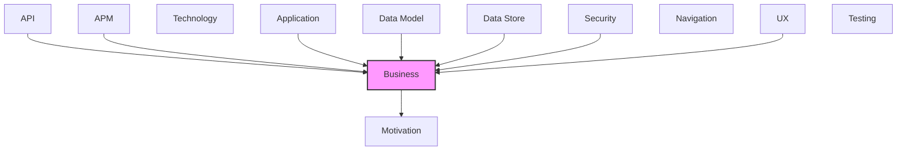

# Business

Business processes, functions, roles, and services.

## Report Index

- [Layer Introduction](#layer-introduction)
- [Intra-Layer Relationships](#intra-layer-relationships)
- [Inter-Layer Dependencies](#inter-layer-dependencies)
- [Inter-Layer Relationships Table](#inter-layer-relationships-table)
- [Element Reference](#element-reference)

## Layer Introduction

| Metric                    | Count |
| ------------------------- | ----- |
| Elements                  | 17    |
| Intra-Layer Relationships | 31    |
| Inter-Layer Relationships | 92    |
| Inbound Relationships     | 79    |
| Outbound Relationships    | 13    |

**Cross-Layer References**:

- **Upstream layers**: [API](./06-api-layer-report.md), [APM](./11-apm-layer-report.md), [Application](./04-application-layer-report.md), [Data Model](./07-data-model-layer-report.md), [Data Store](./08-data-store-layer-report.md), [Security](./03-security-layer-report.md), [UX](./09-ux-layer-report.md)
- **Downstream layers**: [Motivation](./01-motivation-layer-report.md)

## Intra-Layer Relationships

```mermaid
flowchart LR
  subgraph business
    business_businessfunction_cross_layer_reference_resolution["Cross-Layer Reference Resolution"]
    business_businessfunction_graph_layout_computation["Graph Layout Computation"]
    business_businessfunction_yaml_model_parsing["YAML Model Parsing"]
    business_businessobject_annotation["Annotation"]
    business_businessobject_architecture_model["Architecture Model"]
    business_businessobject_changeset["Changeset"]
    business_businessprocess_authentication_flow["Authentication Flow"]
    business_businessprocess_changeset_review_flow["Changeset Review Flow"]
    business_businessprocess_model_loading_and_rendering["Model Loading and Rendering"]
    business_businessprocess_real_time_model_synchronization["Real-time Model Synchronization"]
    business_businessrole_architecture_reviewer["Architecture Reviewer"]
    business_businessrole_model_author["Model Author"]
    business_businessservice_ai_assisted_architecture_chat["AI-Assisted Architecture Chat"]
    business_businessservice_architecture_model_visualization["Architecture Model Visualization"]
    business_businessservice_changeset_review["Changeset Review"]
    business_businessservice_model_annotation["Model Annotation"]
    business_businessservice_schema_exploration["Schema Exploration"]
    03823476_93f8_4ab4_8c51_cd93bf459ff0 -->|delivers| 99380a26_1064_4515_9d15_fec7620549cd
    35295e18_08a8_4ca0_ada3_40a017cb4318 -->|delivers| ffa6bf4a_5281_402f_90d8_a895173fc4ba
    7c85d8fc_3635_45fa_a83c_36f184763cab -->|accesses| ffa6bf4a_5281_402f_90d8_a895173fc4ba
    8b70a28c_08e2_414c_b641_95335ac2a463 -->|accesses| ffa6bf4a_5281_402f_90d8_a895173fc4ba
    af8620f0_9b01_41f2_992c_b90355d2e92c -->|delivers| ea84399d_45dc_4fef_a5a1_759c9b5b5870
    business_businessfunction_cross_layer_reference_resolution -->|accesses| business_businessobject_architecture_model
    business_businessfunction_cross_layer_reference_resolution -->|flows-to| business_businessprocess_model_loading_and_rendering
    business_businessfunction_cross_layer_reference_resolution -->|realizes| business_businessservice_architecture_model_visualization
    business_businessfunction_graph_layout_computation -->|accesses| business_businessobject_architecture_model
    business_businessfunction_graph_layout_computation -->|flows-to| business_businessprocess_model_loading_and_rendering
    business_businessfunction_graph_layout_computation -->|realizes| business_businessservice_architecture_model_visualization
    business_businessfunction_yaml_model_parsing -->|accesses| business_businessobject_architecture_model
    business_businessfunction_yaml_model_parsing -->|flows-to| business_businessprocess_model_loading_and_rendering
    business_businessfunction_yaml_model_parsing -->|realizes| business_businessservice_architecture_model_visualization
    business_businessobject_architecture_model -->|composes| business_businessobject_annotation
    business_businessobject_architecture_model -->|composes| business_businessobject_changeset
    business_businessprocess_authentication_flow -->|flows-to| business_businessprocess_model_loading_and_rendering
    business_businessprocess_authentication_flow -->|realizes| business_businessservice_ai_assisted_architecture_chat
    business_businessprocess_changeset_review_flow -->|accesses| business_businessobject_architecture_model
    business_businessprocess_changeset_review_flow -->|accesses| business_businessobject_changeset
    business_businessprocess_changeset_review_flow -->|realizes| business_businessservice_changeset_review
    business_businessprocess_model_loading_and_rendering -->|accesses| business_businessobject_architecture_model
    business_businessprocess_model_loading_and_rendering -->|flows-to| business_businessprocess_changeset_review_flow
    business_businessprocess_model_loading_and_rendering -->|flows-to| business_businessprocess_real_time_model_synchronization
    business_businessprocess_model_loading_and_rendering -->|realizes| business_businessservice_architecture_model_visualization
    business_businessprocess_real_time_model_synchronization -->|realizes| business_businessservice_architecture_model_visualization
    business_businessrole_architecture_reviewer -->|performs| business_businessprocess_changeset_review_flow
    business_businessrole_model_author -->|performs| business_businessprocess_model_loading_and_rendering
    business_businessservice_architecture_model_visualization -->|delivers| business_businessobject_architecture_model
    business_businessservice_changeset_review -->|delivers| business_businessobject_changeset
    business_businessservice_model_annotation -->|delivers| business_businessobject_annotation
  end
```

## Inter-Layer Dependencies

## Inter-Layer Relationships Table

| Relationship ID                                                                        | Source Node                                                      | Dest Node                                                   | Dest Layer   | Predicate    | Cardinality  | Strength |
| -------------------------------------------------------------------------------------- | ---------------------------------------------------------------- | ----------------------------------------------------------- | ------------ | ------------ | ------------ | -------- |
| `03823476-93f8-4ab4-8c51-cd93bf459ff0-realizes-59d25358-33d1-4c2d-b8fb-2a03ab216ae6`   | `03823476-93f8-4ab4-8c51-cd93bf459ff0`                           | `59d25358-33d1-4c2d-b8fb-2a03ab216ae6`                      | `motivation` | `realizes`   | unknown      | unknown  |
| `0e1d8c49-81ae-41e3-9453-1e989bbffb26-references-7c85d8fc-3635-45fa-a83c-36f184763cab` | `0e1d8c49-81ae-41e3-9453-1e989bbffb26`                           | `7c85d8fc-3635-45fa-a83c-36f184763cab`                      | `business`   | `references` | unknown      | unknown  |
| `16fa387e-b1fd-4daf-9811-c3a0b4fd3d05-realizes-5308e41f-71c9-4ca6-8dfc-11d8b0483ce8`   | `16fa387e-b1fd-4daf-9811-c3a0b4fd3d05`                           | `5308e41f-71c9-4ca6-8dfc-11d8b0483ce8`                      | `business`   | `realizes`   | unknown      | unknown  |
| `29f33e20-2acf-46e3-9f18-02ebd34fc734-accesses-99380a26-1064-4515-9d15-fec7620549cd`   | `29f33e20-2acf-46e3-9f18-02ebd34fc734`                           | `99380a26-1064-4515-9d15-fec7620549cd`                      | `business`   | `accesses`   | unknown      | unknown  |
| `29f33e20-2acf-46e3-9f18-02ebd34fc734-realizes-03823476-93f8-4ab4-8c51-cd93bf459ff0`   | `29f33e20-2acf-46e3-9f18-02ebd34fc734`                           | `03823476-93f8-4ab4-8c51-cd93bf459ff0`                      | `business`   | `realizes`   | unknown      | unknown  |
| `35295e18-08a8-4ca0-ada3-40a017cb4318-realizes-462e2931-4c7c-4051-a9ac-8817c270d650`   | `35295e18-08a8-4ca0-ada3-40a017cb4318`                           | `462e2931-4c7c-4051-a9ac-8817c270d650`                      | `motivation` | `realizes`   | unknown      | unknown  |
| `35295e18-08a8-4ca0-ada3-40a017cb4318-satisfies-e748118c-b989-43fe-b0d2-9121e931fcd2`  | `35295e18-08a8-4ca0-ada3-40a017cb4318`                           | `e748118c-b989-43fe-b0d2-9121e931fcd2`                      | `motivation` | `satisfies`  | unknown      | unknown  |
| `389d0672-e5c3-4d4e-acc9-227e8f5521f7-references-c20e00b6-ef86-415a-92a3-3e9fd9dc7cd6` | `389d0672-e5c3-4d4e-acc9-227e8f5521f7`                           | `c20e00b6-ef86-415a-92a3-3e9fd9dc7cd6`                      | `business`   | `references` | unknown      | unknown  |
| `3ce0eb35-ba57-4f87-8b0b-ba127cac026a-references-7c85d8fc-3635-45fa-a83c-36f184763cab` | `3ce0eb35-ba57-4f87-8b0b-ba127cac026a`                           | `7c85d8fc-3635-45fa-a83c-36f184763cab`                      | `business`   | `references` | unknown      | unknown  |
| `3dee662b-7dc2-4fcc-8677-15a2ba06136e-serves-ed8f5b8f-54e4-498c-a8d9-ebe4ee430b6a`     | `3dee662b-7dc2-4fcc-8677-15a2ba06136e`                           | `ed8f5b8f-54e4-498c-a8d9-ebe4ee430b6a`                      | `business`   | `serves`     | unknown      | unknown  |
| `3e532c87-b3b7-4473-bd47-81bfd5de6507-realizes-c4ba5c59-3f4e-49a9-9915-a48049ddb68e`   | `3e532c87-b3b7-4473-bd47-81bfd5de6507`                           | `c4ba5c59-3f4e-49a9-9915-a48049ddb68e`                      | `business`   | `realizes`   | unknown      | unknown  |
| `406200e9-ef8b-46c9-a1fe-1ff06d6d5602-serves-ed8f5b8f-54e4-498c-a8d9-ebe4ee430b6a`     | `406200e9-ef8b-46c9-a1fe-1ff06d6d5602`                           | `ed8f5b8f-54e4-498c-a8d9-ebe4ee430b6a`                      | `business`   | `serves`     | unknown      | unknown  |
| `4d7f0994-8c0d-4148-9eba-a3479a1f8947-realizes-a138ca69-d437-4841-b96f-5fb5dd703380`   | `4d7f0994-8c0d-4148-9eba-a3479a1f8947`                           | `a138ca69-d437-4841-b96f-5fb5dd703380`                      | `business`   | `realizes`   | unknown      | unknown  |
| `5308e41f-71c9-4ca6-8dfc-11d8b0483ce8-realizes-59d25358-33d1-4c2d-b8fb-2a03ab216ae6`   | `5308e41f-71c9-4ca6-8dfc-11d8b0483ce8`                           | `59d25358-33d1-4c2d-b8fb-2a03ab216ae6`                      | `motivation` | `realizes`   | unknown      | unknown  |
| `57b0c4b1-46b4-49bc-993d-bf7b6cecf206-realizes-ffa6bf4a-5281-402f-90d8-a895173fc4ba`   | `57b0c4b1-46b4-49bc-993d-bf7b6cecf206`                           | `ffa6bf4a-5281-402f-90d8-a895173fc4ba`                      | `business`   | `realizes`   | unknown      | unknown  |
| `582fd707-9e0d-4a98-9b47-b3cda7b26c3d-realizes-ea84399d-45dc-4fef-a5a1-759c9b5b5870`   | `582fd707-9e0d-4a98-9b47-b3cda7b26c3d`                           | `ea84399d-45dc-4fef-a5a1-759c9b5b5870`                      | `business`   | `realizes`   | unknown      | unknown  |
| `63c97821-401c-40cd-a076-ef84e06f5442-realizes-35295e18-08a8-4ca0-ada3-40a017cb4318`   | `63c97821-401c-40cd-a076-ef84e06f5442`                           | `35295e18-08a8-4ca0-ada3-40a017cb4318`                      | `business`   | `realizes`   | unknown      | unknown  |
| `6b2f9b1a-bd90-4b1e-9ee2-bed4cbb73a04-realizes-c20e00b6-ef86-415a-92a3-3e9fd9dc7cd6`   | `6b2f9b1a-bd90-4b1e-9ee2-bed4cbb73a04`                           | `c20e00b6-ef86-415a-92a3-3e9fd9dc7cd6`                      | `business`   | `realizes`   | unknown      | unknown  |
| `6f75bbfc-c13c-4c87-83e5-32f134902391-realizes-35295e18-08a8-4ca0-ada3-40a017cb4318`   | `6f75bbfc-c13c-4c87-83e5-32f134902391`                           | `35295e18-08a8-4ca0-ada3-40a017cb4318`                      | `business`   | `realizes`   | unknown      | unknown  |
| `6f75bbfc-c13c-4c87-83e5-32f134902391-serves-fb417c37-45b0-460f-80bb-4782d6c1a11a`     | `6f75bbfc-c13c-4c87-83e5-32f134902391`                           | `fb417c37-45b0-460f-80bb-4782d6c1a11a`                      | `business`   | `serves`     | unknown      | unknown  |
| `7c85d8fc-3635-45fa-a83c-36f184763cab-realizes-59d25358-33d1-4c2d-b8fb-2a03ab216ae6`   | `7c85d8fc-3635-45fa-a83c-36f184763cab`                           | `59d25358-33d1-4c2d-b8fb-2a03ab216ae6`                      | `motivation` | `realizes`   | unknown      | unknown  |
| `80e6c89f-70ba-4183-909f-0457abdf9fa7-realizes-35295e18-08a8-4ca0-ada3-40a017cb4318`   | `80e6c89f-70ba-4183-909f-0457abdf9fa7`                           | `35295e18-08a8-4ca0-ada3-40a017cb4318`                      | `business`   | `realizes`   | unknown      | unknown  |
| `83c81f34-4376-4ff9-8fb4-98f3ecbc6d68-realizes-731285cc-dc15-4c64-a342-a933ce00bd61`   | `83c81f34-4376-4ff9-8fb4-98f3ecbc6d68`                           | `731285cc-dc15-4c64-a342-a933ce00bd61`                      | `motivation` | `realizes`   | unknown      | unknown  |
| `83c81f34-4376-4ff9-8fb4-98f3ecbc6d68-satisfies-e748118c-b989-43fe-b0d2-9121e931fcd2`  | `83c81f34-4376-4ff9-8fb4-98f3ecbc6d68`                           | `e748118c-b989-43fe-b0d2-9121e931fcd2`                      | `motivation` | `satisfies`  | unknown      | unknown  |
| `8630981b-236c-47ed-b99b-e977c56bdc63-serves-ed8f5b8f-54e4-498c-a8d9-ebe4ee430b6a`     | `8630981b-236c-47ed-b99b-e977c56bdc63`                           | `ed8f5b8f-54e4-498c-a8d9-ebe4ee430b6a`                      | `business`   | `serves`     | unknown      | unknown  |
| `8b70a28c-08e2-414c-b641-95335ac2a463-realizes-462e2931-4c7c-4051-a9ac-8817c270d650`   | `8b70a28c-08e2-414c-b641-95335ac2a463`                           | `462e2931-4c7c-4051-a9ac-8817c270d650`                      | `motivation` | `realizes`   | unknown      | unknown  |
| `a0080aee-7e84-4c2c-8d76-0cd604bfd7f5-realizes-ea84399d-45dc-4fef-a5a1-759c9b5b5870`   | `a0080aee-7e84-4c2c-8d76-0cd604bfd7f5`                           | `ea84399d-45dc-4fef-a5a1-759c9b5b5870`                      | `business`   | `realizes`   | unknown      | unknown  |
| `a138ca69-d437-4841-b96f-5fb5dd703380-realizes-462e2931-4c7c-4051-a9ac-8817c270d650`   | `a138ca69-d437-4841-b96f-5fb5dd703380`                           | `462e2931-4c7c-4051-a9ac-8817c270d650`                      | `motivation` | `realizes`   | unknown      | unknown  |
| `a5342d6f-daf4-4a6e-a98b-7fada2561798-accesses-ffa6bf4a-5281-402f-90d8-a895173fc4ba`   | `a5342d6f-daf4-4a6e-a98b-7fada2561798`                           | `ffa6bf4a-5281-402f-90d8-a895173fc4ba`                      | `business`   | `accesses`   | unknown      | unknown  |
| `a5342d6f-daf4-4a6e-a98b-7fada2561798-realizes-35295e18-08a8-4ca0-ada3-40a017cb4318`   | `a5342d6f-daf4-4a6e-a98b-7fada2561798`                           | `35295e18-08a8-4ca0-ada3-40a017cb4318`                      | `business`   | `realizes`   | unknown      | unknown  |
| `a5342d6f-daf4-4a6e-a98b-7fada2561798-serves-a138ca69-d437-4841-b96f-5fb5dd703380`     | `a5342d6f-daf4-4a6e-a98b-7fada2561798`                           | `a138ca69-d437-4841-b96f-5fb5dd703380`                      | `business`   | `serves`     | unknown      | unknown  |
| `a77489e0-4e1f-42b1-b3e1-b1b534e6e7f8-accesses-ea84399d-45dc-4fef-a5a1-759c9b5b5870`   | `a77489e0-4e1f-42b1-b3e1-b1b534e6e7f8`                           | `ea84399d-45dc-4fef-a5a1-759c9b5b5870`                      | `business`   | `accesses`   | unknown      | unknown  |
| `a77489e0-4e1f-42b1-b3e1-b1b534e6e7f8-realizes-35295e18-08a8-4ca0-ada3-40a017cb4318`   | `a77489e0-4e1f-42b1-b3e1-b1b534e6e7f8`                           | `35295e18-08a8-4ca0-ada3-40a017cb4318`                      | `business`   | `realizes`   | unknown      | unknown  |
| `a920ab1c-c481-46b6-bdb4-4050501adeac-realizes-e642ad79-62ea-47a4-ae04-d512d0ef7881`   | `a920ab1c-c481-46b6-bdb4-4050501adeac`                           | `e642ad79-62ea-47a4-ae04-d512d0ef7881`                      | `business`   | `realizes`   | unknown      | unknown  |
| `a920ab1c-c481-46b6-bdb4-4050501adeac-serves-c20e00b6-ef86-415a-92a3-3e9fd9dc7cd6`     | `a920ab1c-c481-46b6-bdb4-4050501adeac`                           | `c20e00b6-ef86-415a-92a3-3e9fd9dc7cd6`                      | `business`   | `serves`     | unknown      | unknown  |
| `api.operation.realizes.business.businessprocess`                                      | `api.operation.delete-annotation`                                | `business.businessprocess.changeset-review-flow`            | `business`   | `realizes`   | many-to-many | medium   |
| `apm.logconfiguration.monitors.business.businessservice`                               | `apm.logconfiguration.browser-console-error-log-configuration`   | `business.businessservice.architecture-model-visualization` | `business`   | `monitors`   | many-to-many | medium   |
| `application.applicationprocess.realizes.business.businessprocess`                     | `application.applicationprocess.spec-route`                      | `business.businessprocess.model-loading-and-rendering`      | `business`   | `realizes`   | many-to-many | medium   |
| `application.applicationservice.serves.business.businessprocess`                       | `application.applicationservice.changeset-graph-builder`         | `business.businessprocess.changeset-review-flow`            | `business`   | `serves`     | many-to-many | medium   |
| `application.applicationservice.realizes.business.businessservice`                     | `application.applicationservice.chat-validation`                 | `business.businessservice.ai-assisted-architecture-chat`    | `business`   | `realizes`   | many-to-many | medium   |
| `application.applicationservice.realizes.business.businessservice`                     | `application.applicationservice.context-sub-graph-builder`       | `business.businessservice.architecture-model-visualization` | `business`   | `realizes`   | many-to-many | medium   |
| `application.applicationservice.serves.business.businessprocess`                       | `application.applicationservice.coverage-analyzer`               | `business.businessprocess.model-loading-and-rendering`      | `business`   | `serves`     | many-to-many | medium   |
| `application.applicationservice.realizes.business.businessservice`                     | `application.applicationservice.cross-layer-links-extractor`     | `business.businessservice.architecture-model-visualization` | `business`   | `realizes`   | many-to-many | medium   |
| `application.applicationservice.realizes.business.businessservice`                     | `application.applicationservice.cross-layer-processor`           | `business.businessservice.architecture-model-visualization` | `business`   | `realizes`   | many-to-many | medium   |
| `application.applicationservice.realizes.business.businessservice`                     | `application.applicationservice.cross-layer-reference-extractor` | `business.businessservice.architecture-model-visualization` | `business`   | `realizes`   | many-to-many | medium   |
| `application.applicationservice.serves.business.businessprocess`                       | `application.applicationservice.data-loader`                     | `business.businessprocess.model-loading-and-rendering`      | `business`   | `serves`     | many-to-many | medium   |
| `application.applicationservice.serves.business.businessprocess`                       | `application.applicationservice.embedded-data-loader`            | `business.businessprocess.model-loading-and-rendering`      | `business`   | `serves`     | many-to-many | medium   |
| `application.applicationservice.serves.business.businessprocess`                       | `application.applicationservice.error-tracker`                   | `business.businessprocess.model-loading-and-rendering`      | `business`   | `serves`     | many-to-many | medium   |
| `application.applicationservice.serves.business.businessprocess`                       | `application.applicationservice.exception-classifier`            | `business.businessprocess.model-loading-and-rendering`      | `business`   | `serves`     | many-to-many | medium   |
| `application.applicationservice.realizes.business.businessservice`                     | `application.applicationservice.export-utils`                    | `business.businessservice.architecture-model-visualization` | `business`   | `realizes`   | many-to-many | medium   |
| `application.applicationservice.realizes.business.businessservice`                     | `application.applicationservice.git-hub-service`                 | `business.businessservice.model-annotation`                 | `business`   | `realizes`   | many-to-many | medium   |
| `application.applicationservice.realizes.business.businessservice`                     | `application.applicationservice.impact-analysis-service`         | `business.businessservice.changeset-review`                 | `business`   | `realizes`   | many-to-many | medium   |
| `application.applicationservice.serves.business.businessprocess`                       | `application.applicationservice.json-rpc-handler`                | `business.businessprocess.real-time-model-synchronization`  | `business`   | `serves`     | many-to-many | medium   |
| `application.applicationservice.realizes.business.businessservice`                     | `application.applicationservice.json-schema-parser`              | `business.businessservice.architecture-model-visualization` | `business`   | `realizes`   | many-to-many | medium   |
| `application.applicationservice.realizes.business.businessservice`                     | `application.applicationservice.libavoid-router`                 | `business.businessservice.architecture-model-visualization` | `business`   | `realizes`   | many-to-many | medium   |
| `application.applicationservice.realizes.business.businessservice`                     | `application.applicationservice.local-file-loader`               | `business.businessservice.architecture-model-visualization` | `business`   | `realizes`   | many-to-many | medium   |
| `application.applicationservice.serves.business.businessprocess`                       | `application.applicationservice.node-transformer`                | `business.businessprocess.model-loading-and-rendering`      | `business`   | `serves`     | many-to-many | medium   |
| `application.applicationservice.realizes.business.businessservice`                     | `application.applicationservice.spec-context-sub-graph-builder`  | `business.businessservice.schema-exploration`               | `business`   | `realizes`   | many-to-many | medium   |
| `application.applicationservice.realizes.business.businessservice`                     | `application.applicationservice.spec-parser`                     | `business.businessservice.schema-exploration`               | `business`   | `realizes`   | many-to-many | medium   |
| `application.applicationservice.serves.business.businessprocess`                       | `application.applicationservice.web-socket-client`               | `business.businessprocess.real-time-model-synchronization`  | `business`   | `serves`     | many-to-many | medium   |
| `application.applicationservice.realizes.business.businessservice`                     | `application.applicationservice.yaml-parser`                     | `business.businessservice.architecture-model-visualization` | `business`   | `realizes`   | many-to-many | medium   |
| `b4784daf-706d-4f78-b522-165057df8110-realizes-5308e41f-71c9-4ca6-8dfc-11d8b0483ce8`   | `b4784daf-706d-4f78-b522-165057df8110`                           | `5308e41f-71c9-4ca6-8dfc-11d8b0483ce8`                      | `business`   | `realizes`   | unknown      | unknown  |
| `b7775f1a-2418-4c7a-84aa-997efd658a97-realizes-35295e18-08a8-4ca0-ada3-40a017cb4318`   | `b7775f1a-2418-4c7a-84aa-997efd658a97`                           | `35295e18-08a8-4ca0-ada3-40a017cb4318`                      | `business`   | `realizes`   | unknown      | unknown  |
| `b7775f1a-2418-4c7a-84aa-997efd658a97-serves-83c81f34-4376-4ff9-8fb4-98f3ecbc6d68`     | `b7775f1a-2418-4c7a-84aa-997efd658a97`                           | `83c81f34-4376-4ff9-8fb4-98f3ecbc6d68`                      | `business`   | `serves`     | unknown      | unknown  |
| `business.businessservice.realizes.motivation.goal`                                    | `business.businessservice.schema-exploration`                    | `motivation.goal.visualize-multi-layer-architecture-models` | `motivation` | `realizes`   | many-to-many | medium   |
| `c4ba5c59-3f4e-49a9-9915-a48049ddb68e-realizes-59d25358-33d1-4c2d-b8fb-2a03ab216ae6`   | `c4ba5c59-3f4e-49a9-9915-a48049ddb68e`                           | `59d25358-33d1-4c2d-b8fb-2a03ab216ae6`                      | `motivation` | `realizes`   | unknown      | unknown  |
| `cfe8d725-4f64-4eae-b2fa-825e4a774a3a-realizes-ffa6bf4a-5281-402f-90d8-a895173fc4ba`   | `cfe8d725-4f64-4eae-b2fa-825e4a774a3a`                           | `ffa6bf4a-5281-402f-90d8-a895173fc4ba`                      | `business`   | `realizes`   | unknown      | unknown  |
| `cfe8d725-4f64-4eae-b2fa-825e4a774a3a-references-8b70a28c-08e2-414c-b641-95335ac2a463` | `cfe8d725-4f64-4eae-b2fa-825e4a774a3a`                           | `8b70a28c-08e2-414c-b641-95335ac2a463`                      | `business`   | `references` | unknown      | unknown  |
| `data-model.objectschema.realizes.business.businessobject`                             | `data-model.objectschema.data-model-field`                       | `business.businessobject.architecture-model`                | `business`   | `realizes`   | many-to-many | medium   |
| `data-model.objectschema.realizes.business.businessobject`                             | `data-model.objectschema.extracted-reference`                    | `business.businessobject.architecture-model`                | `business`   | `realizes`   | many-to-many | medium   |
| `data-model.objectschema.realizes.business.businessobject`                             | `data-model.objectschema.model-metadata`                         | `business.businessobject.architecture-model`                | `business`   | `realizes`   | many-to-many | medium   |
| `data-model.objectschema.realizes.business.businessobject`                             | `data-model.objectschema.projection-rule`                        | `business.businessobject.architecture-model`                | `business`   | `realizes`   | many-to-many | medium   |
| `data-model.objectschema.realizes.business.businessobject`                             | `data-model.objectschema.reference`                              | `business.businessobject.architecture-model`                | `business`   | `realizes`   | many-to-many | medium   |
| `data-store.collection.realizes.business.businessobject`                               | `data-store.collection.changeset-files`                          | `business.businessobject.changeset`                         | `business`   | `realizes`   | many-to-many | medium   |
| `data-store.collection.realizes.business.businessobject`                               | `data-store.collection.model-manifest`                           | `business.businessobject.architecture-model`                | `business`   | `realizes`   | many-to-many | medium   |
| `dc0fb8df-f1e4-46a0-84bc-febf4e3f6080-realizes-462e2931-4c7c-4051-a9ac-8817c270d650`   | `dc0fb8df-f1e4-46a0-84bc-febf4e3f6080`                           | `462e2931-4c7c-4051-a9ac-8817c270d650`                      | `motivation` | `realizes`   | unknown      | unknown  |
| `dfc6509e-98f5-479a-bfe9-14bfddbb838a-serves-fb417c37-45b0-460f-80bb-4782d6c1a11a`     | `dfc6509e-98f5-479a-bfe9-14bfddbb838a`                           | `fb417c37-45b0-460f-80bb-4782d6c1a11a`                      | `business`   | `serves`     | unknown      | unknown  |
| `e642ad79-62ea-47a4-ae04-d512d0ef7881-realizes-731285cc-dc15-4c64-a342-a933ce00bd61`   | `e642ad79-62ea-47a4-ae04-d512d0ef7881`                           | `731285cc-dc15-4c64-a342-a933ce00bd61`                      | `motivation` | `realizes`   | unknown      | unknown  |
| `fbd68c51-36fa-48ef-b381-5599d2678a90-serves-83c81f34-4376-4ff9-8fb4-98f3ecbc6d68`     | `fbd68c51-36fa-48ef-b381-5599d2678a90`                           | `83c81f34-4376-4ff9-8fb4-98f3ecbc6d68`                      | `business`   | `serves`     | unknown      | unknown  |
| `fd2f4ab4-7477-4ec5-aac4-37aa1d78af4c-realizes-35295e18-08a8-4ca0-ada3-40a017cb4318`   | `fd2f4ab4-7477-4ec5-aac4-37aa1d78af4c`                           | `35295e18-08a8-4ca0-ada3-40a017cb4318`                      | `business`   | `realizes`   | unknown      | unknown  |
| `security.secureresource.references.business.businessobject`                           | `security.secureresource.model-rest-api`                         | `business.businessobject.architecture-model`                | `business`   | `references` | many-to-many | medium   |
| `security.secureresource.references.business.businessobject`                           | `security.secureresource.web-socket-json-rpc-channel`            | `business.businessobject.architecture-model`                | `business`   | `references` | many-to-many | medium   |
| `ux.subview.realizes.business.businessprocess`                                         | `ux.subview.chat-panel`                                          | `business.businessprocess.real-time-model-synchronization`  | `business`   | `realizes`   | many-to-many | medium   |
| `ux.subview.realizes.business.businessprocess`                                         | `ux.subview.embedded-layout`                                     | `business.businessprocess.model-loading-and-rendering`      | `business`   | `realizes`   | many-to-many | medium   |
| `ux.subview.realizes.business.businessprocess`                                         | `ux.subview.floating-chat-panel`                                 | `business.businessprocess.real-time-model-synchronization`  | `business`   | `realizes`   | many-to-many | medium   |
| `ux.subview.realizes.business.businessprocess`                                         | `ux.subview.model-layers-sidebar`                                | `business.businessprocess.model-loading-and-rendering`      | `business`   | `realizes`   | many-to-many | medium   |
| `ux.subview.realizes.business.businessprocess`                                         | `ux.subview.node-details-panel`                                  | `business.businessprocess.model-loading-and-rendering`      | `business`   | `realizes`   | many-to-many | medium   |
| `ux.subview.realizes.business.businessprocess`                                         | `ux.subview.shared-layout`                                       | `business.businessprocess.model-loading-and-rendering`      | `business`   | `realizes`   | many-to-many | medium   |
| `ux.view.realizes.business.businessprocess`                                            | `ux.view.auth-view`                                              | `business.businessprocess.authentication-flow`              | `business`   | `realizes`   | many-to-many | medium   |
| `ux.view.realizes.business.businessprocess`                                            | `ux.view.changeset-list-view`                                    | `business.businessprocess.changeset-review-flow`            | `business`   | `realizes`   | many-to-many | medium   |
| `ux.view.realizes.business.businessprocess`                                            | `ux.view.model-graph-view`                                       | `business.businessprocess.model-loading-and-rendering`      | `business`   | `realizes`   | many-to-many | medium   |
| `ux.view.realizes.business.businessprocess`                                            | `ux.view.spec-details-view`                                      | `business.businessprocess.model-loading-and-rendering`      | `business`   | `realizes`   | many-to-many | medium   |

## Element Reference

### Cross-Layer Reference Resolution {#cross-layer-reference-resolution}

**ID**: `business.businessfunction.cross-layer-reference-resolution`

**Type**: `businessfunction`

Extraction and resolution of cross-layer references between model elements across all 12 architecture layers

#### Relationships

| Type        | Related Element                                             | Predicate  | Direction |
| ----------- | ----------------------------------------------------------- | ---------- | --------- |
| intra-layer | `business.businessobject.architecture-model`                | `accesses` | outbound  |
| intra-layer | `business.businessprocess.model-loading-and-rendering`      | `flows-to` | outbound  |
| intra-layer | `business.businessservice.architecture-model-visualization` | `realizes` | outbound  |

### Graph Layout Computation {#graph-layout-computation}

**ID**: `business.businessfunction.graph-layout-computation`

**Type**: `businessfunction`

Automated positioning of architecture elements using configurable layout engines (Dagre, ELK, D3-Force, Graphviz)

#### Relationships

| Type        | Related Element                                             | Predicate  | Direction |
| ----------- | ----------------------------------------------------------- | ---------- | --------- |
| intra-layer | `business.businessobject.architecture-model`                | `accesses` | outbound  |
| intra-layer | `business.businessprocess.model-loading-and-rendering`      | `flows-to` | outbound  |
| intra-layer | `business.businessservice.architecture-model-visualization` | `realizes` | outbound  |

### YAML Model Parsing {#yaml-model-parsing}

**ID**: `business.businessfunction.yaml-model-parsing`

**Type**: `businessfunction`

Parsing and validation of DR CLI YAML model files into typed TypeScript model objects

#### Relationships

| Type        | Related Element                                             | Predicate  | Direction |
| ----------- | ----------------------------------------------------------- | ---------- | --------- |
| intra-layer | `business.businessobject.architecture-model`                | `accesses` | outbound  |
| intra-layer | `business.businessprocess.model-loading-and-rendering`      | `flows-to` | outbound  |
| intra-layer | `business.businessservice.architecture-model-visualization` | `realizes` | outbound  |

### Annotation {#annotation}

**ID**: `business.businessobject.annotation`

**Type**: `businessobject`

User-created comment or markup attached to a specific model element for collaborative review

#### Relationships

| Type        | Related Element                              | Predicate  | Direction |
| ----------- | -------------------------------------------- | ---------- | --------- |
| intra-layer | `business.businessobject.architecture-model` | `composes` | inbound   |
| intra-layer | `business.businessservice.model-annotation`  | `delivers` | inbound   |

### Architecture Model {#architecture-model}

**ID**: `business.businessobject.architecture-model`

**Type**: `businessobject`

The multi-layer YAML architecture model managed by DR CLI and visualized by the viewer

#### Relationships

| Type        | Related Element                                              | Predicate    | Direction |
| ----------- | ------------------------------------------------------------ | ------------ | --------- |
| inter-layer | `data-model.objectschema.data-model-field`                   | `realizes`   | inbound   |
| inter-layer | `data-model.objectschema.extracted-reference`                | `realizes`   | inbound   |
| inter-layer | `data-model.objectschema.model-metadata`                     | `realizes`   | inbound   |
| inter-layer | `data-model.objectschema.projection-rule`                    | `realizes`   | inbound   |
| inter-layer | `data-model.objectschema.reference`                          | `realizes`   | inbound   |
| inter-layer | `data-store.collection.model-manifest`                       | `realizes`   | inbound   |
| inter-layer | `security.secureresource.model-rest-api`                     | `references` | inbound   |
| inter-layer | `security.secureresource.web-socket-json-rpc-channel`        | `references` | inbound   |
| intra-layer | `business.businessfunction.cross-layer-reference-resolution` | `accesses`   | inbound   |
| intra-layer | `business.businessfunction.graph-layout-computation`         | `accesses`   | inbound   |
| intra-layer | `business.businessfunction.yaml-model-parsing`               | `accesses`   | inbound   |
| intra-layer | `business.businessobject.annotation`                         | `composes`   | outbound  |
| intra-layer | `business.businessobject.changeset`                          | `composes`   | outbound  |
| intra-layer | `business.businessprocess.changeset-review-flow`             | `accesses`   | inbound   |
| intra-layer | `business.businessprocess.model-loading-and-rendering`       | `accesses`   | inbound   |
| intra-layer | `business.businessservice.architecture-model-visualization`  | `delivers`   | inbound   |

### Changeset {#changeset}

**ID**: `business.businessobject.changeset`

**Type**: `businessobject`

A proposed set of architecture model changes that can be reviewed, staged, and committed

#### Relationships

| Type        | Related Element                                  | Predicate  | Direction |
| ----------- | ------------------------------------------------ | ---------- | --------- |
| inter-layer | `data-store.collection.changeset-files`          | `realizes` | inbound   |
| intra-layer | `business.businessobject.architecture-model`     | `composes` | inbound   |
| intra-layer | `business.businessprocess.changeset-review-flow` | `accesses` | inbound   |
| intra-layer | `business.businessservice.changeset-review`      | `delivers` | inbound   |

### Authentication Flow {#authentication-flow}

**ID**: `business.businessprocess.authentication-flow`

**Type**: `businessprocess`

Magic-link token receipt, storage, and injection into all subsequent API requests

#### Relationships

| Type        | Related Element                                          | Predicate  | Direction |
| ----------- | -------------------------------------------------------- | ---------- | --------- |
| inter-layer | `ux.view.auth-view`                                      | `realizes` | inbound   |
| intra-layer | `business.businessprocess.model-loading-and-rendering`   | `flows-to` | outbound  |
| intra-layer | `business.businessservice.ai-assisted-architecture-chat` | `realizes` | outbound  |

### Changeset Review Flow {#changeset-review-flow}

**ID**: `business.businessprocess.changeset-review-flow`

**Type**: `businessprocess`

Process of fetching proposed changesets, visualizing diffs, and presenting them for review

#### Relationships

| Type        | Related Element                                          | Predicate  | Direction |
| ----------- | -------------------------------------------------------- | ---------- | --------- |
| inter-layer | `api.operation.delete-annotation`                        | `realizes` | inbound   |
| inter-layer | `application.applicationservice.changeset-graph-builder` | `serves`   | inbound   |
| inter-layer | `ux.view.changeset-list-view`                            | `realizes` | inbound   |
| intra-layer | `business.businessobject.architecture-model`             | `accesses` | outbound  |
| intra-layer | `business.businessobject.changeset`                      | `accesses` | outbound  |
| intra-layer | `business.businessservice.changeset-review`              | `realizes` | outbound  |
| intra-layer | `business.businessprocess.model-loading-and-rendering`   | `flows-to` | inbound   |
| intra-layer | `business.businessrole.architecture-reviewer`            | `performs` | inbound   |

### Model Loading and Rendering {#model-loading-and-rendering}

**ID**: `business.businessprocess.model-loading-and-rendering`

**Type**: `businessprocess`

Process of loading YAML model data from DR CLI REST API, transforming to React Flow nodes, and rendering interactive graph

#### Relationships

| Type        | Related Element                                              | Predicate  | Direction |
| ----------- | ------------------------------------------------------------ | ---------- | --------- |
| inter-layer | `application.applicationprocess.spec-route`                  | `realizes` | inbound   |
| inter-layer | `application.applicationservice.coverage-analyzer`           | `serves`   | inbound   |
| inter-layer | `application.applicationservice.data-loader`                 | `serves`   | inbound   |
| inter-layer | `application.applicationservice.embedded-data-loader`        | `serves`   | inbound   |
| inter-layer | `application.applicationservice.error-tracker`               | `serves`   | inbound   |
| inter-layer | `application.applicationservice.exception-classifier`        | `serves`   | inbound   |
| inter-layer | `application.applicationservice.node-transformer`            | `serves`   | inbound   |
| inter-layer | `ux.subview.embedded-layout`                                 | `realizes` | inbound   |
| inter-layer | `ux.subview.model-layers-sidebar`                            | `realizes` | inbound   |
| inter-layer | `ux.subview.node-details-panel`                              | `realizes` | inbound   |
| inter-layer | `ux.subview.shared-layout`                                   | `realizes` | inbound   |
| inter-layer | `ux.view.model-graph-view`                                   | `realizes` | inbound   |
| inter-layer | `ux.view.spec-details-view`                                  | `realizes` | inbound   |
| intra-layer | `business.businessfunction.cross-layer-reference-resolution` | `flows-to` | inbound   |
| intra-layer | `business.businessfunction.graph-layout-computation`         | `flows-to` | inbound   |
| intra-layer | `business.businessfunction.yaml-model-parsing`               | `flows-to` | inbound   |
| intra-layer | `business.businessprocess.authentication-flow`               | `flows-to` | inbound   |
| intra-layer | `business.businessobject.architecture-model`                 | `accesses` | outbound  |
| intra-layer | `business.businessprocess.changeset-review-flow`             | `flows-to` | outbound  |
| intra-layer | `business.businessprocess.real-time-model-synchronization`   | `flows-to` | outbound  |
| intra-layer | `business.businessservice.architecture-model-visualization`  | `realizes` | outbound  |
| intra-layer | `business.businessrole.model-author`                         | `performs` | inbound   |

### Real-time Model Synchronization {#real-time-model-synchronization}

**ID**: `business.businessprocess.real-time-model-synchronization`

**Type**: `businessprocess`

Continuous synchronization of model state via WebSocket JSON-RPC connection to DR CLI server

#### Relationships

| Type        | Related Element                                             | Predicate  | Direction |
| ----------- | ----------------------------------------------------------- | ---------- | --------- |
| inter-layer | `application.applicationservice.json-rpc-handler`           | `serves`   | inbound   |
| inter-layer | `application.applicationservice.web-socket-client`          | `serves`   | inbound   |
| inter-layer | `ux.subview.chat-panel`                                     | `realizes` | inbound   |
| inter-layer | `ux.subview.floating-chat-panel`                            | `realizes` | inbound   |
| intra-layer | `business.businessprocess.model-loading-and-rendering`      | `flows-to` | inbound   |
| intra-layer | `business.businessservice.architecture-model-visualization` | `realizes` | outbound  |

### Architecture Reviewer {#architecture-reviewer}

**ID**: `business.businessrole.architecture-reviewer`

**Type**: `businessrole`

Team member who uses the viewer to review, annotate, and discuss architecture models and changesets

#### Relationships

| Type        | Related Element                                  | Predicate  | Direction |
| ----------- | ------------------------------------------------ | ---------- | --------- |
| intra-layer | `business.businessprocess.changeset-review-flow` | `performs` | outbound  |

### Model Author {#model-author}

**ID**: `business.businessrole.model-author`

**Type**: `businessrole`

Architect who creates and updates the DR model via DR CLI; views results in the viewer

#### Relationships

| Type        | Related Element                                        | Predicate  | Direction |
| ----------- | ------------------------------------------------------ | ---------- | --------- |
| intra-layer | `business.businessprocess.model-loading-and-rendering` | `performs` | outbound  |

### AI-Assisted Architecture Chat {#ai-assisted-architecture-chat}

**ID**: `business.businessservice.ai-assisted-architecture-chat`

**Type**: `businessservice`

Conversational interface to query and explore the architecture model via DR CLI AI assistant

#### Relationships

| Type        | Related Element                                  | Predicate  | Direction |
| ----------- | ------------------------------------------------ | ---------- | --------- |
| inter-layer | `application.applicationservice.chat-validation` | `realizes` | inbound   |
| intra-layer | `business.businessprocess.authentication-flow`   | `realizes` | inbound   |

### Architecture Model Visualization {#architecture-model-visualization}

**ID**: `business.businessservice.architecture-model-visualization`

**Type**: `businessservice`

Interactive multi-layer graph visualization of architecture models loaded from DR CLI YAML

#### Relationships

| Type        | Related Element                                                  | Predicate  | Direction |
| ----------- | ---------------------------------------------------------------- | ---------- | --------- |
| inter-layer | `apm.logconfiguration.browser-console-error-log-configuration`   | `monitors` | inbound   |
| inter-layer | `application.applicationservice.context-sub-graph-builder`       | `realizes` | inbound   |
| inter-layer | `application.applicationservice.cross-layer-links-extractor`     | `realizes` | inbound   |
| inter-layer | `application.applicationservice.cross-layer-processor`           | `realizes` | inbound   |
| inter-layer | `application.applicationservice.cross-layer-reference-extractor` | `realizes` | inbound   |
| inter-layer | `application.applicationservice.export-utils`                    | `realizes` | inbound   |
| inter-layer | `application.applicationservice.json-schema-parser`              | `realizes` | inbound   |
| inter-layer | `application.applicationservice.libavoid-router`                 | `realizes` | inbound   |
| inter-layer | `application.applicationservice.local-file-loader`               | `realizes` | inbound   |
| inter-layer | `application.applicationservice.yaml-parser`                     | `realizes` | inbound   |
| intra-layer | `business.businessfunction.cross-layer-reference-resolution`     | `realizes` | inbound   |
| intra-layer | `business.businessfunction.graph-layout-computation`             | `realizes` | inbound   |
| intra-layer | `business.businessfunction.yaml-model-parsing`                   | `realizes` | inbound   |
| intra-layer | `business.businessprocess.model-loading-and-rendering`           | `realizes` | inbound   |
| intra-layer | `business.businessprocess.real-time-model-synchronization`       | `realizes` | inbound   |
| intra-layer | `business.businessobject.architecture-model`                     | `delivers` | outbound  |

### Changeset Review {#changeset-review}

**ID**: `business.businessservice.changeset-review`

**Type**: `businessservice`

Visual diff review of proposed architecture changes via DR CLI changesets

#### Relationships

| Type        | Related Element                                          | Predicate  | Direction |
| ----------- | -------------------------------------------------------- | ---------- | --------- |
| inter-layer | `application.applicationservice.impact-analysis-service` | `realizes` | inbound   |
| intra-layer | `business.businessprocess.changeset-review-flow`         | `realizes` | inbound   |
| intra-layer | `business.businessobject.changeset`                      | `delivers` | outbound  |

### Model Annotation {#model-annotation}

**ID**: `business.businessservice.model-annotation`

**Type**: `businessservice`

Collaborative annotation of architecture model elements with comments and markup

#### Relationships

| Type        | Related Element                                  | Predicate  | Direction |
| ----------- | ------------------------------------------------ | ---------- | --------- |
| inter-layer | `application.applicationservice.git-hub-service` | `realizes` | inbound   |
| intra-layer | `business.businessobject.annotation`             | `delivers` | outbound  |

### Schema Exploration {#schema-exploration}

**ID**: `business.businessservice.schema-exploration`

**Type**: `businessservice`

Browse and inspect layer specification schemas to understand the architecture meta-model

#### Relationships

| Type        | Related Element                                                 | Predicate  | Direction |
| ----------- | --------------------------------------------------------------- | ---------- | --------- |
| inter-layer | `application.applicationservice.spec-context-sub-graph-builder` | `realizes` | inbound   |
| inter-layer | `application.applicationservice.spec-parser`                    | `realizes` | inbound   |
| inter-layer | `motivation.goal.visualize-multi-layer-architecture-models`     | `realizes` | outbound  |

---

Generated: 2026-04-23T10:48:00.903Z | Model Version: 0.1.0
