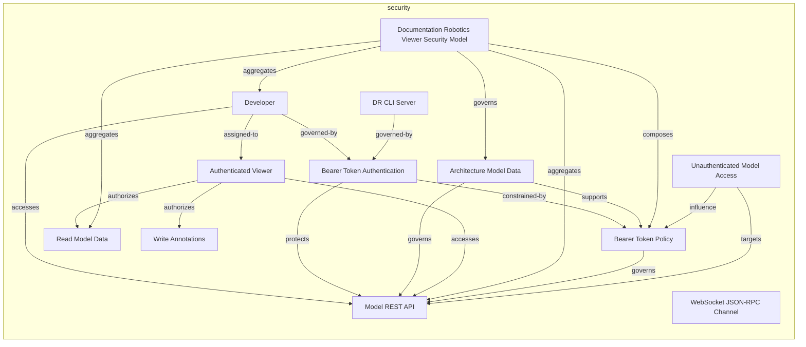
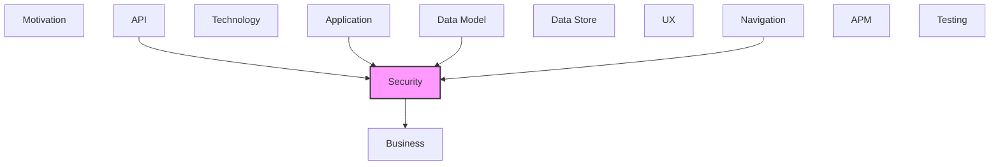

# Security

Authentication, authorization, security threats, and controls.

## Report Index

- [Layer Introduction](#layer-introduction)
- [Intra-Layer Relationships](#intra-layer-relationships)
- [Inter-Layer Dependencies](#inter-layer-dependencies)
- [Inter-Layer Relationships Table](#inter-layer-relationships-table)
- [Element Reference](#element-reference)

## Layer Introduction

| Metric                    | Count |
| ------------------------- | ----- |
| Elements                  | 12    |
| Intra-Layer Relationships | 19    |
| Inter-Layer Relationships | 16    |
| Inbound Relationships     | 14    |
| Outbound Relationships    | 2     |

**Cross-Layer References**:

- **Upstream layers**: [API](./06-api-layer-report.md), [Application](./04-application-layer-report.md), [Data Model](./07-data-model-layer-report.md), [Navigation](./10-navigation-layer-report.md)
- **Downstream layers**: [Business](./02-business-layer-report.md)

## Intra-Layer Relationships

## Inter-Layer Dependencies

## Inter-Layer Relationships Table

| Relationship ID                                                                            | Source Node                                           | Dest Node                                     | Dest Layer | Predicate        | Cardinality  | Strength |
| ------------------------------------------------------------------------------------------ | ----------------------------------------------------- | --------------------------------------------- | ---------- | ---------------- | ------------ | -------- |
| `3dee662b-7dc2-4fcc-8677-15a2ba06136e-requires-f502d58f-1a96-44d5-8fb8-c7e5e67f3f0d`       | `3dee662b-7dc2-4fcc-8677-15a2ba06136e`                | `f502d58f-1a96-44d5-8fb8-c7e5e67f3f0d`        | `security` | `requires`       | unknown      | unknown  |
| `406200e9-ef8b-46c9-a1fe-1ff06d6d5602-requires-f502d58f-1a96-44d5-8fb8-c7e5e67f3f0d`       | `406200e9-ef8b-46c9-a1fe-1ff06d6d5602`                | `f502d58f-1a96-44d5-8fb8-c7e5e67f3f0d`        | `security` | `requires`       | unknown      | unknown  |
| `6f75bbfc-c13c-4c87-83e5-32f134902391-accesses-76929fbe-36ea-4c4f-80d5-eb054598571b`       | `6f75bbfc-c13c-4c87-83e5-32f134902391`                | `76929fbe-36ea-4c4f-80d5-eb054598571b`        | `security` | `accesses`       | unknown      | unknown  |
| `6f75bbfc-c13c-4c87-83e5-32f134902391-constrained-by-f502d58f-1a96-44d5-8fb8-c7e5e67f3f0d` | `6f75bbfc-c13c-4c87-83e5-32f134902391`                | `f502d58f-1a96-44d5-8fb8-c7e5e67f3f0d`        | `security` | `constrained-by` | unknown      | unknown  |
| `6f75bbfc-c13c-4c87-83e5-32f134902391-mitigates-e15b6b69-cc67-4ab9-a3f9-566de56b4804`      | `6f75bbfc-c13c-4c87-83e5-32f134902391`                | `e15b6b69-cc67-4ab9-a3f9-566de56b4804`        | `security` | `mitigates`      | unknown      | unknown  |
| `801c2caa-ec19-4175-bec8-970067823754-satisfies-0fa2ddb9-02df-426f-9c9c-89b857b9dc78`      | `801c2caa-ec19-4175-bec8-970067823754`                | `0fa2ddb9-02df-426f-9c9c-89b857b9dc78`        | `security` | `satisfies`      | unknown      | unknown  |
| `8630981b-236c-47ed-b99b-e977c56bdc63-requires-f502d58f-1a96-44d5-8fb8-c7e5e67f3f0d`       | `8630981b-236c-47ed-b99b-e977c56bdc63`                | `f502d58f-1a96-44d5-8fb8-c7e5e67f3f0d`        | `security` | `requires`       | unknown      | unknown  |
| `a77489e0-4e1f-42b1-b3e1-b1b534e6e7f8-requires-a47870bf-898b-425f-9f73-92663193355a`       | `a77489e0-4e1f-42b1-b3e1-b1b534e6e7f8`                | `a47870bf-898b-425f-9f73-92663193355a`        | `security` | `requires`       | unknown      | unknown  |
| `api.securityscheme.implements.security.securitypolicy`                                    | `api.securityscheme.bearer-auth-scheme`               | `security.securitypolicy.bearer-token-policy` | `security` | `implements`     | many-to-many | medium   |
| `api.securityscheme.implements.security.securitypolicy`                                    | `api.securityscheme.query-auth-scheme`                | `security.securitypolicy.bearer-token-policy` | `security` | `implements`     | many-to-many | medium   |
| `b7775f1a-2418-4c7a-84aa-997efd658a97-requires-a47870bf-898b-425f-9f73-92663193355a`       | `b7775f1a-2418-4c7a-84aa-997efd658a97`                | `a47870bf-898b-425f-9f73-92663193355a`        | `security` | `requires`       | unknown      | unknown  |
| `dfc6509e-98f5-479a-bfe9-14bfddbb838a-requires-f502d58f-1a96-44d5-8fb8-c7e5e67f3f0d`       | `dfc6509e-98f5-479a-bfe9-14bfddbb838a`                | `f502d58f-1a96-44d5-8fb8-c7e5e67f3f0d`        | `security` | `requires`       | unknown      | unknown  |
| `navigation.navigationguard.implements.security.securitypolicy`                            | `navigation.navigationguard.authentication-guard`     | `security.securitypolicy.bearer-token-policy` | `security` | `implements`     | many-to-many | medium   |
| `navigation.navigationguard.requires.security.role`                                        | `navigation.navigationguard.authentication-guard`     | `security.role.authenticated-viewer`          | `security` | `requires`       | many-to-many | medium   |
| `security.secureresource.references.business.businessobject`                               | `security.secureresource.model-rest-api`              | `business.businessobject.architecture-model`  | `business` | `references`     | many-to-many | medium   |
| `security.secureresource.references.business.businessobject`                               | `security.secureresource.web-socket-json-rpc-channel` | `business.businessobject.architecture-model`  | `business` | `references`     | many-to-many | medium   |

## Element Reference

### Developer {#developer}

**ID**: `security.actor.developer`

**Type**: `actor`

Human user who authenticates via magic link to view and annotate architecture models

#### Attributes

| Name | Value |
| ---- | ----- |
| type | human |

#### Relationships

| Type        | Related Element                                                       | Predicate     | Direction |
| ----------- | --------------------------------------------------------------------- | ------------- | --------- |
| intra-layer | `security.secureresource.model-rest-api`                              | `accesses`    | outbound  |
| intra-layer | `security.role.authenticated-viewer`                                  | `assigned-to` | outbound  |
| intra-layer | `security.authenticationconfig.bearer-token-authentication`           | `governed-by` | outbound  |
| intra-layer | `security.securitymodel.documentation-robotics-viewer-security-model` | `aggregates`  | inbound   |

### DR CLI Server {#dr-cli-server}

**ID**: `security.actor.dr-cli-server`

**Type**: `actor`

External DR CLI server that issues authentication tokens and serves model data

#### Attributes

| Name | Value  |
| ---- | ------ |
| type | system |

#### Relationships

| Type        | Related Element                                             | Predicate     | Direction |
| ----------- | ----------------------------------------------------------- | ------------- | --------- |
| intra-layer | `security.authenticationconfig.bearer-token-authentication` | `governed-by` | outbound  |

### Bearer Token Authentication {#bearer-token-authentication}

**ID**: `security.authenticationconfig.bearer-token-authentication`

**Type**: `authenticationconfig`

Magic-link bearer token auth: token arrives via ?token= URL param, stored in localStorage under dr_auth_token, injected as Authorization: Bearer on all REST requests. Provider modeled as local (custom magic-link implementation).

#### Attributes

| Name           | Value |
| -------------- | ----- |
| provider       | local |
| sessionTimeout | 0     |

#### Relationships

| Type        | Related Element                               | Predicate        | Direction |
| ----------- | --------------------------------------------- | ---------------- | --------- |
| intra-layer | `security.actor.developer`                    | `governed-by`    | inbound   |
| intra-layer | `security.actor.dr-cli-server`                | `governed-by`    | inbound   |
| intra-layer | `security.securitypolicy.bearer-token-policy` | `constrained-by` | outbound  |
| intra-layer | `security.secureresource.model-rest-api`      | `protects`       | outbound  |

### Architecture Model Data {#architecture-model-data}

**ID**: `security.dataclassification.architecture-model-data`

**Type**: `dataclassification`

Internal architecture documentation data; confidential within organization

#### Relationships

| Type        | Related Element                                                       | Predicate  | Direction |
| ----------- | --------------------------------------------------------------------- | ---------- | --------- |
| intra-layer | `security.secureresource.model-rest-api`                              | `governs`  | outbound  |
| intra-layer | `security.securitypolicy.bearer-token-policy`                         | `supports` | outbound  |
| intra-layer | `security.securitymodel.documentation-robotics-viewer-security-model` | `governs`  | inbound   |

### Read Model Data {#read-model-data}

**ID**: `security.permission.read-model-data`

**Type**: `permission`

Permission to read architecture model layers, elements, and relationships

#### Attributes

| Name     | Value     |
| -------- | --------- |
| action   | read      |
| resource | model     |
| scope    | read-only |

#### Relationships

| Type        | Related Element                                                       | Predicate    | Direction |
| ----------- | --------------------------------------------------------------------- | ------------ | --------- |
| intra-layer | `security.role.authenticated-viewer`                                  | `authorizes` | inbound   |
| intra-layer | `security.securitymodel.documentation-robotics-viewer-security-model` | `aggregates` | inbound   |

### Write Annotations {#write-annotations}

**ID**: `security.permission.write-annotations`

**Type**: `permission`

Permission to create and update annotations on model elements

#### Attributes

| Name     | Value       |
| -------- | ----------- |
| action   | create      |
| resource | annotations |
| scope    | write       |

#### Relationships

| Type        | Related Element                      | Predicate    | Direction |
| ----------- | ------------------------------------ | ------------ | --------- |
| intra-layer | `security.role.authenticated-viewer` | `authorizes` | inbound   |

### Authenticated Viewer {#authenticated-viewer}

**ID**: `security.role.authenticated-viewer`

**Type**: `role`

Role granted to users who possess a valid bearer token; can read model data and write annotations

#### Attributes

| Name         | Value                |
| ------------ | -------------------- |
| displayName  | Authenticated Viewer |
| inheritsFrom |                      |
| level        | 1                    |

#### Relationships

| Type        | Related Element                                   | Predicate     | Direction |
| ----------- | ------------------------------------------------- | ------------- | --------- |
| inter-layer | `navigation.navigationguard.authentication-guard` | `requires`    | inbound   |
| intra-layer | `security.actor.developer`                        | `assigned-to` | inbound   |
| intra-layer | `security.secureresource.model-rest-api`          | `accesses`    | outbound  |
| intra-layer | `security.permission.read-model-data`             | `authorizes`  | outbound  |
| intra-layer | `security.permission.write-annotations`           | `authorizes`  | outbound  |

### Model REST API {#model-rest-api}

**ID**: `security.secureresource.model-rest-api`

**Type**: `secureresource`

DR CLI REST API endpoints (/api/v1/model, /api/v1/elements, etc.) protected by bearer token

#### Relationships

| Type        | Related Element                                                       | Predicate    | Direction |
| ----------- | --------------------------------------------------------------------- | ------------ | --------- |
| inter-layer | `business.businessobject.architecture-model`                          | `references` | outbound  |
| intra-layer | `security.actor.developer`                                            | `accesses`   | inbound   |
| intra-layer | `security.authenticationconfig.bearer-token-authentication`           | `protects`   | inbound   |
| intra-layer | `security.dataclassification.architecture-model-data`                 | `governs`    | inbound   |
| intra-layer | `security.role.authenticated-viewer`                                  | `accesses`   | inbound   |
| intra-layer | `security.securitymodel.documentation-robotics-viewer-security-model` | `aggregates` | inbound   |
| intra-layer | `security.securitypolicy.bearer-token-policy`                         | `governs`    | inbound   |
| intra-layer | `security.threat.unauthenticated-model-access`                        | `targets`    | inbound   |

### WebSocket JSON-RPC Channel {#websocket-json-rpc-channel}

**ID**: `security.secureresource.web-socket-json-rpc-channel`

**Type**: `secureresource`

WebSocket connection to DR CLI server protected by ?token= query parameter (custom headers not supported in WebSocket)

#### Relationships

| Type        | Related Element                              | Predicate    | Direction |
| ----------- | -------------------------------------------- | ------------ | --------- |
| inter-layer | `business.businessobject.architecture-model` | `references` | outbound  |

### Documentation Robotics Viewer Security Model {#documentation-robotics-viewer-security-model}

**ID**: `security.securitymodel.documentation-robotics-viewer-security-model`

**Type**: `securitymodel`

Security model for the documentation_robotics_viewer browser application

#### Attributes

| Name        | Value                         |
| ----------- | ----------------------------- |
| application | documentation_robotics_viewer |
| version     | 1.0                           |

#### Relationships

| Type        | Related Element                                       | Predicate    | Direction |
| ----------- | ----------------------------------------------------- | ------------ | --------- |
| intra-layer | `security.actor.developer`                            | `aggregates` | outbound  |
| intra-layer | `security.permission.read-model-data`                 | `aggregates` | outbound  |
| intra-layer | `security.secureresource.model-rest-api`              | `aggregates` | outbound  |
| intra-layer | `security.securitypolicy.bearer-token-policy`         | `composes`   | outbound  |
| intra-layer | `security.dataclassification.architecture-model-data` | `governs`    | outbound  |

### Bearer Token Policy {#bearer-token-policy}

**ID**: `security.securitypolicy.bearer-token-policy`

**Type**: `securitypolicy`

All REST requests inject Authorization: Bearer header via global fetch interceptor; WebSocket uses ?token= query param; token persisted in localStorage

#### Attributes

| Name     | Value    |
| -------- | -------- |
| priority | 1        |
| target   | endpoint |

#### Relationships

| Type        | Related Element                                                       | Predicate        | Direction |
| ----------- | --------------------------------------------------------------------- | ---------------- | --------- |
| inter-layer | `api.securityscheme.bearer-auth-scheme`                               | `implements`     | inbound   |
| inter-layer | `api.securityscheme.query-auth-scheme`                                | `implements`     | inbound   |
| inter-layer | `navigation.navigationguard.authentication-guard`                     | `implements`     | inbound   |
| intra-layer | `security.authenticationconfig.bearer-token-authentication`           | `constrained-by` | inbound   |
| intra-layer | `security.dataclassification.architecture-model-data`                 | `supports`       | inbound   |
| intra-layer | `security.securitymodel.documentation-robotics-viewer-security-model` | `composes`       | inbound   |
| intra-layer | `security.secureresource.model-rest-api`                              | `governs`        | outbound  |
| intra-layer | `security.threat.unauthenticated-model-access`                        | `influence`      | inbound   |

### Unauthenticated Model Access {#unauthenticated-model-access}

**ID**: `security.threat.unauthenticated-model-access`

**Type**: `threat`

Risk that an unauthenticated user accesses model data if bearer token is absent or invalid

#### Relationships

| Type        | Related Element                               | Predicate   | Direction |
| ----------- | --------------------------------------------- | ----------- | --------- |
| intra-layer | `security.securitypolicy.bearer-token-policy` | `influence` | outbound  |
| intra-layer | `security.secureresource.model-rest-api`      | `targets`   | outbound  |

---

Generated: 2026-04-23T10:48:00.903Z | Model Version: 0.1.0
