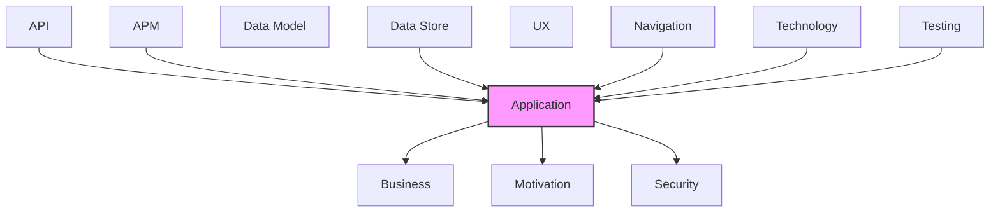

# Application

Application components, services, and interactions.

## Report Index

- [Layer Introduction](#layer-introduction)
- [Intra-Layer Relationships](#intra-layer-relationships)
- [Inter-Layer Dependencies](#inter-layer-dependencies)
- [Inter-Layer Relationships Table](#inter-layer-relationships-table)
- [Element Reference](#element-reference)

## Layer Introduction

| Metric                    | Count |
| ------------------------- | ----- |
| Elements                  | 54    |
| Intra-Layer Relationships | 35    |
| Inter-Layer Relationships | 82    |
| Inbound Relationships     | 28    |
| Outbound Relationships    | 54    |

**Cross-Layer References**:

- **Upstream layers**: [API](./06-api-layer-report.md), [APM](./11-apm-layer-report.md), [Data Store](./08-data-store-layer-report.md), [Navigation](./10-navigation-layer-report.md), [Technology](./05-technology-layer-report.md), [Testing](./12-testing-layer-report.md)
- **Downstream layers**: [Business](./02-business-layer-report.md), [Motivation](./01-motivation-layer-report.md), [Security](./03-security-layer-report.md)

## Intra-Layer Relationships

*This layer has >30 elements. Summary table shown instead of diagram.*

| Element                                                          | Type                   | Relationships |
| ---------------------------------------------------------------- | ---------------------- | ------------- |
| `application.applicationcomponent.dagre-layout-engine`           | `applicationcomponent` | 2             |
| `application.applicationcomponent.elk-layout-engine`             | `applicationcomponent` | 1             |
| `application.applicationcomponent.graph-viewer`                  | `applicationcomponent` | 2             |
| `application.applicationcomponent.layout-engine-registry`        | `applicationcomponent` | 3             |
| `application.applicationfunction.annotation-store`               | `applicationfunction`  | 1             |
| `application.applicationfunction.auth-store`                     | `applicationfunction`  | 3             |
| `application.applicationfunction.changeset-store`                | `applicationfunction`  | 2             |
| `application.applicationfunction.chat-store`                     | `applicationfunction`  | 2             |
| `application.applicationfunction.connection-store`               | `applicationfunction`  | 3             |
| `application.applicationfunction.cross-layer-store`              | `applicationfunction`  | 1             |
| `application.applicationfunction.element-store`                  | `applicationfunction`  | 3             |
| `application.applicationfunction.field-visibility-store`         | `applicationfunction`  | 1             |
| `application.applicationfunction.floating-chat-store`            | `applicationfunction`  | 1             |
| `application.applicationfunction.layer-store`                    | `applicationfunction`  | 1             |
| `application.applicationfunction.layout-preferences-store`       | `applicationfunction`  | 1             |
| `application.applicationfunction.model-store`                    | `applicationfunction`  | 6             |
| `application.applicationfunction.view-preference-store`          | `applicationfunction`  | 1             |
| `application.applicationinterface.dr-cli-rest-interface`         | `applicationinterface` | 2             |
| `application.applicationinterface.dr-cli-web-socket-interface`   | `applicationinterface` | 2             |
| `application.applicationprocess.auth-route`                      | `applicationprocess`   | 2             |
| `application.applicationprocess.changeset-route`                 | `applicationprocess`   | 2             |
| `application.applicationprocess.model-route`                     | `applicationprocess`   | 3             |
| `application.applicationprocess.spec-route`                      | `applicationprocess`   | 0             |
| `application.applicationservice.changeset-graph-builder`         | `applicationservice`   | 0             |
| `application.applicationservice.chat-service`                    | `applicationservice`   | 0             |
| `application.applicationservice.chat-validation`                 | `applicationservice`   | 0             |
| `application.applicationservice.context-sub-graph-builder`       | `applicationservice`   | 1             |
| `application.applicationservice.coverage-analyzer`               | `applicationservice`   | 0             |
| `application.applicationservice.cross-layer-links-extractor`     | `applicationservice`   | 0             |
| `application.applicationservice.cross-layer-processor`           | `applicationservice`   | 0             |
| `application.applicationservice.cross-layer-reference-extractor` | `applicationservice`   | 1             |
| `application.applicationservice.data-loader`                     | `applicationservice`   | 4             |
| `application.applicationservice.embedded-data-loader`            | `applicationservice`   | 1             |
| `application.applicationservice.error-tracker`                   | `applicationservice`   | 0             |
| `application.applicationservice.exception-classifier`            | `applicationservice`   | 0             |
| `application.applicationservice.export-utils`                    | `applicationservice`   | 0             |
| `application.applicationservice.generated-api-client`            | `applicationservice`   | 2             |
| `application.applicationservice.git-hub-service`                 | `applicationservice`   | 0             |
| `application.applicationservice.impact-analysis-service`         | `applicationservice`   | 0             |
| `application.applicationservice.json-rpc-handler`                | `applicationservice`   | 1             |
| `application.applicationservice.json-schema-parser`              | `applicationservice`   | 0             |
| `application.applicationservice.libavoid-router`                 | `applicationservice`   | 0             |
| `application.applicationservice.local-file-loader`               | `applicationservice`   | 0             |
| `application.applicationservice.node-transformer`                | `applicationservice`   | 2             |
| `application.applicationservice.predicate-catalog-loader`        | `applicationservice`   | 1             |
| `application.applicationservice.predicate-type-mapper`           | `applicationservice`   | 1             |
| `application.applicationservice.relationships-yaml-parser`       | `applicationservice`   | 2             |
| `application.applicationservice.spec-context-sub-graph-builder`  | `applicationservice`   | 1             |
| `application.applicationservice.spec-parser`                     | `applicationservice`   | 1             |
| `application.applicationservice.spec-schema-file-loader`         | `applicationservice`   | 2             |
| `application.applicationservice.spec-schema-loader`              | `applicationservice`   | 1             |
| `application.applicationservice.web-socket-client`               | `applicationservice`   | 2             |
| `application.applicationservice.worker-pool`                     | `applicationservice`   | 2             |
| `application.applicationservice.yaml-parser`                     | `applicationservice`   | 0             |

## Inter-Layer Dependencies

## Inter-Layer Relationships Table

| Relationship ID                                                                            | Source Node                                                            | Dest Node                                                        | Dest Layer    | Predicate        | Cardinality  | Strength |
| ------------------------------------------------------------------------------------------ | ---------------------------------------------------------------------- | ---------------------------------------------------------------- | ------------- | ---------------- | ------------ | -------- |
| `13b1a5ff-1cea-4ca0-b557-81f4629f2736-satisfies-6ffaff00-8bf8-4580-98ff-8d2a612a9021`      | `13b1a5ff-1cea-4ca0-b557-81f4629f2736`                                 | `6ffaff00-8bf8-4580-98ff-8d2a612a9021`                           | `motivation`  | `satisfies`      | unknown      | unknown  |
| `16fa387e-b1fd-4daf-9811-c3a0b4fd3d05-realizes-5308e41f-71c9-4ca6-8dfc-11d8b0483ce8`       | `16fa387e-b1fd-4daf-9811-c3a0b4fd3d05`                                 | `5308e41f-71c9-4ca6-8dfc-11d8b0483ce8`                           | `business`    | `realizes`       | unknown      | unknown  |
| `283a8b3d-01cb-4964-b4d0-f04e2df1f2bd-satisfies-1723e358-12bc-460d-ae1d-6d9420128c6a`      | `283a8b3d-01cb-4964-b4d0-f04e2df1f2bd`                                 | `1723e358-12bc-460d-ae1d-6d9420128c6a`                           | `motivation`  | `satisfies`      | unknown      | unknown  |
| `29f33e20-2acf-46e3-9f18-02ebd34fc734-accesses-99380a26-1064-4515-9d15-fec7620549cd`       | `29f33e20-2acf-46e3-9f18-02ebd34fc734`                                 | `99380a26-1064-4515-9d15-fec7620549cd`                           | `business`    | `accesses`       | unknown      | unknown  |
| `29f33e20-2acf-46e3-9f18-02ebd34fc734-realizes-03823476-93f8-4ab4-8c51-cd93bf459ff0`       | `29f33e20-2acf-46e3-9f18-02ebd34fc734`                                 | `03823476-93f8-4ab4-8c51-cd93bf459ff0`                           | `business`    | `realizes`       | unknown      | unknown  |
| `3dee662b-7dc2-4fcc-8677-15a2ba06136e-references-a77489e0-4e1f-42b1-b3e1-b1b534e6e7f8`     | `3dee662b-7dc2-4fcc-8677-15a2ba06136e`                                 | `a77489e0-4e1f-42b1-b3e1-b1b534e6e7f8`                           | `application` | `references`     | unknown      | unknown  |
| `3e532c87-b3b7-4473-bd47-81bfd5de6507-realizes-c4ba5c59-3f4e-49a9-9915-a48049ddb68e`       | `3e532c87-b3b7-4473-bd47-81bfd5de6507`                                 | `c4ba5c59-3f4e-49a9-9915-a48049ddb68e`                           | `business`    | `realizes`       | unknown      | unknown  |
| `406200e9-ef8b-46c9-a1fe-1ff06d6d5602-references-a77489e0-4e1f-42b1-b3e1-b1b534e6e7f8`     | `406200e9-ef8b-46c9-a1fe-1ff06d6d5602`                                 | `a77489e0-4e1f-42b1-b3e1-b1b534e6e7f8`                           | `application` | `references`     | unknown      | unknown  |
| `4d7f0994-8c0d-4148-9eba-a3479a1f8947-realizes-a138ca69-d437-4841-b96f-5fb5dd703380`       | `4d7f0994-8c0d-4148-9eba-a3479a1f8947`                                 | `a138ca69-d437-4841-b96f-5fb5dd703380`                           | `business`    | `realizes`       | unknown      | unknown  |
| `63c97821-401c-40cd-a076-ef84e06f5442-realizes-35295e18-08a8-4ca0-ada3-40a017cb4318`       | `63c97821-401c-40cd-a076-ef84e06f5442`                                 | `35295e18-08a8-4ca0-ada3-40a017cb4318`                           | `business`    | `realizes`       | unknown      | unknown  |
| `6b2f9b1a-bd90-4b1e-9ee2-bed4cbb73a04-realizes-c20e00b6-ef86-415a-92a3-3e9fd9dc7cd6`       | `6b2f9b1a-bd90-4b1e-9ee2-bed4cbb73a04`                                 | `c20e00b6-ef86-415a-92a3-3e9fd9dc7cd6`                           | `business`    | `realizes`       | unknown      | unknown  |
| `6f75bbfc-c13c-4c87-83e5-32f134902391-accesses-76929fbe-36ea-4c4f-80d5-eb054598571b`       | `6f75bbfc-c13c-4c87-83e5-32f134902391`                                 | `76929fbe-36ea-4c4f-80d5-eb054598571b`                           | `security`    | `accesses`       | unknown      | unknown  |
| `6f75bbfc-c13c-4c87-83e5-32f134902391-constrained-by-f502d58f-1a96-44d5-8fb8-c7e5e67f3f0d` | `6f75bbfc-c13c-4c87-83e5-32f134902391`                                 | `f502d58f-1a96-44d5-8fb8-c7e5e67f3f0d`                           | `security`    | `constrained-by` | unknown      | unknown  |
| `6f75bbfc-c13c-4c87-83e5-32f134902391-mitigates-e15b6b69-cc67-4ab9-a3f9-566de56b4804`      | `6f75bbfc-c13c-4c87-83e5-32f134902391`                                 | `e15b6b69-cc67-4ab9-a3f9-566de56b4804`                           | `security`    | `mitigates`      | unknown      | unknown  |
| `6f75bbfc-c13c-4c87-83e5-32f134902391-realizes-35295e18-08a8-4ca0-ada3-40a017cb4318`       | `6f75bbfc-c13c-4c87-83e5-32f134902391`                                 | `35295e18-08a8-4ca0-ada3-40a017cb4318`                           | `business`    | `realizes`       | unknown      | unknown  |
| `6f75bbfc-c13c-4c87-83e5-32f134902391-serves-fb417c37-45b0-460f-80bb-4782d6c1a11a`         | `6f75bbfc-c13c-4c87-83e5-32f134902391`                                 | `fb417c37-45b0-460f-80bb-4782d6c1a11a`                           | `business`    | `serves`         | unknown      | unknown  |
| `80e6c89f-70ba-4183-909f-0457abdf9fa7-realizes-35295e18-08a8-4ca0-ada3-40a017cb4318`       | `80e6c89f-70ba-4183-909f-0457abdf9fa7`                                 | `35295e18-08a8-4ca0-ada3-40a017cb4318`                           | `business`    | `realizes`       | unknown      | unknown  |
| `8630981b-236c-47ed-b99b-e977c56bdc63-realizes-71f9eb72-20e1-4ae6-be30-425c11e59edb`       | `8630981b-236c-47ed-b99b-e977c56bdc63`                                 | `71f9eb72-20e1-4ae6-be30-425c11e59edb`                           | `application` | `realizes`       | unknown      | unknown  |
| `8630981b-236c-47ed-b99b-e977c56bdc63-references-a77489e0-4e1f-42b1-b3e1-b1b534e6e7f8`     | `8630981b-236c-47ed-b99b-e977c56bdc63`                                 | `a77489e0-4e1f-42b1-b3e1-b1b534e6e7f8`                           | `application` | `references`     | unknown      | unknown  |
| `a5342d6f-daf4-4a6e-a98b-7fada2561798-accesses-ffa6bf4a-5281-402f-90d8-a895173fc4ba`       | `a5342d6f-daf4-4a6e-a98b-7fada2561798`                                 | `ffa6bf4a-5281-402f-90d8-a895173fc4ba`                           | `business`    | `accesses`       | unknown      | unknown  |
| `a5342d6f-daf4-4a6e-a98b-7fada2561798-realizes-35295e18-08a8-4ca0-ada3-40a017cb4318`       | `a5342d6f-daf4-4a6e-a98b-7fada2561798`                                 | `35295e18-08a8-4ca0-ada3-40a017cb4318`                           | `business`    | `realizes`       | unknown      | unknown  |
| `a5342d6f-daf4-4a6e-a98b-7fada2561798-satisfies-9fe1281a-2547-416f-872f-38e1b066db15`      | `a5342d6f-daf4-4a6e-a98b-7fada2561798`                                 | `9fe1281a-2547-416f-872f-38e1b066db15`                           | `motivation`  | `satisfies`      | unknown      | unknown  |
| `a5342d6f-daf4-4a6e-a98b-7fada2561798-serves-a138ca69-d437-4841-b96f-5fb5dd703380`         | `a5342d6f-daf4-4a6e-a98b-7fada2561798`                                 | `a138ca69-d437-4841-b96f-5fb5dd703380`                           | `business`    | `serves`         | unknown      | unknown  |
| `a77489e0-4e1f-42b1-b3e1-b1b534e6e7f8-accesses-ea84399d-45dc-4fef-a5a1-759c9b5b5870`       | `a77489e0-4e1f-42b1-b3e1-b1b534e6e7f8`                                 | `ea84399d-45dc-4fef-a5a1-759c9b5b5870`                           | `business`    | `accesses`       | unknown      | unknown  |
| `a77489e0-4e1f-42b1-b3e1-b1b534e6e7f8-realizes-35295e18-08a8-4ca0-ada3-40a017cb4318`       | `a77489e0-4e1f-42b1-b3e1-b1b534e6e7f8`                                 | `35295e18-08a8-4ca0-ada3-40a017cb4318`                           | `business`    | `realizes`       | unknown      | unknown  |
| `a77489e0-4e1f-42b1-b3e1-b1b534e6e7f8-requires-a47870bf-898b-425f-9f73-92663193355a`       | `a77489e0-4e1f-42b1-b3e1-b1b534e6e7f8`                                 | `a47870bf-898b-425f-9f73-92663193355a`                           | `security`    | `requires`       | unknown      | unknown  |
| `a920ab1c-c481-46b6-bdb4-4050501adeac-realizes-e642ad79-62ea-47a4-ae04-d512d0ef7881`       | `a920ab1c-c481-46b6-bdb4-4050501adeac`                                 | `e642ad79-62ea-47a4-ae04-d512d0ef7881`                           | `business`    | `realizes`       | unknown      | unknown  |
| `a920ab1c-c481-46b6-bdb4-4050501adeac-serves-c20e00b6-ef86-415a-92a3-3e9fd9dc7cd6`         | `a920ab1c-c481-46b6-bdb4-4050501adeac`                                 | `c20e00b6-ef86-415a-92a3-3e9fd9dc7cd6`                           | `business`    | `serves`         | unknown      | unknown  |
| `api.openapidocument.serves.application.applicationcomponent`                              | `api.openapidocument.dr-cli-visualization-server-open-api-document`    | `application.applicationcomponent.graph-viewer`                  | `application` | `serves`         | many-to-many | medium   |
| `apm.instrumentationconfig.monitors.application.applicationcomponent`                      | `apm.instrumentationconfig.browser-error-instrumentation`              | `application.applicationcomponent.graph-viewer`                  | `application` | `monitors`       | many-to-many | medium   |
| `apm.metricinstrument.monitors.application.applicationservice`                             | `apm.metricinstrument.chat-api-token-usage-counter`                    | `application.applicationservice.chat-service`                    | `application` | `monitors`       | many-to-many | medium   |
| `apm.metricinstrument.monitors.application.applicationcomponent`                           | `apm.metricinstrument.graph-node-render-histogram`                     | `application.applicationcomponent.graph-viewer`                  | `application` | `monitors`       | many-to-many | medium   |
| `apm.metricinstrument.monitors.application.applicationservice`                             | `apm.metricinstrument.web-socket-reconnection-attempt-counter`         | `application.applicationservice.web-socket-client`               | `application` | `monitors`       | many-to-many | medium   |
| `application.applicationprocess.realizes.business.businessprocess`                         | `application.applicationprocess.spec-route`                            | `business.businessprocess.model-loading-and-rendering`           | `business`    | `realizes`       | many-to-many | medium   |
| `application.applicationservice.serves.business.businessprocess`                           | `application.applicationservice.changeset-graph-builder`               | `business.businessprocess.changeset-review-flow`                 | `business`    | `serves`         | many-to-many | medium   |
| `application.applicationservice.realizes.business.businessservice`                         | `application.applicationservice.chat-validation`                       | `business.businessservice.ai-assisted-architecture-chat`         | `business`    | `realizes`       | many-to-many | medium   |
| `application.applicationservice.realizes.business.businessservice`                         | `application.applicationservice.context-sub-graph-builder`             | `business.businessservice.architecture-model-visualization`      | `business`    | `realizes`       | many-to-many | medium   |
| `application.applicationservice.serves.business.businessprocess`                           | `application.applicationservice.coverage-analyzer`                     | `business.businessprocess.model-loading-and-rendering`           | `business`    | `serves`         | many-to-many | medium   |
| `application.applicationservice.realizes.business.businessservice`                         | `application.applicationservice.cross-layer-links-extractor`           | `business.businessservice.architecture-model-visualization`      | `business`    | `realizes`       | many-to-many | medium   |
| `application.applicationservice.realizes.business.businessservice`                         | `application.applicationservice.cross-layer-processor`                 | `business.businessservice.architecture-model-visualization`      | `business`    | `realizes`       | many-to-many | medium   |
| `application.applicationservice.realizes.business.businessservice`                         | `application.applicationservice.cross-layer-reference-extractor`       | `business.businessservice.architecture-model-visualization`      | `business`    | `realizes`       | many-to-many | medium   |
| `application.applicationservice.serves.business.businessprocess`                           | `application.applicationservice.data-loader`                           | `business.businessprocess.model-loading-and-rendering`           | `business`    | `serves`         | many-to-many | medium   |
| `application.applicationservice.serves.business.businessprocess`                           | `application.applicationservice.embedded-data-loader`                  | `business.businessprocess.model-loading-and-rendering`           | `business`    | `serves`         | many-to-many | medium   |
| `application.applicationservice.serves.business.businessprocess`                           | `application.applicationservice.error-tracker`                         | `business.businessprocess.model-loading-and-rendering`           | `business`    | `serves`         | many-to-many | medium   |
| `application.applicationservice.serves.business.businessprocess`                           | `application.applicationservice.exception-classifier`                  | `business.businessprocess.model-loading-and-rendering`           | `business`    | `serves`         | many-to-many | medium   |
| `application.applicationservice.realizes.business.businessservice`                         | `application.applicationservice.export-utils`                          | `business.businessservice.architecture-model-visualization`      | `business`    | `realizes`       | many-to-many | medium   |
| `application.applicationservice.realizes.business.businessservice`                         | `application.applicationservice.git-hub-service`                       | `business.businessservice.model-annotation`                      | `business`    | `realizes`       | many-to-many | medium   |
| `application.applicationservice.realizes.business.businessservice`                         | `application.applicationservice.impact-analysis-service`               | `business.businessservice.changeset-review`                      | `business`    | `realizes`       | many-to-many | medium   |
| `application.applicationservice.serves.business.businessprocess`                           | `application.applicationservice.json-rpc-handler`                      | `business.businessprocess.real-time-model-synchronization`       | `business`    | `serves`         | many-to-many | medium   |
| `application.applicationservice.realizes.business.businessservice`                         | `application.applicationservice.json-schema-parser`                    | `business.businessservice.architecture-model-visualization`      | `business`    | `realizes`       | many-to-many | medium   |
| `application.applicationservice.realizes.business.businessservice`                         | `application.applicationservice.libavoid-router`                       | `business.businessservice.architecture-model-visualization`      | `business`    | `realizes`       | many-to-many | medium   |
| `application.applicationservice.realizes.business.businessservice`                         | `application.applicationservice.local-file-loader`                     | `business.businessservice.architecture-model-visualization`      | `business`    | `realizes`       | many-to-many | medium   |
| `application.applicationservice.serves.business.businessprocess`                           | `application.applicationservice.node-transformer`                      | `business.businessprocess.model-loading-and-rendering`           | `business`    | `serves`         | many-to-many | medium   |
| `application.applicationservice.realizes.business.businessservice`                         | `application.applicationservice.spec-context-sub-graph-builder`        | `business.businessservice.schema-exploration`                    | `business`    | `realizes`       | many-to-many | medium   |
| `application.applicationservice.realizes.business.businessservice`                         | `application.applicationservice.spec-parser`                           | `business.businessservice.schema-exploration`                    | `business`    | `realizes`       | many-to-many | medium   |
| `application.applicationservice.serves.business.businessprocess`                           | `application.applicationservice.web-socket-client`                     | `business.businessprocess.real-time-model-synchronization`       | `business`    | `serves`         | many-to-many | medium   |
| `application.applicationservice.realizes.business.businessservice`                         | `application.applicationservice.yaml-parser`                           | `business.businessservice.architecture-model-visualization`      | `business`    | `realizes`       | many-to-many | medium   |
| `b4784daf-706d-4f78-b522-165057df8110-realizes-5308e41f-71c9-4ca6-8dfc-11d8b0483ce8`       | `b4784daf-706d-4f78-b522-165057df8110`                                 | `5308e41f-71c9-4ca6-8dfc-11d8b0483ce8`                           | `business`    | `realizes`       | unknown      | unknown  |
| `b66b613e-27b6-4d90-909f-3aa81570de15-references-b7775f1a-2418-4c7a-84aa-997efd658a97`     | `b66b613e-27b6-4d90-909f-3aa81570de15`                                 | `b7775f1a-2418-4c7a-84aa-997efd658a97`                           | `application` | `references`     | unknown      | unknown  |
| `b7775f1a-2418-4c7a-84aa-997efd658a97-realizes-35295e18-08a8-4ca0-ada3-40a017cb4318`       | `b7775f1a-2418-4c7a-84aa-997efd658a97`                                 | `35295e18-08a8-4ca0-ada3-40a017cb4318`                           | `business`    | `realizes`       | unknown      | unknown  |
| `b7775f1a-2418-4c7a-84aa-997efd658a97-requires-a47870bf-898b-425f-9f73-92663193355a`       | `b7775f1a-2418-4c7a-84aa-997efd658a97`                                 | `a47870bf-898b-425f-9f73-92663193355a`                           | `security`    | `requires`       | unknown      | unknown  |
| `b7775f1a-2418-4c7a-84aa-997efd658a97-serves-83c81f34-4376-4ff9-8fb4-98f3ecbc6d68`         | `b7775f1a-2418-4c7a-84aa-997efd658a97`                                 | `83c81f34-4376-4ff9-8fb4-98f3ecbc6d68`                           | `business`    | `serves`         | unknown      | unknown  |
| `data-store.collection.serves.application.applicationcomponent`                            | `data-store.collection.auth-token-entry`                               | `application.applicationcomponent.graph-viewer`                  | `application` | `serves`         | many-to-many | medium   |
| `data-store.collection.serves.application.applicationcomponent`                            | `data-store.collection.layer-yaml-files`                               | `application.applicationcomponent.graph-viewer`                  | `application` | `serves`         | many-to-many | medium   |
| `data-store.collection.serves.application.applicationcomponent`                            | `data-store.collection.model-manifest`                                 | `application.applicationcomponent.graph-viewer`                  | `application` | `serves`         | many-to-many | medium   |
| `dc2da0b6-3de0-44d1-840f-5d49cc976cd9-references-b4784daf-706d-4f78-b522-165057df8110`     | `dc2da0b6-3de0-44d1-840f-5d49cc976cd9`                                 | `b4784daf-706d-4f78-b522-165057df8110`                           | `application` | `references`     | unknown      | unknown  |
| `dfc6509e-98f5-479a-bfe9-14bfddbb838a-realizes-3b08f432-72aa-4df6-978c-d76d3312f72b`       | `dfc6509e-98f5-479a-bfe9-14bfddbb838a`                                 | `3b08f432-72aa-4df6-978c-d76d3312f72b`                           | `application` | `realizes`       | unknown      | unknown  |
| `dfc6509e-98f5-479a-bfe9-14bfddbb838a-references-a5342d6f-daf4-4a6e-a98b-7fada2561798`     | `dfc6509e-98f5-479a-bfe9-14bfddbb838a`                                 | `a5342d6f-daf4-4a6e-a98b-7fada2561798`                           | `application` | `references`     | unknown      | unknown  |
| `e067f83f-1f31-44d7-a5d0-86059f8beb9f-references-29f33e20-2acf-46e3-9f18-02ebd34fc734`     | `e067f83f-1f31-44d7-a5d0-86059f8beb9f`                                 | `29f33e20-2acf-46e3-9f18-02ebd34fc734`                           | `application` | `references`     | unknown      | unknown  |
| `f952fcc0-7c42-4586-a306-a5f2f94a3068-realizes-f1edef84-1298-486c-b347-f47c3b0f9712`       | `f952fcc0-7c42-4586-a306-a5f2f94a3068`                                 | `f1edef84-1298-486c-b347-f47c3b0f9712`                           | `application` | `realizes`       | unknown      | unknown  |
| `f952fcc0-7c42-4586-a306-a5f2f94a3068-references-29f33e20-2acf-46e3-9f18-02ebd34fc734`     | `f952fcc0-7c42-4586-a306-a5f2f94a3068`                                 | `29f33e20-2acf-46e3-9f18-02ebd34fc734`                           | `application` | `references`     | unknown      | unknown  |
| `fbd68c51-36fa-48ef-b381-5599d2678a90-serves-83c81f34-4376-4ff9-8fb4-98f3ecbc6d68`         | `fbd68c51-36fa-48ef-b381-5599d2678a90`                                 | `83c81f34-4376-4ff9-8fb4-98f3ecbc6d68`                           | `business`    | `serves`         | unknown      | unknown  |
| `fd2f4ab4-7477-4ec5-aac4-37aa1d78af4c-realizes-35295e18-08a8-4ca0-ada3-40a017cb4318`       | `fd2f4ab4-7477-4ec5-aac4-37aa1d78af4c`                                 | `35295e18-08a8-4ca0-ada3-40a017cb4318`                           | `business`    | `realizes`       | unknown      | unknown  |
| `ff16c609-618e-4dd9-b477-12e17c000df8-realizes-71f9eb72-20e1-4ae6-be30-425c11e59edb`       | `ff16c609-618e-4dd9-b477-12e17c000df8`                                 | `71f9eb72-20e1-4ae6-be30-425c11e59edb`                           | `application` | `realizes`       | unknown      | unknown  |
| `ff16c609-618e-4dd9-b477-12e17c000df8-references-a77489e0-4e1f-42b1-b3e1-b1b534e6e7f8`     | `ff16c609-618e-4dd9-b477-12e17c000df8`                                 | `a77489e0-4e1f-42b1-b3e1-b1b534e6e7f8`                           | `application` | `references`     | unknown      | unknown  |
| `navigation.navigationflow.realizes.application.applicationprocess`                        | `navigation.navigationflow.authentication-to-model-flow`               | `application.applicationprocess.auth-route`                      | `application` | `realizes`       | many-to-many | medium   |
| `technology.systemsoftware.serves.application.applicationcomponent`                        | `technology.systemsoftware.tailwind-css-v4`                            | `application.applicationcomponent.graph-viewer`                  | `application` | `serves`         | many-to-many | medium   |
| `testing.testcoveragetarget.tests.application.applicationcomponent`                        | `testing.testcoveragetarget.auth-flow-e2e-test-coverage`               | `application.applicationcomponent.graph-viewer`                  | `application` | `tests`          | many-to-many | medium   |
| `testing.testcoveragetarget.covers.application.applicationservice`                         | `testing.testcoveragetarget.cross-component-integration-test-coverage` | `application.applicationservice.cross-layer-reference-extractor` | `application` | `covers`         | many-to-many | medium   |
| `testing.testcoveragetarget.tests.application.applicationcomponent`                        | `testing.testcoveragetarget.embedded-app-e2e-test-coverage`            | `application.applicationcomponent.graph-viewer`                  | `application` | `tests`          | many-to-many | medium   |
| `testing.testcoveragetarget.covers.application.applicationservice`                         | `testing.testcoveragetarget.service-and-store-unit-test-coverage`      | `application.applicationservice.data-loader`                     | `application` | `covers`         | many-to-many | medium   |
| `testing.testcoveragetarget.covers.application.applicationservice`                         | `testing.testcoveragetarget.web-socket-recovery-test-coverage`         | `application.applicationservice.web-socket-client`               | `application` | `covers`         | many-to-many | medium   |

## Element Reference

### Dagre Layout Engine {#dagre-layout-engine}

**ID**: `application.applicationcomponent.dagre-layout-engine`

**Type**: `applicationcomponent`

Adapts the Dagre hierarchical layout algorithm to the React Flow node/edge format; implements the LayoutEngine interface

#### Attributes

| Name | Value    |
| ---- | -------- |
| type | internal |

#### Relationships

| Type        | Related Element                                           | Predicate  | Direction |
| ----------- | --------------------------------------------------------- | ---------- | --------- |
| intra-layer | `application.applicationservice.worker-pool`              | `realizes` | outbound  |
| intra-layer | `application.applicationcomponent.layout-engine-registry` | `uses`     | inbound   |

### ELK Layout Engine {#elk-layout-engine}

**ID**: `application.applicationcomponent.elk-layout-engine`

**Type**: `applicationcomponent`

Adapts the Eclipse Layout Kernel (ELK) to React Flow; supports layered, force, stress, and tree algorithms

#### Attributes

| Name | Value    |
| ---- | -------- |
| type | internal |

#### Relationships

| Type        | Related Element                              | Predicate  | Direction |
| ----------- | -------------------------------------------- | ---------- | --------- |
| intra-layer | `application.applicationservice.worker-pool` | `realizes` | outbound  |

### Graph Viewer {#graph-viewer}

**ID**: `application.applicationcomponent.graph-viewer`

**Type**: `applicationcomponent`

The primary React Flow canvas component; renders all architecture nodes and edges with pan/zoom, minimap, and SpaceMouse support

#### Attributes

| Name | Value    |
| ---- | -------- |
| type | internal |

#### Relationships

| Type        | Related Element                                                     | Predicate  | Direction |
| ----------- | ------------------------------------------------------------------- | ---------- | --------- |
| inter-layer | `api.openapidocument.dr-cli-visualization-server-open-api-document` | `serves`   | inbound   |
| inter-layer | `apm.instrumentationconfig.browser-error-instrumentation`           | `monitors` | inbound   |
| inter-layer | `apm.metricinstrument.graph-node-render-histogram`                  | `monitors` | inbound   |
| inter-layer | `data-store.collection.auth-token-entry`                            | `serves`   | inbound   |
| inter-layer | `data-store.collection.layer-yaml-files`                            | `serves`   | inbound   |
| inter-layer | `data-store.collection.model-manifest`                              | `serves`   | inbound   |
| inter-layer | `technology.systemsoftware.tailwind-css-v4`                         | `serves`   | inbound   |
| inter-layer | `testing.testcoveragetarget.auth-flow-e2e-test-coverage`            | `tests`    | inbound   |
| inter-layer | `testing.testcoveragetarget.embedded-app-e2e-test-coverage`         | `tests`    | inbound   |
| intra-layer | `application.applicationservice.node-transformer`                   | `realizes` | outbound  |
| intra-layer | `application.applicationcomponent.layout-engine-registry`           | `uses`     | outbound  |

### Layout Engine Registry {#layout-engine-registry}

**ID**: `application.applicationcomponent.layout-engine-registry`

**Type**: `applicationcomponent`

Central registry that resolves layout algorithm by name and orchestrates layout computation across engines

#### Attributes

| Name | Value    |
| ---- | -------- |
| type | internal |

#### Relationships

| Type        | Related Element                                        | Predicate  | Direction |
| ----------- | ------------------------------------------------------ | ---------- | --------- |
| intra-layer | `application.applicationcomponent.graph-viewer`        | `uses`     | inbound   |
| intra-layer | `application.applicationservice.data-loader`           | `realizes` | outbound  |
| intra-layer | `application.applicationcomponent.dagre-layout-engine` | `uses`     | outbound  |

### Annotation Store {#annotation-store}

**ID**: `application.applicationfunction.annotation-store`

**Type**: `applicationfunction`

Zustand store managing user annotations on model elements; syncs with DR CLI server via REST API

#### Relationships

| Type        | Related Element                              | Predicate    | Direction |
| ----------- | -------------------------------------------- | ------------ | --------- |
| intra-layer | `application.applicationfunction.auth-store` | `depends-on` | outbound  |

### Auth Store {#auth-store}

**ID**: `application.applicationfunction.auth-store`

**Type**: `applicationfunction`

Zustand store managing the DR CLI auth token, authentication state, and magic-link token extraction

#### Relationships

| Type        | Related Element                                       | Predicate        | Direction |
| ----------- | ----------------------------------------------------- | ---------------- | --------- |
| intra-layer | `application.applicationfunction.annotation-store`    | `depends-on`     | inbound   |
| intra-layer | `application.applicationservice.generated-api-client` | `delivers-value` | outbound  |
| intra-layer | `application.applicationprocess.auth-route`           | `depends-on`     | inbound   |

### Changeset Store {#changeset-store}

**ID**: `application.applicationfunction.changeset-store`

**Type**: `applicationfunction`

Zustand store managing the active changeset list, selected changeset, and changeset diff state

#### Relationships

| Type        | Related Element                                    | Predicate    | Direction |
| ----------- | -------------------------------------------------- | ------------ | --------- |
| intra-layer | `application.applicationfunction.connection-store` | `depends-on` | outbound  |
| intra-layer | `application.applicationprocess.changeset-route`   | `depends-on` | inbound   |

### Chat Store {#chat-store}

**ID**: `application.applicationfunction.chat-store`

**Type**: `applicationfunction`

Zustand store managing chat conversation history, streaming state, and active tool invocations for the AI assistant

#### Relationships

| Type        | Related Element                                       | Predicate    | Direction |
| ----------- | ----------------------------------------------------- | ------------ | --------- |
| intra-layer | `application.applicationfunction.connection-store`    | `depends-on` | outbound  |
| intra-layer | `application.applicationfunction.floating-chat-store` | `depends-on` | inbound   |

### Connection Store {#connection-store}

**ID**: `application.applicationfunction.connection-store`

**Type**: `applicationfunction`

Zustand store tracking WebSocket connection state (connected/disconnected/reconnecting) to the DR CLI server

#### Relationships

| Type        | Related Element                                    | Predicate        | Direction |
| ----------- | -------------------------------------------------- | ---------------- | --------- |
| intra-layer | `application.applicationfunction.changeset-store`  | `depends-on`     | inbound   |
| intra-layer | `application.applicationfunction.chat-store`       | `depends-on`     | inbound   |
| intra-layer | `application.applicationservice.web-socket-client` | `delivers-value` | outbound  |

### Cross-Layer Store {#cross-layer-store}

**ID**: `application.applicationfunction.cross-layer-store`

**Type**: `applicationfunction`

Zustand store holding resolved cross-layer references and edge data for the graph

#### Relationships

| Type        | Related Element                               | Predicate    | Direction |
| ----------- | --------------------------------------------- | ------------ | --------- |
| intra-layer | `application.applicationfunction.model-store` | `depends-on` | outbound  |

### Element Store {#element-store}

**ID**: `application.applicationfunction.element-store`

**Type**: `applicationfunction`

Zustand store tracking selected element, highlighted paths, and focus mode state

#### Relationships

| Type        | Related Element                                          | Predicate    | Direction |
| ----------- | -------------------------------------------------------- | ------------ | --------- |
| intra-layer | `application.applicationfunction.model-store`            | `depends-on` | outbound  |
| intra-layer | `application.applicationfunction.field-visibility-store` | `depends-on` | inbound   |
| intra-layer | `application.applicationfunction.view-preference-store`  | `depends-on` | inbound   |

### Field Visibility Store {#field-visibility-store}

**ID**: `application.applicationfunction.field-visibility-store`

**Type**: `applicationfunction`

Zustand store managing graph-level and node-level field visibility toggles

#### Relationships

| Type        | Related Element                                 | Predicate    | Direction |
| ----------- | ----------------------------------------------- | ------------ | --------- |
| intra-layer | `application.applicationfunction.element-store` | `depends-on` | outbound  |

### Floating Chat Store {#floating-chat-store}

**ID**: `application.applicationfunction.floating-chat-store`

**Type**: `applicationfunction`

Zustand store managing the floating chat panel open/close state and panel position

#### Relationships

| Type        | Related Element                              | Predicate    | Direction |
| ----------- | -------------------------------------------- | ------------ | --------- |
| intra-layer | `application.applicationfunction.chat-store` | `depends-on` | outbound  |

### Layer Store {#layer-store}

**ID**: `application.applicationfunction.layer-store`

**Type**: `applicationfunction`

Zustand store managing active layer selection and layer visibility filters

#### Relationships

| Type        | Related Element                               | Predicate    | Direction |
| ----------- | --------------------------------------------- | ------------ | --------- |
| intra-layer | `application.applicationfunction.model-store` | `depends-on` | outbound  |

### Layout Preferences Store {#layout-preferences-store}

**ID**: `application.applicationfunction.layout-preferences-store`

**Type**: `applicationfunction`

Zustand store persisting user layout algorithm preferences and layout configuration options

#### Relationships

| Type        | Related Element                               | Predicate    | Direction |
| ----------- | --------------------------------------------- | ------------ | --------- |
| intra-layer | `application.applicationfunction.model-store` | `depends-on` | outbound  |

### Model Store {#model-store}

**ID**: `application.applicationfunction.model-store`

**Type**: `applicationfunction`

Global Zustand store holding the parsed architecture model, loading state, and error state

#### Relationships

| Type        | Related Element                                            | Predicate        | Direction |
| ----------- | ---------------------------------------------------------- | ---------------- | --------- |
| intra-layer | `application.applicationfunction.cross-layer-store`        | `depends-on`     | inbound   |
| intra-layer | `application.applicationfunction.element-store`            | `depends-on`     | inbound   |
| intra-layer | `application.applicationfunction.layer-store`              | `depends-on`     | inbound   |
| intra-layer | `application.applicationfunction.layout-preferences-store` | `depends-on`     | inbound   |
| intra-layer | `application.applicationservice.data-loader`               | `delivers-value` | outbound  |
| intra-layer | `application.applicationprocess.model-route`               | `depends-on`     | inbound   |

### View Preference Store {#view-preference-store}

**ID**: `application.applicationfunction.view-preference-store`

**Type**: `applicationfunction`

Zustand store persisting view mode preferences (graph vs. details, sidebar visibility, zoom level)

#### Relationships

| Type        | Related Element                                 | Predicate    | Direction |
| ----------- | ----------------------------------------------- | ------------ | --------- |
| intra-layer | `application.applicationfunction.element-store` | `depends-on` | outbound  |

### DR CLI REST Interface {#dr-cli-rest-interface}

**ID**: `application.applicationinterface.dr-cli-rest-interface`

**Type**: `applicationinterface`

The HTTP REST interface through which the embedded app communicates with the DR CLI visualization server

#### Attributes

| Name     | Value |
| -------- | ----- |
| protocol | REST  |

#### Relationships

| Type        | Related Element                                       | Predicate    | Direction |
| ----------- | ----------------------------------------------------- | ------------ | --------- |
| intra-layer | `application.applicationservice.generated-api-client` | `depends-on` | outbound  |
| intra-layer | `application.applicationservice.data-loader`          | `serves`     | outbound  |

### DR CLI WebSocket Interface {#dr-cli-websocket-interface}

**ID**: `application.applicationinterface.dr-cli-web-socket-interface`

**Type**: `applicationinterface`

The WebSocket interface for subscribing to real-time model/changeset/annotation update events

#### Attributes

| Name     | Value     |
| -------- | --------- |
| protocol | WebSocket |

#### Relationships

| Type        | Related Element                                    | Predicate    | Direction |
| ----------- | -------------------------------------------------- | ------------ | --------- |
| intra-layer | `application.applicationservice.web-socket-client` | `depends-on` | outbound  |
| intra-layer | `application.applicationservice.json-rpc-handler`  | `serves`     | outbound  |

### Auth Route {#auth-route}

**ID**: `application.applicationprocess.auth-route`

**Type**: `applicationprocess`

TanStack Router route handling token-based authentication via magic link; extracts token from URL query params

#### Relationships

| Type        | Related Element                                          | Predicate    | Direction |
| ----------- | -------------------------------------------------------- | ------------ | --------- |
| inter-layer | `navigation.navigationflow.authentication-to-model-flow` | `realizes`   | inbound   |
| intra-layer | `application.applicationfunction.auth-store`             | `depends-on` | outbound  |
| intra-layer | `application.applicationprocess.model-route`             | `flows-to`   | outbound  |

### Changeset Route {#changeset-route}

**ID**: `application.applicationprocess.changeset-route`

**Type**: `applicationprocess`

TanStack Router route displaying changeset history, diff views, and changeset graph visualization

#### Relationships

| Type        | Related Element                                   | Predicate    | Direction |
| ----------- | ------------------------------------------------- | ------------ | --------- |
| intra-layer | `application.applicationfunction.changeset-store` | `depends-on` | outbound  |
| intra-layer | `application.applicationprocess.model-route`      | `flows-to`   | inbound   |

### Model Route {#model-route}

**ID**: `application.applicationprocess.model-route`

**Type**: `applicationprocess`

TanStack Router route that renders the main architecture model graph visualization with layer selection and cross-layer navigation

#### Relationships

| Type        | Related Element                                  | Predicate    | Direction |
| ----------- | ------------------------------------------------ | ------------ | --------- |
| intra-layer | `application.applicationprocess.auth-route`      | `flows-to`   | inbound   |
| intra-layer | `application.applicationfunction.model-store`    | `depends-on` | outbound  |
| intra-layer | `application.applicationprocess.changeset-route` | `flows-to`   | outbound  |

### Spec Route {#spec-route}

**ID**: `application.applicationprocess.spec-route`

**Type**: `applicationprocess`

TanStack Router route rendering the JSON Schema spec browser with layer schema navigation

#### Relationships

| Type        | Related Element                                        | Predicate  | Direction |
| ----------- | ------------------------------------------------------ | ---------- | --------- |
| inter-layer | `business.businessprocess.model-loading-and-rendering` | `realizes` | outbound  |

### Changeset Graph Builder {#changeset-graph-builder}

**ID**: `application.applicationservice.changeset-graph-builder`

**Type**: `applicationservice`

Transforms changeset diff data into React Flow graph nodes and edges for visual changeset review

#### Attributes

| Name        | Value       |
| ----------- | ----------- |
| serviceType | synchronous |

#### Relationships

| Type        | Related Element                                  | Predicate | Direction |
| ----------- | ------------------------------------------------ | --------- | --------- |
| inter-layer | `business.businessprocess.changeset-review-flow` | `serves`  | outbound  |

### Chat Service {#chat-service}

**ID**: `application.applicationservice.chat-service`

**Type**: `applicationservice`

Interfaces with the Claude AI API to provide architectural assistant chat functionality; manages message streaming and tool invocations

#### Attributes

| Name        | Value        |
| ----------- | ------------ |
| serviceType | asynchronous |

#### Relationships

| Type        | Related Element                                     | Predicate  | Direction |
| ----------- | --------------------------------------------------- | ---------- | --------- |
| inter-layer | `apm.metricinstrument.chat-api-token-usage-counter` | `monitors` | inbound   |

### Chat Validation {#chat-validation}

**ID**: `application.applicationservice.chat-validation`

**Type**: `applicationservice`

Validates chat message content and enforces conversation constraints before submission

#### Attributes

| Name        | Value       |
| ----------- | ----------- |
| serviceType | synchronous |

#### Relationships

| Type        | Related Element                                          | Predicate  | Direction |
| ----------- | -------------------------------------------------------- | ---------- | --------- |
| inter-layer | `business.businessservice.ai-assisted-architecture-chat` | `realizes` | outbound  |

### Context Sub-Graph Builder {#context-sub-graph-builder}

**ID**: `application.applicationservice.context-sub-graph-builder`

**Type**: `applicationservice`

Builds 1-hop neighborhood sub-graphs for a given focal node using radial layout; powers the node focus/context view in the embedded application

#### Attributes

| Name        | Value       |
| ----------- | ----------- |
| serviceType | synchronous |

#### Relationships

| Type        | Related Element                                             | Predicate    | Direction |
| ----------- | ----------------------------------------------------------- | ------------ | --------- |
| inter-layer | `business.businessservice.architecture-model-visualization` | `realizes`   | outbound  |
| intra-layer | `application.applicationservice.node-transformer`           | `depends-on` | outbound  |

### Coverage Analyzer {#coverage-analyzer}

**ID**: `application.applicationservice.coverage-analyzer`

**Type**: `applicationservice`

Analyzes model completeness by comparing element counts and relationship coverage against expected patterns

#### Attributes

| Name        | Value       |
| ----------- | ----------- |
| serviceType | synchronous |

#### Relationships

| Type        | Related Element                                        | Predicate | Direction |
| ----------- | ------------------------------------------------------ | --------- | --------- |
| inter-layer | `business.businessprocess.model-loading-and-rendering` | `serves`  | outbound  |

### Cross-Layer Links Extractor {#cross-layer-links-extractor}

**ID**: `application.applicationservice.cross-layer-links-extractor`

**Type**: `applicationservice`

Extracts implicit link relationships between layers from element attribute patterns

#### Attributes

| Name        | Value       |
| ----------- | ----------- |
| serviceType | synchronous |

#### Relationships

| Type        | Related Element                                             | Predicate  | Direction |
| ----------- | ----------------------------------------------------------- | ---------- | --------- |
| inter-layer | `business.businessservice.architecture-model-visualization` | `realizes` | outbound  |

### Cross-Layer Processor {#cross-layer-processor}

**ID**: `application.applicationservice.cross-layer-processor`

**Type**: `applicationservice`

Resolves and validates cross-layer references; builds the edge list connecting nodes across different architecture layers

#### Attributes

| Name        | Value       |
| ----------- | ----------- |
| serviceType | synchronous |

#### Relationships

| Type        | Related Element                                             | Predicate  | Direction |
| ----------- | ----------------------------------------------------------- | ---------- | --------- |
| inter-layer | `business.businessservice.architecture-model-visualization` | `realizes` | outbound  |

### Cross-Layer Reference Extractor {#cross-layer-reference-extractor}

**ID**: `application.applicationservice.cross-layer-reference-extractor`

**Type**: `applicationservice`

Extracts cross-layer reference declarations from YAML element attributes across all layers

#### Attributes

| Name        | Value       |
| ----------- | ----------- |
| serviceType | synchronous |

#### Relationships

| Type        | Related Element                                                        | Predicate    | Direction |
| ----------- | ---------------------------------------------------------------------- | ------------ | --------- |
| inter-layer | `business.businessservice.architecture-model-visualization`            | `realizes`   | outbound  |
| inter-layer | `testing.testcoveragetarget.cross-component-integration-test-coverage` | `covers`     | inbound   |
| intra-layer | `application.applicationservice.predicate-catalog-loader`              | `depends-on` | outbound  |

### Data Loader {#data-loader}

**ID**: `application.applicationservice.data-loader`

**Type**: `applicationservice`

Orchestrates model and spec data loading from the DR CLI REST API; coordinates YAML parsing, schema parsing, and cross-layer reference extraction

#### Attributes

| Name        | Value       |
| ----------- | ----------- |
| serviceType | synchronous |

#### Relationships

| Type        | Related Element                                                   | Predicate        | Direction |
| ----------- | ----------------------------------------------------------------- | ---------------- | --------- |
| inter-layer | `business.businessprocess.model-loading-and-rendering`            | `serves`         | outbound  |
| inter-layer | `testing.testcoveragetarget.service-and-store-unit-test-coverage` | `covers`         | inbound   |
| intra-layer | `application.applicationcomponent.layout-engine-registry`         | `realizes`       | inbound   |
| intra-layer | `application.applicationfunction.model-store`                     | `delivers-value` | inbound   |
| intra-layer | `application.applicationinterface.dr-cli-rest-interface`          | `serves`         | inbound   |
| intra-layer | `application.applicationservice.relationships-yaml-parser`        | `depends-on`     | outbound  |

### Embedded Data Loader {#embedded-data-loader}

**ID**: `application.applicationservice.embedded-data-loader`

**Type**: `applicationservice`

Coordinates data loading for the embedded app; selects between DR CLI server, GitHub, or local file sources based on connection state

#### Attributes

| Name        | Value        |
| ----------- | ------------ |
| serviceType | asynchronous |

#### Relationships

| Type        | Related Element                                          | Predicate    | Direction |
| ----------- | -------------------------------------------------------- | ------------ | --------- |
| inter-layer | `business.businessprocess.model-loading-and-rendering`   | `serves`     | outbound  |
| intra-layer | `application.applicationservice.spec-schema-file-loader` | `depends-on` | outbound  |

### Error Tracker {#error-tracker}

**ID**: `application.applicationservice.error-tracker`

**Type**: `applicationservice`

Captures and categorizes runtime errors with context for display in the UI and structured logging

#### Attributes

| Name        | Value       |
| ----------- | ----------- |
| serviceType | synchronous |

#### Relationships

| Type        | Related Element                                        | Predicate | Direction |
| ----------- | ------------------------------------------------------ | --------- | --------- |
| inter-layer | `business.businessprocess.model-loading-and-rendering` | `serves`  | outbound  |

### Exception Classifier {#exception-classifier}

**ID**: `application.applicationservice.exception-classifier`

**Type**: `applicationservice`

Classifies runtime exceptions into categories for structured error reporting and Storybook story error filtering

#### Attributes

| Name        | Value       |
| ----------- | ----------- |
| serviceType | synchronous |

#### Relationships

| Type        | Related Element                                        | Predicate | Direction |
| ----------- | ------------------------------------------------------ | --------- | --------- |
| inter-layer | `business.businessprocess.model-loading-and-rendering` | `serves`  | outbound  |

### Export Utils {#export-utils}

**ID**: `application.applicationservice.export-utils`

**Type**: `applicationservice`

Handles PNG/SVG export of graph views and ZIP archive bundling of model data

#### Attributes

| Name        | Value       |
| ----------- | ----------- |
| serviceType | synchronous |

#### Relationships

| Type        | Related Element                                             | Predicate  | Direction |
| ----------- | ----------------------------------------------------------- | ---------- | --------- |
| inter-layer | `business.businessservice.architecture-model-visualization` | `realizes` | outbound  |

### Generated API Client {#generated-api-client}

**ID**: `application.applicationservice.generated-api-client`

**Type**: `applicationservice`

Auto-generated TypeScript HTTP client from the OpenAPI spec; provides typed methods for all DR CLI REST endpoints

#### Attributes

| Name        | Value       |
| ----------- | ----------- |
| serviceType | synchronous |

#### Relationships

| Type        | Related Element                                          | Predicate        | Direction |
| ----------- | -------------------------------------------------------- | ---------------- | --------- |
| intra-layer | `application.applicationfunction.auth-store`             | `delivers-value` | inbound   |
| intra-layer | `application.applicationinterface.dr-cli-rest-interface` | `depends-on`     | inbound   |

### GitHub Service {#github-service}

**ID**: `application.applicationservice.git-hub-service`

**Type**: `applicationservice`

Fetches model YAML files directly from GitHub repository URLs as an alternative data source

#### Attributes

| Name        | Value       |
| ----------- | ----------- |
| serviceType | synchronous |

#### Relationships

| Type        | Related Element                             | Predicate  | Direction |
| ----------- | ------------------------------------------- | ---------- | --------- |
| inter-layer | `business.businessservice.model-annotation` | `realizes` | outbound  |

### Impact Analysis Service {#impact-analysis-service}

**ID**: `application.applicationservice.impact-analysis-service`

**Type**: `applicationservice`

Analyzes change impact by traversing cross-layer relationships to identify transitively affected elements

#### Attributes

| Name        | Value       |
| ----------- | ----------- |
| serviceType | synchronous |

#### Relationships

| Type        | Related Element                             | Predicate  | Direction |
| ----------- | ------------------------------------------- | ---------- | --------- |
| inter-layer | `business.businessservice.changeset-review` | `realizes` | outbound  |

### JSON-RPC Handler {#json-rpc-handler}

**ID**: `application.applicationservice.json-rpc-handler`

**Type**: `applicationservice`

Processes incoming JSON-RPC 2.0 messages from the WebSocket connection; routes model/changeset/annotation update events to the appropriate stores

#### Attributes

| Name        | Value        |
| ----------- | ------------ |
| serviceType | event-driven |

#### Relationships

| Type        | Related Element                                                | Predicate | Direction |
| ----------- | -------------------------------------------------------------- | --------- | --------- |
| inter-layer | `business.businessprocess.real-time-model-synchronization`     | `serves`  | outbound  |
| intra-layer | `application.applicationinterface.dr-cli-web-socket-interface` | `serves`  | inbound   |

### JSON Schema Parser {#json-schema-parser}

**ID**: `application.applicationservice.json-schema-parser`

**Type**: `applicationservice`

Parses JSON Schema spec files from the DR CLI; used to power the Spec viewer and field-level type information

#### Attributes

| Name        | Value       |
| ----------- | ----------- |
| serviceType | synchronous |

#### Relationships

| Type        | Related Element                                             | Predicate  | Direction |
| ----------- | ----------------------------------------------------------- | ---------- | --------- |
| inter-layer | `business.businessservice.architecture-model-visualization` | `realizes` | outbound  |

### Libavoid Router {#libavoid-router}

**ID**: `application.applicationservice.libavoid-router`

**Type**: `applicationservice`

Computes obstacle-avoiding edge routes using the libavoid-js WASM library for complex graph layouts

#### Attributes

| Name        | Value        |
| ----------- | ------------ |
| serviceType | asynchronous |

#### Relationships

| Type        | Related Element                                             | Predicate  | Direction |
| ----------- | ----------------------------------------------------------- | ---------- | --------- |
| inter-layer | `business.businessservice.architecture-model-visualization` | `realizes` | outbound  |

### Local File Loader {#local-file-loader}

**ID**: `application.applicationservice.local-file-loader`

**Type**: `applicationservice`

Loads model YAML files from local filesystem during development (fallback when DR CLI server not available)

#### Attributes

| Name        | Value       |
| ----------- | ----------- |
| serviceType | synchronous |

#### Relationships

| Type        | Related Element                                             | Predicate  | Direction |
| ----------- | ----------------------------------------------------------- | ---------- | --------- |
| inter-layer | `business.businessservice.architecture-model-visualization` | `realizes` | outbound  |

### Node Transformer {#node-transformer}

**ID**: `application.applicationservice.node-transformer`

**Type**: `applicationservice`

Transforms raw YAML model elements into React Flow node data (UnifiedNodeData) with position, styling, and handle assignments

#### Attributes

| Name        | Value       |
| ----------- | ----------- |
| serviceType | synchronous |

#### Relationships

| Type        | Related Element                                            | Predicate    | Direction |
| ----------- | ---------------------------------------------------------- | ------------ | --------- |
| inter-layer | `business.businessprocess.model-loading-and-rendering`     | `serves`     | outbound  |
| intra-layer | `application.applicationcomponent.graph-viewer`            | `realizes`   | inbound   |
| intra-layer | `application.applicationservice.context-sub-graph-builder` | `depends-on` | inbound   |

### Predicate Catalog Loader {#predicate-catalog-loader}

**ID**: `application.applicationservice.predicate-catalog-loader`

**Type**: `applicationservice`

Stateless service that parses the predicate catalog from base.json; builds indexed PredicateCatalog maps for forward predicate lookup by name and inverse predicate lookup by inverse name, enabling catalog-driven field discovery in the CrossLayerReferenceExtractor

#### Attributes

| Name        | Value       |
| ----------- | ----------- |
| serviceType | synchronous |

#### Relationships

| Type        | Related Element                                                  | Predicate    | Direction |
| ----------- | ---------------------------------------------------------------- | ------------ | --------- |
| intra-layer | `application.applicationservice.cross-layer-reference-extractor` | `depends-on` | inbound   |

### Predicate Type Mapper {#predicate-type-mapper}

**ID**: `application.applicationservice.predicate-type-mapper`

**Type**: `applicationservice`

Single source of truth for mapping predicate strings to RelationshipType string values; normalizes predicates by converting underscores to hyphens and handles all ArchiMate-style, motivation, security, and general relationship predicates

#### Attributes

| Name        | Value       |
| ----------- | ----------- |
| serviceType | synchronous |

#### Relationships

| Type        | Related Element                                            | Predicate    | Direction |
| ----------- | ---------------------------------------------------------- | ------------ | --------- |
| intra-layer | `application.applicationservice.relationships-yaml-parser` | `depends-on` | inbound   |

### Relationships YAML Parser {#relationships-yaml-parser}

**ID**: `application.applicationservice.relationships-yaml-parser`

**Type**: `applicationservice`

Parses the flat relationships.yaml file (v0.8.3 format) containing cross-layer relationship entries; resolves dot-notation source/target IDs to UUIDs using a lookup map and maps predicates to RelationshipType values

#### Attributes

| Name        | Value       |
| ----------- | ----------- |
| serviceType | synchronous |

#### Relationships

| Type        | Related Element                                        | Predicate    | Direction |
| ----------- | ------------------------------------------------------ | ------------ | --------- |
| intra-layer | `application.applicationservice.data-loader`           | `depends-on` | inbound   |
| intra-layer | `application.applicationservice.predicate-type-mapper` | `depends-on` | outbound  |

### Spec Context Sub-Graph Builder {#spec-context-sub-graph-builder}

**ID**: `application.applicationservice.spec-context-sub-graph-builder`

**Type**: `applicationservice`

Builds 1-hop neighborhood sub-graphs for spec node types using relationship schemas; powers the spec browser context view

#### Attributes

| Name        | Value       |
| ----------- | ----------- |
| serviceType | synchronous |

#### Relationships

| Type        | Related Element                               | Predicate    | Direction |
| ----------- | --------------------------------------------- | ------------ | --------- |
| inter-layer | `business.businessservice.schema-exploration` | `realizes`   | outbound  |
| intra-layer | `application.applicationservice.spec-parser`  | `depends-on` | outbound  |

### Spec Parser {#spec-parser}

**ID**: `application.applicationservice.spec-parser`

**Type**: `applicationservice`

Parses the DR CLI spec manifest and layer spec schemas into structured TypeScript objects

#### Attributes

| Name        | Value       |
| ----------- | ----------- |
| serviceType | synchronous |

#### Relationships

| Type        | Related Element                                                 | Predicate    | Direction |
| ----------- | --------------------------------------------------------------- | ------------ | --------- |
| inter-layer | `business.businessservice.schema-exploration`                   | `realizes`   | outbound  |
| intra-layer | `application.applicationservice.spec-context-sub-graph-builder` | `depends-on` | inbound   |

### Spec Schema File Loader {#spec-schema-file-loader}

**ID**: `application.applicationservice.spec-schema-file-loader`

**Type**: `applicationservice`

Fetches .dr/spec/\*.json files (manifest.json, base.json, and per-layer schemas) in parallel via HTTP; used by SpecRoute and ModelRoute to load spec schema data for the spec viewer and predicate catalog

#### Attributes

| Name        | Value        |
| ----------- | ------------ |
| serviceType | asynchronous |

#### Relationships

| Type        | Related Element                                       | Predicate    | Direction |
| ----------- | ----------------------------------------------------- | ------------ | --------- |
| intra-layer | `application.applicationservice.embedded-data-loader` | `depends-on` | inbound   |
| intra-layer | `application.applicationservice.spec-schema-loader`   | `depends-on` | inbound   |

### Spec Schema Loader {#spec-schema-loader}

**ID**: `application.applicationservice.spec-schema-loader`

**Type**: `applicationservice`

Stateless service that loads and indexes spec schemas from layer JSON files; parses node schemas and relationship schemas per layer and returns a Record keyed by layer ID

#### Attributes

| Name        | Value       |
| ----------- | ----------- |
| serviceType | synchronous |

#### Relationships

| Type        | Related Element                                          | Predicate    | Direction |
| ----------- | -------------------------------------------------------- | ------------ | --------- |
| intra-layer | `application.applicationservice.spec-schema-file-loader` | `depends-on` | outbound  |

### WebSocket Client {#websocket-client}

**ID**: `application.applicationservice.web-socket-client`

**Type**: `applicationservice`

Manages the persistent WebSocket connection to the DR CLI server; handles reconnection, topic subscriptions, and JSON-RPC message dispatch

#### Attributes

| Name        | Value        |
| ----------- | ------------ |
| serviceType | event-driven |

#### Relationships

| Type        | Related Element                                                | Predicate        | Direction |
| ----------- | -------------------------------------------------------------- | ---------------- | --------- |
| inter-layer | `apm.metricinstrument.web-socket-reconnection-attempt-counter` | `monitors`       | inbound   |
| inter-layer | `business.businessprocess.real-time-model-synchronization`     | `serves`         | outbound  |
| inter-layer | `testing.testcoveragetarget.web-socket-recovery-test-coverage` | `covers`         | inbound   |
| intra-layer | `application.applicationfunction.connection-store`             | `delivers-value` | inbound   |
| intra-layer | `application.applicationinterface.dr-cli-web-socket-interface` | `depends-on`     | inbound   |

### Worker Pool {#worker-pool}

**ID**: `application.applicationservice.worker-pool`

**Type**: `applicationservice`

Manages a pool of Web Workers for parallelizing CPU-intensive layout and data-processing tasks

#### Attributes

| Name        | Value        |
| ----------- | ------------ |
| serviceType | asynchronous |

#### Relationships

| Type        | Related Element                                        | Predicate  | Direction |
| ----------- | ------------------------------------------------------ | ---------- | --------- |
| intra-layer | `application.applicationcomponent.dagre-layout-engine` | `realizes` | inbound   |
| intra-layer | `application.applicationcomponent.elk-layout-engine`   | `realizes` | inbound   |

### YAML Parser {#yaml-parser}

**ID**: `application.applicationservice.yaml-parser`

**Type**: `applicationservice`

Parses YAML model files into typed JavaScript objects; used by DataLoader for all layer files

#### Attributes

| Name        | Value       |
| ----------- | ----------- |
| serviceType | synchronous |

#### Relationships

| Type        | Related Element                                             | Predicate  | Direction |
| ----------- | ----------------------------------------------------------- | ---------- | --------- |
| inter-layer | `business.businessservice.architecture-model-visualization` | `realizes` | outbound  |

---

Generated: 2026-04-23T10:48:00.903Z | Model Version: 0.1.0
