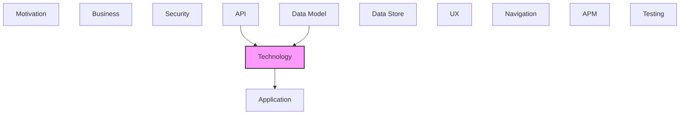

# Technology

Infrastructure, platforms, systems, and technology components.

## Report Index

- [Layer Introduction](#layer-introduction)
- [Intra-Layer Relationships](#intra-layer-relationships)
- [Inter-Layer Dependencies](#inter-layer-dependencies)
- [Inter-Layer Relationships Table](#inter-layer-relationships-table)
- [Element Reference](#element-reference)

## Layer Introduction

| Metric                    | Count |
| ------------------------- | ----- |
| Elements                  | 31    |
| Intra-Layer Relationships | 33    |
| Inter-Layer Relationships | 3     |
| Inbound Relationships     | 2     |
| Outbound Relationships    | 1     |

**Cross-Layer References**:

- **Upstream layers**: [API](./06-api-layer-report.md), [Data Model](./07-data-model-layer-report.md)
- **Downstream layers**: [Application](./04-application-layer-report.md)

## Intra-Layer Relationships

*This layer has >30 elements. Summary table shown instead of diagram.*

| Element                                                  | Type                  | Relationships |
| -------------------------------------------------------- | --------------------- | ------------- |
| `technology.artifact.docker-agent-image`                 | `artifact`            | 1             |
| `technology.artifact.embedded-app-bundle`                | `artifact`            | 2             |
| `technology.artifact.open-api-specification`             | `artifact`            | 2             |
| `technology.artifact.storybook-catalog-build`            | `artifact`            | 1             |
| `technology.node.docker-agent-container`                 | `node`                | 4             |
| `technology.node.vite-dev-server`                        | `node`                | 2             |
| `technology.path.app-to-dr-cli-https-path`               | `path`                | 1             |
| `technology.path.app-to-dr-cli-web-socket-path`          | `path`                | 2             |
| `technology.systemsoftware.d3-force`                     | `systemsoftware`      | 1             |
| `technology.systemsoftware.dagre`                        | `systemsoftware`      | 1             |
| `technology.systemsoftware.elkjs`                        | `systemsoftware`      | 1             |
| `technology.systemsoftware.expressjs-5`                  | `systemsoftware`      | 1             |
| `technology.systemsoftware.flowbite-react`               | `systemsoftware`      | 1             |
| `technology.systemsoftware.graphviz-wasm`                | `systemsoftware`      | 1             |
| `technology.systemsoftware.nodejs`                       | `systemsoftware`      | 5             |
| `technology.systemsoftware.playwright`                   | `systemsoftware`      | 2             |
| `technology.systemsoftware.react-19`                     | `systemsoftware`      | 7             |
| `technology.systemsoftware.react-flow`                   | `systemsoftware`      | 5             |
| `technology.systemsoftware.storybook-10`                 | `systemsoftware`      | 2             |
| `technology.systemsoftware.tailwind-css-v4`              | `systemsoftware`      | 0             |
| `technology.systemsoftware.tan-stack-router`             | `systemsoftware`      | 1             |
| `technology.systemsoftware.type-script-59`               | `systemsoftware`      | 1             |
| `technology.systemsoftware.vite-6`                       | `systemsoftware`      | 2             |
| `technology.systemsoftware.zustand-5`                    | `systemsoftware`      | 1             |
| `technology.technologyinterface.rest-https-interface`    | `technologyinterface` | 4             |
| `technology.technologyinterface.web-socket-interface`    | `technologyinterface` | 3             |
| `technology.technologyprocess.open-api-type-generation`  | `technologyprocess`   | 2             |
| `technology.technologyprocess.playwright-test-execution` | `technologyprocess`   | 2             |
| `technology.technologyprocess.vite-build-pipeline`       | `technologyprocess`   | 3             |
| `technology.technologyservice.dr-cli-rest-server`        | `technologyservice`   | 3             |
| `technology.technologyservice.web-socket-model-service`  | `technologyservice`   | 2             |

## Inter-Layer Dependencies

## Inter-Layer Relationships Table

| Relationship ID                                                     | Source Node                                                         | Dest Node                                         | Dest Layer    | Predicate    | Cardinality  | Strength |
| ------------------------------------------------------------------- | ------------------------------------------------------------------- | ------------------------------------------------- | ------------- | ------------ | ------------ | -------- |
| `api.openapidocument.depends-on.technology.technologyservice`       | `api.openapidocument.dr-cli-visualization-server-open-api-document` | `technology.technologyservice.dr-cli-rest-server` | `technology`  | `depends-on` | many-to-many | medium   |
| `data-model.schemadefinition.depends-on.technology.systemsoftware`  | `data-model.schemadefinition.changeset-id`                          | `technology.systemsoftware.type-script-59`        | `technology`  | `depends-on` | many-to-many | medium   |
| `technology.systemsoftware.serves.application.applicationcomponent` | `technology.systemsoftware.tailwind-css-v4`                         | `application.applicationcomponent.graph-viewer`   | `application` | `serves`     | many-to-many | medium   |

## Element Reference

### Docker Agent Image {#docker-agent-image}

**ID**: `technology.artifact.docker-agent-image`

**Type**: `artifact`

Docker container image for the Claude Code agent runtime, defined in Dockerfile.agent; used for isolated DR CLI beta testing

#### Attributes

| Name         | Value           |
| ------------ | --------------- |
| artifactType | container-image |

#### Relationships

| Type        | Related Element                    | Predicate         | Direction |
| ----------- | ---------------------------------- | ----------------- | --------- |
| intra-layer | `technology.systemsoftware.nodejs` | `associated-with` | outbound  |

### Embedded App Bundle {#embedded-app-bundle}

**ID**: `technology.artifact.embedded-app-bundle`

**Type**: `artifact`

Production Vite build output; bundled React application (JS/CSS) packaged as an embeddable archive via package-embedded.cjs script

#### Attributes

| Name         | Value   |
| ------------ | ------- |
| artifactType | archive |

#### Relationships

| Type        | Related Element                                    | Predicate         | Direction |
| ----------- | -------------------------------------------------- | ----------------- | --------- |
| intra-layer | `technology.systemsoftware.vite-6`                 | `associated-with` | outbound  |
| intra-layer | `technology.technologyprocess.vite-build-pipeline` | `flows-to`        | outbound  |

### OpenAPI Specification {#openapi-specification}

**ID**: `technology.artifact.open-api-specification`

**Type**: `artifact`

OpenAPI 3.0 REST API contract (openapi.yaml / docs/api-spec.yaml) describing the DR CLI server endpoints; source for TypeScript client generation

#### Attributes

| Name         | Value         |
| ------------ | ------------- |
| artifactType | configuration |

#### Relationships

| Type        | Related Element                                         | Predicate         | Direction |
| ----------- | ------------------------------------------------------- | ----------------- | --------- |
| intra-layer | `technology.systemsoftware.expressjs-5`                 | `associated-with` | outbound  |
| intra-layer | `technology.technologyprocess.open-api-type-generation` | `flows-to`        | outbound  |

### Storybook Catalog Build {#storybook-catalog-build}

**ID**: `technology.artifact.storybook-catalog-build`

**Type**: `artifact`

Static Storybook build output (dist/storybook/); pre-built component catalog for CI validation and a11y testing

#### Attributes

| Name         | Value   |
| ------------ | ------- |
| artifactType | archive |

#### Relationships

| Type        | Related Element                          | Predicate         | Direction |
| ----------- | ---------------------------------------- | ----------------- | --------- |
| intra-layer | `technology.systemsoftware.storybook-10` | `associated-with` | outbound  |

### Docker Agent Container {#docker-agent-container}

**ID**: `technology.node.docker-agent-container`

**Type**: `node`

Container runtime node for the Claude Code agent process; defined by Dockerfile.agent, provides isolated execution environment for DR CLI beta test runs

#### Attributes

| Name     | Value     |
| -------- | --------- |
| nodeType | container |

#### Relationships

| Type        | Related Element                                       | Predicate     | Direction |
| ----------- | ----------------------------------------------------- | ------------- | --------- |
| intra-layer | `technology.systemsoftware.playwright`                | `composes`    | outbound  |
| intra-layer | `technology.path.app-to-dr-cli-web-socket-path`       | `serves`      | inbound   |
| intra-layer | `technology.technologyinterface.rest-https-interface` | `assigned-to` | inbound   |
| intra-layer | `technology.technologyinterface.web-socket-interface` | `assigned-to` | inbound   |

### Vite Dev Server {#vite-dev-server}

**ID**: `technology.node.vite-dev-server`

**Type**: `node`

Development HTTP server node running on port 3001; spawned by Vite with HMR, hosts the embedded app during local development and E2E testing

#### Attributes

| Name     | Value     |
| -------- | --------- |
| nodeType | container |

#### Relationships

| Type        | Related Element                                         | Predicate    | Direction |
| ----------- | ------------------------------------------------------- | ------------ | --------- |
| intra-layer | `technology.technologyservice.dr-cli-rest-server`       | `depends-on` | inbound   |
| intra-layer | `technology.technologyservice.web-socket-model-service` | `depends-on` | inbound   |

### App to DR CLI HTTPS Path {#app-to-dr-cli-https-path}

**ID**: `technology.path.app-to-dr-cli-https-path`

**Type**: `path`

HTTPS communication path from browser application to the DR CLI REST server; carries JSON model management requests and responses

#### Attributes

| Name     | Value          |
| -------- | -------------- |
| pathType | point-to-point |
| protocol | https          |

#### Relationships

| Type        | Related Element                      | Predicate | Direction |
| ----------- | ------------------------------------ | --------- | --------- |
| intra-layer | `technology.systemsoftware.react-19` | `uses`    | inbound   |

### App to DR CLI WebSocket Path {#app-to-dr-cli-websocket-path}

**ID**: `technology.path.app-to-dr-cli-web-socket-path`

**Type**: `path`

Persistent WebSocket path between browser application and DR CLI server; carries JSON-RPC 2.0 real-time model update messages

#### Attributes

| Name     | Value         |
| -------- | ------------- |
| pathType | bidirectional |
| protocol | websocket     |

#### Relationships

| Type        | Related Element                                          | Predicate | Direction |
| ----------- | -------------------------------------------------------- | --------- | --------- |
| intra-layer | `technology.node.docker-agent-container`                 | `serves`  | outbound  |
| intra-layer | `technology.technologyprocess.playwright-test-execution` | `uses`    | inbound   |

### D3 Force {#d3-force}

**ID**: `technology.systemsoftware.d3-force`

**Type**: `systemsoftware`

d3-force 3.0 — physics-based force simulation for organic graph layouts; used for non-hierarchical relationship visualizations

#### Attributes

| Name         | Value      |
| ------------ | ---------- |
| softwareType | middleware |

#### Relationships

| Type        | Related Element                        | Predicate    | Direction |
| ----------- | -------------------------------------- | ------------ | --------- |
| intra-layer | `technology.systemsoftware.react-flow` | `depends-on` | outbound  |

### Dagre {#dagre}

**ID**: `technology.systemsoftware.dagre`

**Type**: `systemsoftware`

Hierarchical directed-graph layout engine; primary layout algorithm for structured architecture diagrams with ranked node positioning

#### Attributes

| Name         | Value      |
| ------------ | ---------- |
| softwareType | middleware |

#### Relationships

| Type        | Related Element                        | Predicate    | Direction |
| ----------- | -------------------------------------- | ------------ | --------- |
| intra-layer | `technology.systemsoftware.react-flow` | `depends-on` | outbound  |

### ELK.js {#elk-js}

**ID**: `technology.systemsoftware.elkjs`

**Type**: `systemsoftware`

Eclipse Layout Kernel JavaScript port (elkjs 0.11); advanced graph layout supporting layered, force, stress, and tree algorithms for complex diagrams

#### Attributes

| Name         | Value      |
| ------------ | ---------- |
| softwareType | middleware |

#### Relationships

| Type        | Related Element                        | Predicate    | Direction |
| ----------- | -------------------------------------- | ------------ | --------- |
| intra-layer | `technology.systemsoftware.react-flow` | `depends-on` | outbound  |

### Express.js 5 {#express-js-5}

**ID**: `technology.systemsoftware.expressjs-5`

**Type**: `systemsoftware`

Node.js HTTP server framework (express 5.1); used for the DR CLI integration server and authentication test server

#### Attributes

| Name         | Value      |
| ------------ | ---------- |
| softwareType | middleware |

#### Relationships

| Type        | Related Element                              | Predicate         | Direction |
| ----------- | -------------------------------------------- | ----------------- | --------- |
| intra-layer | `technology.artifact.open-api-specification` | `associated-with` | inbound   |

### Flowbite React {#flowbite-react}

**ID**: `technology.systemsoftware.flowbite-react`

**Type**: `systemsoftware`

Tailwind-based React component library (flowbite-react 0.12, flowbite 4.0); provides Card, Badge, Button, Modal and other UI primitives

#### Attributes

| Name         | Value      |
| ------------ | ---------- |
| softwareType | middleware |

#### Relationships

| Type        | Related Element                      | Predicate    | Direction |
| ----------- | ------------------------------------ | ------------ | --------- |
| intra-layer | `technology.systemsoftware.react-19` | `depends-on` | outbound  |

### Graphviz WASM {#graphviz-wasm}

**ID**: `technology.systemsoftware.graphviz-wasm`

**Type**: `systemsoftware`

@hpcc-js/wasm 2.30 — Graphviz compiled to WebAssembly; enables server-side-grade Graphviz layout algorithms (dot, neato, fdp) in the browser

#### Attributes

| Name         | Value      |
| ------------ | ---------- |
| softwareType | middleware |

#### Relationships

| Type        | Related Element                        | Predicate    | Direction |
| ----------- | -------------------------------------- | ------------ | --------- |
| intra-layer | `technology.systemsoftware.react-flow` | `depends-on` | outbound  |

### Node.js {#node-js}

**ID**: `technology.systemsoftware.nodejs`

**Type**: `systemsoftware`

JavaScript runtime environment powering the build toolchain, dev server, and test execution pipeline

#### Attributes

| Name         | Value      |
| ------------ | ---------- |
| softwareType | middleware |

#### Relationships

| Type        | Related Element                            | Predicate         | Direction |
| ----------- | ------------------------------------------ | ----------------- | --------- |
| intra-layer | `technology.artifact.docker-agent-image`   | `associated-with` | inbound   |
| intra-layer | `technology.systemsoftware.playwright`     | `depends-on`      | inbound   |
| intra-layer | `technology.systemsoftware.react-19`       | `depends-on`      | inbound   |
| intra-layer | `technology.systemsoftware.type-script-59` | `depends-on`      | inbound   |
| intra-layer | `technology.systemsoftware.vite-6`         | `depends-on`      | inbound   |

### Playwright {#playwright}

**ID**: `technology.systemsoftware.playwright`

**Type**: `systemsoftware`

@playwright/test 1.57 — end-to-end browser automation framework; runs 1170 unit/integration tests and E2E suite with axe-core accessibility validation

#### Attributes

| Name         | Value      |
| ------------ | ---------- |
| softwareType | middleware |

#### Relationships

| Type        | Related Element                          | Predicate    | Direction |
| ----------- | ---------------------------------------- | ------------ | --------- |
| intra-layer | `technology.node.docker-agent-container` | `composes`   | inbound   |
| intra-layer | `technology.systemsoftware.nodejs`       | `depends-on` | outbound  |

### React 19 {#react-19}

**ID**: `technology.systemsoftware.react-19`

**Type**: `systemsoftware`

Core UI rendering framework; component-based architecture with concurrent rendering, used via Vite plugin for JSX transformation

#### Attributes

| Name         | Value      |
| ------------ | ---------- |
| softwareType | middleware |

#### Relationships

| Type        | Related Element                              | Predicate    | Direction |
| ----------- | -------------------------------------------- | ------------ | --------- |
| intra-layer | `technology.systemsoftware.flowbite-react`   | `depends-on` | inbound   |
| intra-layer | `technology.systemsoftware.nodejs`           | `depends-on` | outbound  |
| intra-layer | `technology.path.app-to-dr-cli-https-path`   | `uses`       | outbound  |
| intra-layer | `technology.systemsoftware.react-flow`       | `depends-on` | inbound   |
| intra-layer | `technology.systemsoftware.storybook-10`     | `depends-on` | inbound   |
| intra-layer | `technology.systemsoftware.tan-stack-router` | `depends-on` | inbound   |
| intra-layer | `technology.systemsoftware.zustand-5`        | `depends-on` | inbound   |

### React Flow {#react-flow}

**ID**: `technology.systemsoftware.react-flow`

**Type**: `systemsoftware`

@xyflow/react 12.10 — interactive graph visualization library powering the multi-layer architecture diagrams with custom node and edge types

#### Attributes

| Name         | Value      |
| ------------ | ---------- |
| softwareType | middleware |

#### Relationships

| Type        | Related Element                           | Predicate    | Direction |
| ----------- | ----------------------------------------- | ------------ | --------- |
| intra-layer | `technology.systemsoftware.d3-force`      | `depends-on` | inbound   |
| intra-layer | `technology.systemsoftware.dagre`         | `depends-on` | inbound   |
| intra-layer | `technology.systemsoftware.elkjs`         | `depends-on` | inbound   |
| intra-layer | `technology.systemsoftware.graphviz-wasm` | `depends-on` | inbound   |
| intra-layer | `technology.systemsoftware.react-19`      | `depends-on` | outbound  |

### Storybook 10 {#storybook-10}

**ID**: `technology.systemsoftware.storybook-10`

**Type**: `systemsoftware`

Component development and testing catalog (storybook 10.2); hosts 578 stories across 97 files with CSF3 format; includes a11y addon and test runner

#### Attributes

| Name         | Value      |
| ------------ | ---------- |
| softwareType | middleware |

#### Relationships

| Type        | Related Element                               | Predicate         | Direction |
| ----------- | --------------------------------------------- | ----------------- | --------- |
| intra-layer | `technology.artifact.storybook-catalog-build` | `associated-with` | inbound   |
| intra-layer | `technology.systemsoftware.react-19`          | `depends-on`      | outbound  |

### Tailwind CSS v4 {#tailwind-css-v4}

**ID**: `technology.systemsoftware.tailwind-css-v4`

**Type**: `systemsoftware`

Utility-first CSS framework v4 with PostCSS pipeline; all styling via utility classes, dark mode variants required on all components

#### Attributes

| Name         | Value      |
| ------------ | ---------- |
| softwareType | middleware |

#### Relationships

| Type        | Related Element                                 | Predicate | Direction |
| ----------- | ----------------------------------------------- | --------- | --------- |
| inter-layer | `application.applicationcomponent.graph-viewer` | `serves`  | outbound  |

### TanStack Router {#tanstack-router}

**ID**: `technology.systemsoftware.tan-stack-router`

**Type**: `systemsoftware`

@tanstack/react-router 1.139 — fully type-safe file-based client-side router; powers the embedded app route hierarchy

#### Attributes

| Name         | Value      |
| ------------ | ---------- |
| softwareType | middleware |

#### Relationships

| Type        | Related Element                      | Predicate    | Direction |
| ----------- | ------------------------------------ | ------------ | --------- |
| intra-layer | `technology.systemsoftware.react-19` | `depends-on` | outbound  |

### TypeScript 5.9 {#typescript-5-9}

**ID**: `technology.systemsoftware.type-script-59`

**Type**: `systemsoftware`

Statically-typed JavaScript superset providing compile-time type safety across all source files, strict mode enabled

#### Attributes

| Name         | Value      |
| ------------ | ---------- |
| softwareType | middleware |

#### Relationships

| Type        | Related Element                            | Predicate    | Direction |
| ----------- | ------------------------------------------ | ------------ | --------- |
| inter-layer | `data-model.schemadefinition.changeset-id` | `depends-on` | inbound   |
| intra-layer | `technology.systemsoftware.nodejs`         | `depends-on` | outbound  |

### Vite 6 {#vite-6}

**ID**: `technology.systemsoftware.vite-6`

**Type**: `systemsoftware`

Next-generation build toolchain and HMR dev server for the React application; handles TypeScript compilation, bundling, and WASM file copying

#### Attributes

| Name         | Value      |
| ------------ | ---------- |
| softwareType | middleware |

#### Relationships

| Type        | Related Element                           | Predicate         | Direction |
| ----------- | ----------------------------------------- | ----------------- | --------- |
| intra-layer | `technology.artifact.embedded-app-bundle` | `associated-with` | inbound   |
| intra-layer | `technology.systemsoftware.nodejs`        | `depends-on`      | outbound  |

### Zustand 5 {#zustand-5}

**ID**: `technology.systemsoftware.zustand-5`

**Type**: `systemsoftware`

Lightweight Zustand state management library; provides multiple isolated stores (modelStore, layerStore, elementStore, crossLayerStore, etc.) with no Redux/Context coupling

#### Attributes

| Name         | Value      |
| ------------ | ---------- |
| softwareType | middleware |

#### Relationships

| Type        | Related Element                      | Predicate    | Direction |
| ----------- | ------------------------------------ | ------------ | --------- |
| intra-layer | `technology.systemsoftware.react-19` | `depends-on` | outbound  |

### REST HTTPS Interface {#rest-https-interface}

**ID**: `technology.technologyinterface.rest-https-interface`

**Type**: `technologyinterface`

HTTPS interface point exposing DR CLI REST API endpoints to the browser application; typed against the generated OpenAPI client

#### Attributes

| Name     | Value |
| -------- | ----- |
| protocol | https |

#### Relationships

| Type        | Related Element                                         | Predicate     | Direction |
| ----------- | ------------------------------------------------------- | ------------- | --------- |
| intra-layer | `technology.node.docker-agent-container`                | `assigned-to` | outbound  |
| intra-layer | `technology.technologyprocess.open-api-type-generation` | `serves`      | outbound  |
| intra-layer | `technology.technologyprocess.vite-build-pipeline`      | `uses`        | inbound   |
| intra-layer | `technology.technologyservice.dr-cli-rest-server`       | `provides`    | inbound   |

### WebSocket Interface {#websocket-interface}

**ID**: `technology.technologyinterface.web-socket-interface`

**Type**: `technologyinterface`

WebSocket interface providing full-duplex communication channel for real-time JSON-RPC 2.0 model update notifications

#### Attributes

| Name     | Value     |
| -------- | --------- |
| protocol | websocket |

#### Relationships

| Type        | Related Element                                          | Predicate     | Direction |
| ----------- | -------------------------------------------------------- | ------------- | --------- |
| intra-layer | `technology.node.docker-agent-container`                 | `assigned-to` | outbound  |
| intra-layer | `technology.technologyprocess.playwright-test-execution` | `serves`      | outbound  |
| intra-layer | `technology.technologyservice.web-socket-model-service`  | `provides`    | inbound   |

### OpenAPI Type Generation {#openapi-type-generation}

**ID**: `technology.technologyprocess.open-api-type-generation`

**Type**: `technologyprocess`

Code-generation process using openapi-typescript to produce src/core/types/api-client.ts from the OpenAPI spec; enforces client-server type contract at build time

#### Relationships

| Type        | Related Element                                       | Predicate  | Direction |
| ----------- | ----------------------------------------------------- | ---------- | --------- |
| intra-layer | `technology.artifact.open-api-specification`          | `flows-to` | inbound   |
| intra-layer | `technology.technologyinterface.rest-https-interface` | `serves`   | inbound   |

### Playwright Test Execution {#playwright-test-execution}

**ID**: `technology.technologyprocess.playwright-test-execution`

**Type**: `technologyprocess`

Automated test pipeline running 1170 Playwright tests across unit, integration, and E2E configs (playwright.config.ts, playwright.e2e.config.ts, playwright.auth.config.ts)

#### Relationships

| Type        | Related Element                                       | Predicate | Direction |
| ----------- | ----------------------------------------------------- | --------- | --------- |
| intra-layer | `technology.technologyinterface.web-socket-interface` | `serves`  | inbound   |
| intra-layer | `technology.path.app-to-dr-cli-web-socket-path`       | `uses`    | outbound  |

### Vite Build Pipeline {#vite-build-pipeline}

**ID**: `technology.technologyprocess.vite-build-pipeline`

**Type**: `technologyprocess`

Automated build sequence: copy WASM assets → generate OpenAPI client → check API version → Vite bundle → package embedded artifact; produces the deployable app

#### Relationships

| Type        | Related Element                                       | Predicate    | Direction |
| ----------- | ----------------------------------------------------- | ------------ | --------- |
| intra-layer | `technology.artifact.embedded-app-bundle`             | `flows-to`   | inbound   |
| intra-layer | `technology.technologyinterface.rest-https-interface` | `uses`       | outbound  |
| intra-layer | `technology.technologyservice.dr-cli-rest-server`     | `aggregates` | inbound   |

### DR CLI REST Server {#dr-cli-rest-server}

**ID**: `technology.technologyservice.dr-cli-rest-server`

**Type**: `technologyservice`

HTTP compute service exposing the DR model management REST API; the embedded app connects to this service to read/write architecture model elements

#### Attributes

| Name        | Value   |
| ----------- | ------- |
| serviceType | compute |

#### Relationships

| Type        | Related Element                                                     | Predicate    | Direction |
| ----------- | ------------------------------------------------------------------- | ------------ | --------- |
| inter-layer | `api.openapidocument.dr-cli-visualization-server-open-api-document` | `depends-on` | inbound   |
| intra-layer | `technology.technologyprocess.vite-build-pipeline`                  | `aggregates` | outbound  |
| intra-layer | `technology.node.vite-dev-server`                                   | `depends-on` | outbound  |
| intra-layer | `technology.technologyinterface.rest-https-interface`               | `provides`   | outbound  |

### WebSocket Model Service {#websocket-model-service}

**ID**: `technology.technologyservice.web-socket-model-service`

**Type**: `technologyservice`

Persistent WebSocket messaging service on the DR CLI server; delivers real-time model change events to connected browser clients via JSON-RPC 2.0

#### Attributes

| Name        | Value     |
| ----------- | --------- |
| serviceType | messaging |

#### Relationships

| Type        | Related Element                                       | Predicate    | Direction |
| ----------- | ----------------------------------------------------- | ------------ | --------- |
| intra-layer | `technology.node.vite-dev-server`                     | `depends-on` | outbound  |
| intra-layer | `technology.technologyinterface.web-socket-interface` | `provides`   | outbound  |

---

Generated: 2026-04-23T10:48:00.903Z | Model Version: 0.1.0
