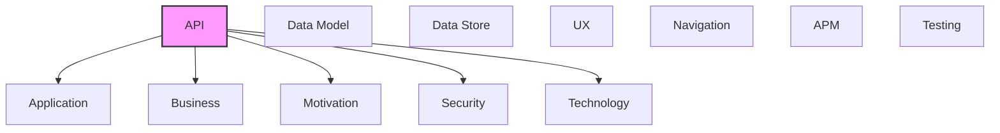

# API

REST APIs, operations, endpoints, and API integrations.

## Report Index

- [Layer Introduction](#layer-introduction)
- [Intra-Layer Relationships](#intra-layer-relationships)
- [Inter-Layer Dependencies](#inter-layer-dependencies)
- [Inter-Layer Relationships Table](#inter-layer-relationships-table)
- [Element Reference](#element-reference)

## Layer Introduction

| Metric                    | Count |
| ------------------------- | ----- |
| Elements                  | 22    |
| Intra-Layer Relationships | 19    |
| Inter-Layer Relationships | 29    |
| Inbound Relationships     | 0     |
| Outbound Relationships    | 29    |

**Cross-Layer References**:

- **Downstream layers**: [Application](./04-application-layer-report.md), [Business](./02-business-layer-report.md), [Motivation](./01-motivation-layer-report.md), [Security](./03-security-layer-report.md), [Technology](./05-technology-layer-report.md)

## Intra-Layer Relationships

```mermaid
flowchart LR
  subgraph api
    api_info_dr_cli_visualization_server_api["DR CLI Visualization Server API"]
    api_openapidocument_dr_cli_visualization_server_open_api_document["DR CLI Visualization Server OpenAPI Document"]
    api_operation_create_annotation["Create Annotation"]
    api_operation_delete_annotation["Delete Annotation"]
    api_operation_get_annotations["Get Annotations"]
    api_operation_get_architecture_model["Get Architecture Model"]
    api_operation_get_changeset_details["Get Changeset Details"]
    api_operation_get_schema_specifications["Get Schema Specifications"]
    api_operation_health_check["Health Check"]
    api_operation_list_changesets["List Changesets"]
    api_operation_update_annotation["Update Annotation"]
    api_operation_web_socket_real_time_updates["WebSocket Real-time Updates"]
    api_pathitem_annotation_detail_path["Annotation Detail Path"]
    api_pathitem_annotations_path["Annotations Path"]
    api_pathitem_changeset_detail_path["Changeset Detail Path"]
    api_pathitem_changesets_path["Changesets Path"]
    api_pathitem_health_path["Health Path"]
    api_pathitem_model_path["Model Path"]
    api_pathitem_spec_path["Spec Path"]
    api_pathitem_web_socket_path["WebSocket Path"]
    api_securityscheme_bearer_auth_scheme["Bearer Auth Scheme"]
    api_securityscheme_query_auth_scheme["Query Auth Scheme"]
    api_info_dr_cli_visualization_server_api -->|associated-with| api_openapidocument_dr_cli_visualization_server_open_api_document
    api_openapidocument_dr_cli_visualization_server_open_api_document -->|composes| api_info_dr_cli_visualization_server_api
    api_openapidocument_dr_cli_visualization_server_open_api_document -->|requires| api_securityscheme_bearer_auth_scheme
    api_openapidocument_dr_cli_visualization_server_open_api_document -->|requires| api_securityscheme_query_auth_scheme
    api_operation_create_annotation -->|uses| api_securityscheme_bearer_auth_scheme
    api_operation_get_annotations -->|uses| api_securityscheme_bearer_auth_scheme
    api_operation_get_architecture_model -->|uses| api_securityscheme_bearer_auth_scheme
    api_operation_list_changesets -->|uses| api_securityscheme_bearer_auth_scheme
    api_operation_web_socket_real_time_updates -->|uses| api_securityscheme_query_auth_scheme
    api_pathitem_annotation_detail_path -->|composes| api_operation_update_annotation
    api_pathitem_annotations_path -->|composes| api_operation_get_annotations
    api_pathitem_changeset_detail_path -->|composes| api_operation_get_changeset_details
    api_pathitem_changesets_path -->|composes| api_operation_list_changesets
    api_pathitem_health_path -->|composes| api_operation_health_check
    api_pathitem_model_path -->|composes| api_operation_get_architecture_model
    api_pathitem_spec_path -->|composes| api_operation_get_schema_specifications
    api_pathitem_web_socket_path -->|composes| api_operation_web_socket_real_time_updates
    api_securityscheme_bearer_auth_scheme -->|serves| api_operation_get_architecture_model
    api_securityscheme_query_auth_scheme -->|serves| api_operation_web_socket_real_time_updates
  end
```

## Inter-Layer Dependencies

## Inter-Layer Relationships Table

| Relationship ID                                                                        | Source Node                                                         | Dest Node                                         | Dest Layer    | Predicate    | Cardinality  | Strength |
| -------------------------------------------------------------------------------------- | ------------------------------------------------------------------- | ------------------------------------------------- | ------------- | ------------ | ------------ | -------- |
| `3dee662b-7dc2-4fcc-8677-15a2ba06136e-references-a77489e0-4e1f-42b1-b3e1-b1b534e6e7f8` | `3dee662b-7dc2-4fcc-8677-15a2ba06136e`                              | `a77489e0-4e1f-42b1-b3e1-b1b534e6e7f8`            | `application` | `references` | unknown      | unknown  |
| `3dee662b-7dc2-4fcc-8677-15a2ba06136e-requires-f502d58f-1a96-44d5-8fb8-c7e5e67f3f0d`   | `3dee662b-7dc2-4fcc-8677-15a2ba06136e`                              | `f502d58f-1a96-44d5-8fb8-c7e5e67f3f0d`            | `security`    | `requires`   | unknown      | unknown  |
| `3dee662b-7dc2-4fcc-8677-15a2ba06136e-serves-ed8f5b8f-54e4-498c-a8d9-ebe4ee430b6a`     | `3dee662b-7dc2-4fcc-8677-15a2ba06136e`                              | `ed8f5b8f-54e4-498c-a8d9-ebe4ee430b6a`            | `business`    | `serves`     | unknown      | unknown  |
| `406200e9-ef8b-46c9-a1fe-1ff06d6d5602-references-a77489e0-4e1f-42b1-b3e1-b1b534e6e7f8` | `406200e9-ef8b-46c9-a1fe-1ff06d6d5602`                              | `a77489e0-4e1f-42b1-b3e1-b1b534e6e7f8`            | `application` | `references` | unknown      | unknown  |
| `406200e9-ef8b-46c9-a1fe-1ff06d6d5602-requires-f502d58f-1a96-44d5-8fb8-c7e5e67f3f0d`   | `406200e9-ef8b-46c9-a1fe-1ff06d6d5602`                              | `f502d58f-1a96-44d5-8fb8-c7e5e67f3f0d`            | `security`    | `requires`   | unknown      | unknown  |
| `406200e9-ef8b-46c9-a1fe-1ff06d6d5602-serves-ed8f5b8f-54e4-498c-a8d9-ebe4ee430b6a`     | `406200e9-ef8b-46c9-a1fe-1ff06d6d5602`                              | `ed8f5b8f-54e4-498c-a8d9-ebe4ee430b6a`            | `business`    | `serves`     | unknown      | unknown  |
| `8630981b-236c-47ed-b99b-e977c56bdc63-realizes-71f9eb72-20e1-4ae6-be30-425c11e59edb`   | `8630981b-236c-47ed-b99b-e977c56bdc63`                              | `71f9eb72-20e1-4ae6-be30-425c11e59edb`            | `application` | `realizes`   | unknown      | unknown  |
| `8630981b-236c-47ed-b99b-e977c56bdc63-references-a77489e0-4e1f-42b1-b3e1-b1b534e6e7f8` | `8630981b-236c-47ed-b99b-e977c56bdc63`                              | `a77489e0-4e1f-42b1-b3e1-b1b534e6e7f8`            | `application` | `references` | unknown      | unknown  |
| `8630981b-236c-47ed-b99b-e977c56bdc63-requires-f502d58f-1a96-44d5-8fb8-c7e5e67f3f0d`   | `8630981b-236c-47ed-b99b-e977c56bdc63`                              | `f502d58f-1a96-44d5-8fb8-c7e5e67f3f0d`            | `security`    | `requires`   | unknown      | unknown  |
| `8630981b-236c-47ed-b99b-e977c56bdc63-serves-ed8f5b8f-54e4-498c-a8d9-ebe4ee430b6a`     | `8630981b-236c-47ed-b99b-e977c56bdc63`                              | `ed8f5b8f-54e4-498c-a8d9-ebe4ee430b6a`            | `business`    | `serves`     | unknown      | unknown  |
| `api.openapidocument.depends-on.technology.technologyservice`                          | `api.openapidocument.dr-cli-visualization-server-open-api-document` | `technology.technologyservice.dr-cli-rest-server` | `technology`  | `depends-on` | many-to-many | medium   |
| `api.openapidocument.serves.application.applicationcomponent`                          | `api.openapidocument.dr-cli-visualization-server-open-api-document` | `application.applicationcomponent.graph-viewer`   | `application` | `serves`     | many-to-many | medium   |
| `api.operation.realizes.business.businessprocess`                                      | `api.operation.delete-annotation`                                   | `business.businessprocess.changeset-review-flow`  | `business`    | `realizes`   | many-to-many | medium   |
| `api.securityscheme.implements.security.securitypolicy`                                | `api.securityscheme.bearer-auth-scheme`                             | `security.securitypolicy.bearer-token-policy`     | `security`    | `implements` | many-to-many | medium   |
| `api.securityscheme.implements.security.securitypolicy`                                | `api.securityscheme.query-auth-scheme`                              | `security.securitypolicy.bearer-token-policy`     | `security`    | `implements` | many-to-many | medium   |
| `b66b613e-27b6-4d90-909f-3aa81570de15-references-b7775f1a-2418-4c7a-84aa-997efd658a97` | `b66b613e-27b6-4d90-909f-3aa81570de15`                              | `b7775f1a-2418-4c7a-84aa-997efd658a97`            | `application` | `references` | unknown      | unknown  |
| `b66b613e-27b6-4d90-909f-3aa81570de15-satisfies-fc86a033-81bd-4933-abb8-b24076577123`  | `b66b613e-27b6-4d90-909f-3aa81570de15`                              | `fc86a033-81bd-4933-abb8-b24076577123`            | `motivation`  | `satisfies`  | unknown      | unknown  |
| `dc2da0b6-3de0-44d1-840f-5d49cc976cd9-references-b4784daf-706d-4f78-b522-165057df8110` | `dc2da0b6-3de0-44d1-840f-5d49cc976cd9`                              | `b4784daf-706d-4f78-b522-165057df8110`            | `application` | `references` | unknown      | unknown  |
| `dc2da0b6-3de0-44d1-840f-5d49cc976cd9-satisfies-e748118c-b989-43fe-b0d2-9121e931fcd2`  | `dc2da0b6-3de0-44d1-840f-5d49cc976cd9`                              | `e748118c-b989-43fe-b0d2-9121e931fcd2`            | `motivation`  | `satisfies`  | unknown      | unknown  |
| `dfc6509e-98f5-479a-bfe9-14bfddbb838a-realizes-3b08f432-72aa-4df6-978c-d76d3312f72b`   | `dfc6509e-98f5-479a-bfe9-14bfddbb838a`                              | `3b08f432-72aa-4df6-978c-d76d3312f72b`            | `application` | `realizes`   | unknown      | unknown  |
| `dfc6509e-98f5-479a-bfe9-14bfddbb838a-references-a5342d6f-daf4-4a6e-a98b-7fada2561798` | `dfc6509e-98f5-479a-bfe9-14bfddbb838a`                              | `a5342d6f-daf4-4a6e-a98b-7fada2561798`            | `application` | `references` | unknown      | unknown  |
| `dfc6509e-98f5-479a-bfe9-14bfddbb838a-requires-f502d58f-1a96-44d5-8fb8-c7e5e67f3f0d`   | `dfc6509e-98f5-479a-bfe9-14bfddbb838a`                              | `f502d58f-1a96-44d5-8fb8-c7e5e67f3f0d`            | `security`    | `requires`   | unknown      | unknown  |
| `dfc6509e-98f5-479a-bfe9-14bfddbb838a-satisfies-fc86a033-81bd-4933-abb8-b24076577123`  | `dfc6509e-98f5-479a-bfe9-14bfddbb838a`                              | `fc86a033-81bd-4933-abb8-b24076577123`            | `motivation`  | `satisfies`  | unknown      | unknown  |
| `dfc6509e-98f5-479a-bfe9-14bfddbb838a-serves-fb417c37-45b0-460f-80bb-4782d6c1a11a`     | `dfc6509e-98f5-479a-bfe9-14bfddbb838a`                              | `fb417c37-45b0-460f-80bb-4782d6c1a11a`            | `business`    | `serves`     | unknown      | unknown  |
| `e067f83f-1f31-44d7-a5d0-86059f8beb9f-references-29f33e20-2acf-46e3-9f18-02ebd34fc734` | `e067f83f-1f31-44d7-a5d0-86059f8beb9f`                              | `29f33e20-2acf-46e3-9f18-02ebd34fc734`            | `application` | `references` | unknown      | unknown  |
| `f952fcc0-7c42-4586-a306-a5f2f94a3068-realizes-f1edef84-1298-486c-b347-f47c3b0f9712`   | `f952fcc0-7c42-4586-a306-a5f2f94a3068`                              | `f1edef84-1298-486c-b347-f47c3b0f9712`            | `application` | `realizes`   | unknown      | unknown  |
| `f952fcc0-7c42-4586-a306-a5f2f94a3068-references-29f33e20-2acf-46e3-9f18-02ebd34fc734` | `f952fcc0-7c42-4586-a306-a5f2f94a3068`                              | `29f33e20-2acf-46e3-9f18-02ebd34fc734`            | `application` | `references` | unknown      | unknown  |
| `ff16c609-618e-4dd9-b477-12e17c000df8-realizes-71f9eb72-20e1-4ae6-be30-425c11e59edb`   | `ff16c609-618e-4dd9-b477-12e17c000df8`                              | `71f9eb72-20e1-4ae6-be30-425c11e59edb`            | `application` | `realizes`   | unknown      | unknown  |
| `ff16c609-618e-4dd9-b477-12e17c000df8-references-a77489e0-4e1f-42b1-b3e1-b1b534e6e7f8` | `ff16c609-618e-4dd9-b477-12e17c000df8`                              | `a77489e0-4e1f-42b1-b3e1-b1b534e6e7f8`            | `application` | `references` | unknown      | unknown  |

## Element Reference

### DR CLI Visualization Server API {#dr-cli-visualization-server-api}

**ID**: `api.info.dr-cli-visualization-server-api`

**Type**: `info`

OpenAPI document info for the Documentation Robotics Visualization Server API

#### Attributes

| Name    | Value                                           |
| ------- | ----------------------------------------------- |
| title   | Documentation Robotics Visualization Server API |
| version | 0.2.3                                           |

#### Relationships

| Type        | Related Element                                                     | Predicate         | Direction |
| ----------- | ------------------------------------------------------------------- | ----------------- | --------- |
| intra-layer | `api.openapidocument.dr-cli-visualization-server-open-api-document` | `associated-with` | outbound  |
| intra-layer | `api.openapidocument.dr-cli-visualization-server-open-api-document` | `composes`        | inbound   |

### DR CLI Visualization Server OpenAPI Document {#dr-cli-visualization-server-openapi-document}

**ID**: `api.openapidocument.dr-cli-visualization-server-open-api-document`

**Type**: `openapidocument`

Root OpenAPI 3.0 document describing the Documentation Robotics Visualization Server REST and WebSocket API

#### Relationships

| Type        | Related Element                                   | Predicate         | Direction |
| ----------- | ------------------------------------------------- | ----------------- | --------- |
| inter-layer | `technology.technologyservice.dr-cli-rest-server` | `depends-on`      | outbound  |
| inter-layer | `application.applicationcomponent.graph-viewer`   | `serves`          | outbound  |
| intra-layer | `api.info.dr-cli-visualization-server-api`        | `associated-with` | inbound   |
| intra-layer | `api.info.dr-cli-visualization-server-api`        | `composes`        | outbound  |
| intra-layer | `api.securityscheme.bearer-auth-scheme`           | `requires`        | outbound  |
| intra-layer | `api.securityscheme.query-auth-scheme`            | `requires`        | outbound  |

### Create Annotation {#create-annotation}

**ID**: `api.operation.create-annotation`

**Type**: `operation`

Creates a new annotation on a model element

#### Attributes

| Name        | Value                   |
| ----------- | ----------------------- |
| operationId | createAnnotation        |
| summary     | Create a new annotation |
| tags        | Annotations             |

#### Relationships

| Type        | Related Element                         | Predicate | Direction |
| ----------- | --------------------------------------- | --------- | --------- |
| intra-layer | `api.securityscheme.bearer-auth-scheme` | `uses`    | outbound  |

### Delete Annotation {#delete-annotation}

**ID**: `api.operation.delete-annotation`

**Type**: `operation`

Deletes an existing annotation

#### Attributes

| Name        | Value                |
| ----------- | -------------------- |
| operationId | deleteAnnotation     |
| summary     | Delete an annotation |
| tags        | Annotations          |

#### Relationships

| Type        | Related Element                                  | Predicate  | Direction |
| ----------- | ------------------------------------------------ | ---------- | --------- |
| inter-layer | `business.businessprocess.changeset-review-flow` | `realizes` | outbound  |

### Get Annotations {#get-annotations}

**ID**: `api.operation.get-annotations`

**Type**: `operation`

Returns annotations optionally filtered by elementId query param

#### Attributes

| Name        | Value                                          |
| ----------- | ---------------------------------------------- |
| operationId | getAnnotations                                 |
| summary     | Get annotations with optional elementId filter |
| tags        | Annotations                                    |

#### Relationships

| Type        | Related Element                         | Predicate  | Direction |
| ----------- | --------------------------------------- | ---------- | --------- |
| intra-layer | `api.securityscheme.bearer-auth-scheme` | `uses`     | outbound  |
| intra-layer | `api.pathitem.annotations-path`         | `composes` | inbound   |

### Get Architecture Model {#get-architecture-model}

**ID**: `api.operation.get-architecture-model`

**Type**: `operation`

Returns full architecture model from documentation-robotics/model/ including all layers, elements, relationships, and cross-layer references

#### Attributes

| Name        | Value                       |
| ----------- | --------------------------- |
| operationId | getModel                    |
| summary     | Get full architecture model |
| tags        | Model                       |

#### Relationships

| Type        | Related Element                         | Predicate  | Direction |
| ----------- | --------------------------------------- | ---------- | --------- |
| intra-layer | `api.securityscheme.bearer-auth-scheme` | `uses`     | outbound  |
| intra-layer | `api.pathitem.model-path`               | `composes` | inbound   |
| intra-layer | `api.securityscheme.bearer-auth-scheme` | `serves`   | inbound   |

### Get Changeset Details {#get-changeset-details}

**ID**: `api.operation.get-changeset-details`

**Type**: `operation`

Returns detailed changeset including all element changes with before/after states

#### Attributes

| Name        | Value               |
| ----------- | ------------------- |
| operationId | getChangeset        |
| summary     | Get changeset by ID |
| tags        | Changesets          |

#### Relationships

| Type        | Related Element                      | Predicate  | Direction |
| ----------- | ------------------------------------ | ---------- | --------- |
| intra-layer | `api.pathitem.changeset-detail-path` | `composes` | inbound   |

### Get Schema Specifications {#get-schema-specifications}

**ID**: `api.operation.get-schema-specifications`

**Type**: `operation`

Returns all JSON Schema files from .dr/schemas/ including layer schemas, relationship catalog, and link registry

#### Attributes

| Name        | Value                                   |
| ----------- | --------------------------------------- |
| operationId | getSpec                                 |
| summary     | Get all JSON Schema specification files |
| tags        | Schema                                  |

#### Relationships

| Type        | Related Element          | Predicate  | Direction |
| ----------- | ------------------------ | ---------- | --------- |
| intra-layer | `api.pathitem.spec-path` | `composes` | inbound   |

### Health Check {#health-check}

**ID**: `api.operation.health-check`

**Type**: `operation`

No auth required; returns server status and version

#### Attributes

| Name        | Value                           |
| ----------- | ------------------------------- |
| operationId | getHealth                       |
| summary     | Check server health and version |
| tags        | Health                          |

#### Relationships

| Type        | Related Element            | Predicate  | Direction |
| ----------- | -------------------------- | ---------- | --------- |
| intra-layer | `api.pathitem.health-path` | `composes` | inbound   |

### List Changesets {#list-changesets}

**ID**: `api.operation.list-changesets`

**Type**: `operation`

Returns registry of all available changesets with summaries

#### Attributes

| Name        | Value               |
| ----------- | ------------------- |
| operationId | listChangesets      |
| summary     | List all changesets |
| tags        | Changesets          |

#### Relationships

| Type        | Related Element                         | Predicate  | Direction |
| ----------- | --------------------------------------- | ---------- | --------- |
| intra-layer | `api.securityscheme.bearer-auth-scheme` | `uses`     | outbound  |
| intra-layer | `api.pathitem.changesets-path`          | `composes` | inbound   |

### Update Annotation {#update-annotation}

**ID**: `api.operation.update-annotation`

**Type**: `operation`

Updates content or tags of an existing annotation

#### Attributes

| Name        | Value                         |
| ----------- | ----------------------------- |
| operationId | updateAnnotation              |
| summary     | Update an existing annotation |
| tags        | Annotations                   |

#### Relationships

| Type        | Related Element                       | Predicate  | Direction |
| ----------- | ------------------------------------- | ---------- | --------- |
| intra-layer | `api.pathitem.annotation-detail-path` | `composes` | inbound   |

### WebSocket Real-time Updates {#websocket-real-time-updates}

**ID**: `api.operation.web-socket-real-time-updates`

**Type**: `operation`

Persistent WebSocket connection for subscribing to model/changeset/annotation real-time events via JSON message protocol

#### Attributes

| Name        | Value                              |
| ----------- | ---------------------------------- |
| operationId | connectWebSocket                   |
| summary     | Connect to real-time update stream |
| tags        | WebSocket                          |

#### Relationships

| Type        | Related Element                        | Predicate  | Direction |
| ----------- | -------------------------------------- | ---------- | --------- |
| intra-layer | `api.securityscheme.query-auth-scheme` | `uses`     | outbound  |
| intra-layer | `api.pathitem.web-socket-path`         | `composes` | inbound   |
| intra-layer | `api.securityscheme.query-auth-scheme` | `serves`   | inbound   |

### Annotation Detail Path {#annotation-detail-path}

**ID**: `api.pathitem.annotation-detail-path`

**Type**: `pathitem`

Path /api/annotations/\{annotationId\} — update and delete a specific annotation

#### Attributes

| Name        | Value                                      |
| ----------- | ------------------------------------------ |
| description | Update or delete annotation by ID          |
| summary     | /api/annotations/\{annotationId\} endpoint |

#### Relationships

| Type        | Related Element                   | Predicate  | Direction |
| ----------- | --------------------------------- | ---------- | --------- |
| intra-layer | `api.operation.update-annotation` | `composes` | outbound  |

### Annotations Path {#annotations-path}

**ID**: `api.pathitem.annotations-path`

**Type**: `pathitem`

Path /api/annotations — list and create annotations

#### Attributes

| Name        | Value                       |
| ----------- | --------------------------- |
| description | List and create annotations |
| summary     | /api/annotations endpoint   |

#### Relationships

| Type        | Related Element                 | Predicate  | Direction |
| ----------- | ------------------------------- | ---------- | --------- |
| intra-layer | `api.operation.get-annotations` | `composes` | outbound  |

### Changeset Detail Path {#changeset-detail-path}

**ID**: `api.pathitem.changeset-detail-path`

**Type**: `pathitem`

Path /api/changesets/\{changesetId\} — retrieves a specific changeset by ID

#### Attributes

| Name        | Value                                    |
| ----------- | ---------------------------------------- |
| description | Get changeset detail by ID               |
| summary     | /api/changesets/\{changesetId\} endpoint |

#### Relationships

| Type        | Related Element                       | Predicate  | Direction |
| ----------- | ------------------------------------- | ---------- | --------- |
| intra-layer | `api.operation.get-changeset-details` | `composes` | outbound  |

### Changesets Path {#changesets-path}

**ID**: `api.pathitem.changesets-path`

**Type**: `pathitem`

Path /api/changesets — lists all available changesets

#### Attributes

| Name        | Value                    |
| ----------- | ------------------------ |
| description | List all changesets      |
| summary     | /api/changesets endpoint |

#### Relationships

| Type        | Related Element                 | Predicate  | Direction |
| ----------- | ------------------------------- | ---------- | --------- |
| intra-layer | `api.operation.list-changesets` | `composes` | outbound  |

### Health Path {#health-path}

**ID**: `api.pathitem.health-path`

**Type**: `pathitem`

Path /health — no authentication required

#### Attributes

| Name        | Value                                 |
| ----------- | ------------------------------------- |
| description | Server health check; no auth required |
| summary     | /health endpoint                      |

#### Relationships

| Type        | Related Element              | Predicate  | Direction |
| ----------- | ---------------------------- | ---------- | --------- |
| intra-layer | `api.operation.health-check` | `composes` | outbound  |

### Model Path {#model-path}

**ID**: `api.pathitem.model-path`

**Type**: `pathitem`

Path /api/model — returns the full architecture model

#### Attributes

| Name        | Value                            |
| ----------- | -------------------------------- |
| description | Retrieve full architecture model |
| summary     | /api/model endpoint              |

#### Relationships

| Type        | Related Element                        | Predicate  | Direction |
| ----------- | -------------------------------------- | ---------- | --------- |
| intra-layer | `api.operation.get-architecture-model` | `composes` | outbound  |

### Spec Path {#spec-path}

**ID**: `api.pathitem.spec-path`

**Type**: `pathitem`

Path /api/spec — returns all JSON Schema specification files

#### Attributes

| Name        | Value                                  |
| ----------- | -------------------------------------- |
| description | Retrieve all DR spec JSON Schema files |
| summary     | /api/spec endpoint                     |

#### Relationships

| Type        | Related Element                           | Predicate  | Direction |
| ----------- | ----------------------------------------- | ---------- | --------- |
| intra-layer | `api.operation.get-schema-specifications` | `composes` | outbound  |

### WebSocket Path {#websocket-path}

**ID**: `api.pathitem.web-socket-path`

**Type**: `pathitem`

Path /ws — WebSocket upgrade endpoint for real-time event subscriptions

#### Attributes

| Name        | Value                                                             |
| ----------- | ----------------------------------------------------------------- |
| description | WebSocket upgrade for real-time model/changeset/annotation events |
| summary     | /ws endpoint                                                      |

#### Relationships

| Type        | Related Element                              | Predicate  | Direction |
| ----------- | -------------------------------------------- | ---------- | --------- |
| intra-layer | `api.operation.web-socket-real-time-updates` | `composes` | outbound  |

### Bearer Auth Scheme {#bearer-auth-scheme}

**ID**: `api.securityscheme.bearer-auth-scheme`

**Type**: `securityscheme`

Token in Authorization header; used for REST API endpoints requiring authentication

#### Attributes

| Name         | Value  |
| ------------ | ------ |
| bearerFormat | token  |
| scheme       | bearer |
| type         | http   |

#### Relationships

| Type        | Related Element                                                     | Predicate    | Direction |
| ----------- | ------------------------------------------------------------------- | ------------ | --------- |
| inter-layer | `security.securitypolicy.bearer-token-policy`                       | `implements` | outbound  |
| intra-layer | `api.openapidocument.dr-cli-visualization-server-open-api-document` | `requires`   | inbound   |
| intra-layer | `api.operation.create-annotation`                                   | `uses`       | inbound   |
| intra-layer | `api.operation.get-annotations`                                     | `uses`       | inbound   |
| intra-layer | `api.operation.get-architecture-model`                              | `uses`       | inbound   |
| intra-layer | `api.operation.list-changesets`                                     | `uses`       | inbound   |
| intra-layer | `api.operation.get-architecture-model`                              | `serves`     | outbound  |

### Query Auth Scheme {#query-auth-scheme}

**ID**: `api.securityscheme.query-auth-scheme`

**Type**: `securityscheme`

Token as ?token= query param; used for WebSocket connection authentication where Authorization headers cannot be set

#### Attributes

| Name | Value  |
| ---- | ------ |
| in   | query  |
| type | apiKey |

#### Relationships

| Type        | Related Element                                                     | Predicate    | Direction |
| ----------- | ------------------------------------------------------------------- | ------------ | --------- |
| inter-layer | `security.securitypolicy.bearer-token-policy`                       | `implements` | outbound  |
| intra-layer | `api.openapidocument.dr-cli-visualization-server-open-api-document` | `requires`   | inbound   |
| intra-layer | `api.operation.web-socket-real-time-updates`                        | `uses`       | inbound   |
| intra-layer | `api.operation.web-socket-real-time-updates`                        | `serves`     | outbound  |

---

Generated: 2026-04-23T10:48:00.903Z | Model Version: 0.1.0
