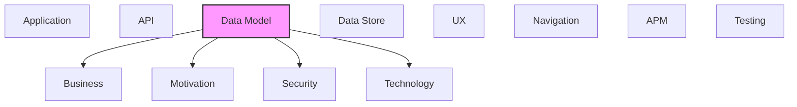

# Data Model

Data entities, relationships, and data structure definitions.

## Report Index

- [Layer Introduction](#layer-introduction)
- [Intra-Layer Relationships](#intra-layer-relationships)
- [Inter-Layer Dependencies](#inter-layer-dependencies)
- [Inter-Layer Relationships Table](#inter-layer-relationships-table)
- [Element Reference](#element-reference)

## Layer Introduction

| Metric                    | Count |
| ------------------------- | ----- |
| Elements                  | 34    |
| Intra-Layer Relationships | 22    |
| Inter-Layer Relationships | 18    |
| Inbound Relationships     | 0     |
| Outbound Relationships    | 18    |

**Cross-Layer References**:

- **Downstream layers**: [Business](./02-business-layer-report.md), [Motivation](./01-motivation-layer-report.md), [Security](./03-security-layer-report.md), [Technology](./05-technology-layer-report.md)

## Intra-Layer Relationships

*This layer has >30 elements. Summary table shown instead of diagram.*

| Element                                            | Type               | Relationships |
| -------------------------------------------------- | ------------------ | ------------- |
| `data-model.objectschema.annotation`               | `objectschema`     | 1             |
| `data-model.objectschema.annotation-create`        | `objectschema`     | 1             |
| `data-model.objectschema.base-node-data`           | `objectschema`     | 1             |
| `data-model.objectschema.chat-conversation`        | `objectschema`     | 1             |
| `data-model.objectschema.chat-message`             | `objectschema`     | 2             |
| `data-model.objectschema.data-model-field`         | `objectschema`     | 0             |
| `data-model.objectschema.data-model-node-data`     | `objectschema`     | 1             |
| `data-model.objectschema.extracted-reference`      | `objectschema`     | 0             |
| `data-model.objectschema.json-rpc-request`         | `objectschema`     | 1             |
| `data-model.objectschema.layer`                    | `objectschema`     | 2             |
| `data-model.objectschema.meta-model`               | `objectschema`     | 2             |
| `data-model.objectschema.model-element`            | `objectschema`     | 3             |
| `data-model.objectschema.model-metadata`           | `objectschema`     | 0             |
| `data-model.objectschema.predicate-catalog`        | `objectschema`     | 1             |
| `data-model.objectschema.predicate-definition`     | `objectschema`     | 2             |
| `data-model.objectschema.projection-rule`          | `objectschema`     | 0             |
| `data-model.objectschema.reference`                | `objectschema`     | 0             |
| `data-model.objectschema.relationship`             | `objectschema`     | 4             |
| `data-model.objectschema.relationship-type`        | `objectschema`     | 1             |
| `data-model.objectschema.relationships-yaml-entry` | `objectschema`     | 1             |
| `data-model.objectschema.source-reference`         | `objectschema`     | 1             |
| `data-model.objectschema.spec-layer-data`          | `objectschema`     | 1             |
| `data-model.objectschema.spec-node-relationship`   | `objectschema`     | 1             |
| `data-model.objectschema.tool-invocation-content`  | `objectschema`     | 1             |
| `data-model.objectschema.web-socket-event-map`     | `objectschema`     | 1             |
| `data-model.objectschema.web-socket-message`       | `objectschema`     | 2             |
| `data-model.objectschema.yamlelement`              | `objectschema`     | 2             |
| `data-model.objectschema.yamllayer-data`           | `objectschema`     | 2             |
| `data-model.objectschema.yamlmanifest`             | `objectschema`     | 1             |
| `data-model.objectschema.yamlmodel-data`           | `objectschema`     | 1             |
| `data-model.objectschema.yamlrelationships`        | `objectschema`     | 1             |
| `data-model.schemadefinition.annotation-id`        | `schemadefinition` | 3             |
| `data-model.schemadefinition.changeset-id`         | `schemadefinition` | 1             |
| `data-model.schemadefinition.element-id`           | `schemadefinition` | 2             |

## Inter-Layer Dependencies

## Inter-Layer Relationships Table

| Relationship ID                                                                        | Source Node                                   | Dest Node                                       | Dest Layer   | Predicate    | Cardinality  | Strength |
| -------------------------------------------------------------------------------------- | --------------------------------------------- | ----------------------------------------------- | ------------ | ------------ | ------------ | -------- |
| `0e1d8c49-81ae-41e3-9453-1e989bbffb26-references-7c85d8fc-3635-45fa-a83c-36f184763cab` | `0e1d8c49-81ae-41e3-9453-1e989bbffb26`        | `7c85d8fc-3635-45fa-a83c-36f184763cab`          | `business`   | `references` | unknown      | unknown  |
| `389d0672-e5c3-4d4e-acc9-227e8f5521f7-references-c20e00b6-ef86-415a-92a3-3e9fd9dc7cd6` | `389d0672-e5c3-4d4e-acc9-227e8f5521f7`        | `c20e00b6-ef86-415a-92a3-3e9fd9dc7cd6`          | `business`   | `references` | unknown      | unknown  |
| `3ce0eb35-ba57-4f87-8b0b-ba127cac026a-references-7c85d8fc-3635-45fa-a83c-36f184763cab` | `3ce0eb35-ba57-4f87-8b0b-ba127cac026a`        | `7c85d8fc-3635-45fa-a83c-36f184763cab`          | `business`   | `references` | unknown      | unknown  |
| `57b0c4b1-46b4-49bc-993d-bf7b6cecf206-realizes-ffa6bf4a-5281-402f-90d8-a895173fc4ba`   | `57b0c4b1-46b4-49bc-993d-bf7b6cecf206`        | `ffa6bf4a-5281-402f-90d8-a895173fc4ba`          | `business`   | `realizes`   | unknown      | unknown  |
| `582fd707-9e0d-4a98-9b47-b3cda7b26c3d-realizes-ea84399d-45dc-4fef-a5a1-759c9b5b5870`   | `582fd707-9e0d-4a98-9b47-b3cda7b26c3d`        | `ea84399d-45dc-4fef-a5a1-759c9b5b5870`          | `business`   | `realizes`   | unknown      | unknown  |
| `801c2caa-ec19-4175-bec8-970067823754-satisfies-0fa2ddb9-02df-426f-9c9c-89b857b9dc78`  | `801c2caa-ec19-4175-bec8-970067823754`        | `0fa2ddb9-02df-426f-9c9c-89b857b9dc78`          | `security`   | `satisfies`  | unknown      | unknown  |
| `a0080aee-7e84-4c2c-8d76-0cd604bfd7f5-realizes-ea84399d-45dc-4fef-a5a1-759c9b5b5870`   | `a0080aee-7e84-4c2c-8d76-0cd604bfd7f5`        | `ea84399d-45dc-4fef-a5a1-759c9b5b5870`          | `business`   | `realizes`   | unknown      | unknown  |
| `cfe8d725-4f64-4eae-b2fa-825e4a774a3a-realizes-ffa6bf4a-5281-402f-90d8-a895173fc4ba`   | `cfe8d725-4f64-4eae-b2fa-825e4a774a3a`        | `ffa6bf4a-5281-402f-90d8-a895173fc4ba`          | `business`   | `realizes`   | unknown      | unknown  |
| `cfe8d725-4f64-4eae-b2fa-825e4a774a3a-references-8b70a28c-08e2-414c-b641-95335ac2a463` | `cfe8d725-4f64-4eae-b2fa-825e4a774a3a`        | `8b70a28c-08e2-414c-b641-95335ac2a463`          | `business`   | `references` | unknown      | unknown  |
| `data-model.objectschema.realizes.business.businessobject`                             | `data-model.objectschema.data-model-field`    | `business.businessobject.architecture-model`    | `business`   | `realizes`   | many-to-many | medium   |
| `data-model.objectschema.realizes.business.businessobject`                             | `data-model.objectschema.extracted-reference` | `business.businessobject.architecture-model`    | `business`   | `realizes`   | many-to-many | medium   |
| `data-model.objectschema.realizes.business.businessobject`                             | `data-model.objectschema.model-metadata`      | `business.businessobject.architecture-model`    | `business`   | `realizes`   | many-to-many | medium   |
| `data-model.objectschema.realizes.business.businessobject`                             | `data-model.objectschema.projection-rule`     | `business.businessobject.architecture-model`    | `business`   | `realizes`   | many-to-many | medium   |
| `data-model.objectschema.realizes.business.businessobject`                             | `data-model.objectschema.reference`           | `business.businessobject.architecture-model`    | `business`   | `realizes`   | many-to-many | medium   |
| `data-model.schemadefinition.satisfies.motivation.constraint`                          | `data-model.schemadefinition.annotation-id`   | `motivation.constraint.type-script-strict-mode` | `motivation` | `satisfies`  | many-to-many | medium   |
| `data-model.schemadefinition.depends-on.technology.systemsoftware`                     | `data-model.schemadefinition.changeset-id`    | `technology.systemsoftware.type-script-59`      | `technology` | `depends-on` | many-to-many | medium   |
| `data-model.schemadefinition.satisfies.motivation.constraint`                          | `data-model.schemadefinition.changeset-id`    | `motivation.constraint.type-script-strict-mode` | `motivation` | `satisfies`  | many-to-many | medium   |
| `data-model.schemadefinition.satisfies.motivation.constraint`                          | `data-model.schemadefinition.element-id`      | `motivation.constraint.type-script-strict-mode` | `motivation` | `satisfies`  | many-to-many | medium   |

## Element Reference

### Annotation {#annotation}

**ID**: `data-model.objectschema.annotation`

**Type**: `objectschema`

User annotation attached to a specific architecture model element; includes author, markdown content, resolution state, and an optional thread of replies.

#### Relationships

| Type        | Related Element                             | Predicate | Direction |
| ----------- | ------------------------------------------- | --------- | --------- |
| intra-layer | `data-model.objectschema.annotation-create` | `extends` | inbound   |

### AnnotationCreate {#annotationcreate}

**ID**: `data-model.objectschema.annotation-create`

**Type**: `objectschema`

Request payload for creating a new annotation; requires target elementId and content text.

#### Relationships

| Type        | Related Element                      | Predicate | Direction |
| ----------- | ------------------------------------ | --------- | --------- |
| intra-layer | `data-model.objectschema.annotation` | `extends` | outbound  |

### BaseNodeData {#basenodedata}

**ID**: `data-model.objectschema.base-node-data`

**Type**: `objectschema`

React Flow node data shared by all 20 custom node types; carries label, elementId, layerId, fill/stroke colors, optional modelElement reference, semantic zoom detail level, changeset operation, and relationship badge.

#### Relationships

| Type        | Related Element                                | Predicate | Direction |
| ----------- | ---------------------------------------------- | --------- | --------- |
| intra-layer | `data-model.objectschema.data-model-node-data` | `extends` | inbound   |

### ChatConversation {#chatconversation}

**ID**: `data-model.objectschema.chat-conversation`

**Type**: `objectschema`

Chat conversation grouping metadata; holds conversation ID, title, creation/update timestamps, and message count.

#### Relationships

| Type        | Related Element                        | Predicate | Direction |
| ----------- | -------------------------------------- | --------- | --------- |
| intra-layer | `data-model.objectschema.chat-message` | `extends` | outbound  |

### ChatMessage {#chatmessage}

**ID**: `data-model.objectschema.chat-message`

**Type**: `objectschema`

Multi-part chat conversation message; contains a role (user/assistant/system), ordered content parts (text, tool invocations, thinking, usage, errors), and streaming state.

#### Relationships

| Type        | Related Element                                   | Predicate | Direction |
| ----------- | ------------------------------------------------- | --------- | --------- |
| intra-layer | `data-model.objectschema.chat-conversation`       | `extends` | inbound   |
| intra-layer | `data-model.objectschema.tool-invocation-content` | `extends` | inbound   |

### DataModelField {#datamodelfield}

**ID**: `data-model.objectschema.data-model-field`

**Type**: `objectschema`

Field definition for data model table nodes displayed in the graph; holds field id, name, type string, required flag, and optional description.

#### Relationships

| Type        | Related Element                              | Predicate  | Direction |
| ----------- | -------------------------------------------- | ---------- | --------- |
| inter-layer | `business.businessobject.architecture-model` | `realizes` | outbound  |

### DataModelNodeData {#datamodelnodedata}

**ID**: `data-model.objectschema.data-model-node-data`

**Type**: `objectschema`

Specialized React Flow node data for data model elements; extends BaseNodeData with an ordered list of DataModelField entries and a componentType discriminator (entity/interface/enum).

#### Relationships

| Type        | Related Element                          | Predicate | Direction |
| ----------- | ---------------------------------------- | --------- | --------- |
| intra-layer | `data-model.objectschema.base-node-data` | `extends` | outbound  |

### ExtractedReference {#extractedreference}

**ID**: `data-model.objectschema.extracted-reference`

**Type**: `objectschema`

Raw reference metadata captured during YAML parsing before cross-layer resolution; stores property name, reference type, and target identifier or UUID.

#### Relationships

| Type        | Related Element                              | Predicate  | Direction |
| ----------- | -------------------------------------------- | ---------- | --------- |
| inter-layer | `business.businessobject.architecture-model` | `realizes` | outbound  |

### JsonRpcRequest {#jsonrpcrequest}

**ID**: `data-model.objectschema.json-rpc-request`

**Type**: `objectschema`

JSON-RPC 2.0 request envelope used for all chat WebSocket messages; carries jsonrpc version string, method name, typed params, and request ID for correlation.

#### Relationships

| Type        | Related Element                              | Predicate | Direction |
| ----------- | -------------------------------------------- | --------- | --------- |
| intra-layer | `data-model.objectschema.web-socket-message` | `extends` | inbound   |

### Layer {#layer}

**ID**: `data-model.objectschema.layer`

**Type**: `objectschema`

Individual architecture layer within the MetaModel; contains a flat list of elements, intra-layer relationships, and visual configuration.

#### Relationships

| Type        | Related Element                          | Predicate | Direction |
| ----------- | ---------------------------------------- | --------- | --------- |
| intra-layer | `data-model.objectschema.meta-model`     | `extends` | inbound   |
| intra-layer | `data-model.objectschema.yamllayer-data` | `extends` | inbound   |

### MetaModel {#metamodel}

**ID**: `data-model.objectschema.meta-model`

**Type**: `objectschema`

Root container for the loaded architecture model; holds all layers, cross-layer references, and metadata. Loaded from DR CLI REST API response and stored in modelStore.

#### Relationships

| Type        | Related Element                          | Predicate | Direction |
| ----------- | ---------------------------------------- | --------- | --------- |
| intra-layer | `data-model.objectschema.layer`          | `extends` | outbound  |
| intra-layer | `data-model.objectschema.yamlmodel-data` | `extends` | inbound   |

### ModelElement {#modelelement}

**ID**: `data-model.objectschema.model-element`

**Type**: `objectschema`

Base element interface for all architecture layer elements; holds the element ID (dot-notation), type, name, properties, visual positioning, and intra-layer relationship references.

#### Relationships

| Type        | Related Element                            | Predicate | Direction |
| ----------- | ------------------------------------------ | --------- | --------- |
| intra-layer | `data-model.objectschema.relationship`     | `extends` | outbound  |
| intra-layer | `data-model.objectschema.source-reference` | `extends` | inbound   |
| intra-layer | `data-model.objectschema.yamlelement`      | `extends` | inbound   |

### ModelMetadata {#modelmetadata}

**ID**: `data-model.objectschema.model-metadata`

**Type**: `objectschema`

Metadata bag attached to the MetaModel root; includes author, timestamps, parse errors, element/layer counts, and cross-layer reference statistics.

#### Relationships

| Type        | Related Element                              | Predicate  | Direction |
| ----------- | -------------------------------------------- | ---------- | --------- |
| inter-layer | `business.businessobject.architecture-model` | `realizes` | outbound  |

### PredicateCatalog {#predicatecatalog}

**ID**: `data-model.objectschema.predicate-catalog`

**Type**: `objectschema`

Indexed predicate catalog produced by PredicateCatalogLoader from base.json; provides two Maps: byPredicate (predicate name -&gt; PredicateDefinition) and byInverse (inverse predicate name -&gt; forward predicate name) for O(1) catalog lookups

#### Relationships

| Type        | Related Element                                | Predicate | Direction |
| ----------- | ---------------------------------------------- | --------- | --------- |
| intra-layer | `data-model.objectschema.predicate-definition` | `extends` | outbound  |

### PredicateDefinition {#predicatedefinition}

**ID**: `data-model.objectschema.predicate-definition`

**Type**: `objectschema`

Full predicate metadata from the v0.8.3 predicate catalog; carries predicate name, inverse name, category, description, optional ArchiMate alignment, semantic properties (directionality/transitivity/symmetry/reflexivity), default strength, and fieldPaths for dynamic reference discovery

#### Relationships

| Type        | Related Element                             | Predicate | Direction |
| ----------- | ------------------------------------------- | --------- | --------- |
| intra-layer | `data-model.objectschema.predicate-catalog` | `extends` | inbound   |
| intra-layer | `data-model.objectschema.relationship`      | `extends` | outbound  |

### ProjectionRule {#projectionrule}

**ID**: `data-model.objectschema.projection-rule`

**Type**: `objectschema`

Rule definition in projection-rules.yaml describing how to auto-generate elements in one layer from elements in another (e.g., business.service -&gt; application.service).

#### Relationships

| Type        | Related Element                              | Predicate  | Direction |
| ----------- | -------------------------------------------- | ---------- | --------- |
| inter-layer | `business.businessobject.architecture-model` | `realizes` | outbound  |

### Reference {#reference}

**ID**: `data-model.objectschema.reference`

**Type**: `objectschema`

Cross-layer reference connecting an element in one architecture layer to an element in another; carries source/target layer IDs, element IDs, and validation status.

#### Relationships

| Type        | Related Element                              | Predicate  | Direction |
| ----------- | -------------------------------------------- | ---------- | --------- |
| inter-layer | `business.businessobject.architecture-model` | `realizes` | outbound  |

### Relationship {#relationship}

**ID**: `data-model.objectschema.relationship`

**Type**: `objectschema`

Typed relationship between two elements within the same layer; supports 15 ArchiMate and custom relationship types (composition, aggregation, realization, serving, access, data-flow, etc.).

#### Relationships

| Type        | Related Element                                    | Predicate | Direction |
| ----------- | -------------------------------------------------- | --------- | --------- |
| intra-layer | `data-model.objectschema.model-element`            | `extends` | inbound   |
| intra-layer | `data-model.objectschema.predicate-definition`     | `extends` | inbound   |
| intra-layer | `data-model.objectschema.relationship-type`        | `extends` | inbound   |
| intra-layer | `data-model.objectschema.relationships-yaml-entry` | `extends` | inbound   |

### RelationshipType {#relationshiptype}

**ID**: `data-model.objectschema.relationship-type`

**Type**: `objectschema`

TypeScript enum providing dot-notation access to the full v0.8.3 predicate catalog; covers motivation, business, structural, process, data, API, testing, security, and UI/navigation predicates; kept for backwards compatibility alongside the RelationshipTypeValue union type

#### Relationships

| Type        | Related Element                        | Predicate | Direction |
| ----------- | -------------------------------------- | --------- | --------- |
| intra-layer | `data-model.objectschema.relationship` | `extends` | outbound  |

### RelationshipsYamlEntry {#relationshipsyamlentry}

**ID**: `data-model.objectschema.relationships-yaml-entry`

**Type**: `objectschema`

Structure of a single entry in the flat relationships.yaml file (v0.8.3 format); requires source and target dot-notation paths and a predicate string, with optional layer, category, and arbitrary properties

#### Relationships

| Type        | Related Element                        | Predicate | Direction |
| ----------- | -------------------------------------- | --------- | --------- |
| intra-layer | `data-model.objectschema.relationship` | `extends` | outbound  |

### SourceReference {#sourcereference}

**ID**: `data-model.objectschema.source-reference`

**Type**: `objectschema`

Tracks where a model element was extracted from; holds provenance type (extracted/manual/inferred/generated), a list of SourceLocation entries (file + optional symbol), and optional repository context (URL + commit SHA)

#### Relationships

| Type        | Related Element                         | Predicate | Direction |
| ----------- | --------------------------------------- | --------- | --------- |
| intra-layer | `data-model.objectschema.model-element` | `extends` | outbound  |

### SpecLayerData {#speclayerdata}

**ID**: `data-model.objectschema.spec-layer-data`

**Type**: `objectschema`

Structured spec data for a single architecture layer loaded from .dr/spec/\*.json; contains layer metadata (id, number, name, description), a map of node type name to JSON schema, and an array of SpecNodeRelationship entries

#### Relationships

| Type        | Related Element                                  | Predicate | Direction |
| ----------- | ------------------------------------------------ | --------- | --------- |
| intra-layer | `data-model.objectschema.spec-node-relationship` | `extends` | outbound  |

### SpecNodeRelationship {#specnoderelationship}

**ID**: `data-model.objectschema.spec-node-relationship`

**Type**: `objectschema`

Valid relationship definition between two spec node types; specifies source and destination spec node IDs and their layers, predicate, cardinality, strength, and whether the relationship is required

#### Relationships

| Type        | Related Element                           | Predicate | Direction |
| ----------- | ----------------------------------------- | --------- | --------- |
| intra-layer | `data-model.objectschema.spec-layer-data` | `extends` | inbound   |

### ToolInvocationContent {#toolinvocationcontent}

**ID**: `data-model.objectschema.tool-invocation-content`

**Type**: `objectschema`

Chat content part representing an AI tool invocation; tracks tool name, typed input parameters, and execution status (executing/completed/failed) with result or error.

#### Relationships

| Type        | Related Element                        | Predicate | Direction |
| ----------- | -------------------------------------- | --------- | --------- |
| intra-layer | `data-model.objectschema.chat-message` | `extends` | outbound  |

### WebSocketEventMap {#websocketeventmap}

**ID**: `data-model.objectschema.web-socket-event-map`

**Type**: `objectschema`

Typed event map for all WebSocket client events: connect, disconnect, message, error, close, reconnecting, rest-mode, max-reconnect-attempts.

#### Relationships

| Type        | Related Element                              | Predicate | Direction |
| ----------- | -------------------------------------------- | --------- | --------- |
| intra-layer | `data-model.objectschema.web-socket-message` | `extends` | outbound  |

### WebSocketMessage {#websocketmessage}

**ID**: `data-model.objectschema.web-socket-message`

**Type**: `objectschema`

Base WebSocket protocol message with discriminating type string; all real-time server messages extend this interface.

#### Relationships

| Type        | Related Element                                | Predicate | Direction |
| ----------- | ---------------------------------------------- | --------- | --------- |
| intra-layer | `data-model.objectschema.web-socket-event-map` | `extends` | inbound   |
| intra-layer | `data-model.objectschema.json-rpc-request`     | `extends` | outbound  |

### YAMLElement {#yamlelement}

**ID**: `data-model.objectschema.yamlelement`

**Type**: `objectschema`

Structure of a single model element as stored in a YAML file; includes id, name, description, optional API properties (method, path), inline relationships, and arbitrary custom properties.

#### Relationships

| Type        | Related Element                             | Predicate | Direction |
| ----------- | ------------------------------------------- | --------- | --------- |
| intra-layer | `data-model.objectschema.model-element`     | `extends` | outbound  |
| intra-layer | `data-model.objectschema.yamlrelationships` | `extends` | inbound   |

### YAMLLayerData {#yamllayerdata}

**ID**: `data-model.objectschema.yamllayer-data`

**Type**: `objectschema`

Aggregated layer data assembled from multiple YAML files for a single layer; maps element names to YAMLElement objects with source file tracking.

#### Relationships

| Type        | Related Element                        | Predicate | Direction |
| ----------- | -------------------------------------- | --------- | --------- |
| intra-layer | `data-model.objectschema.layer`        | `extends` | outbound  |
| intra-layer | `data-model.objectschema.yamlmanifest` | `extends` | inbound   |

### YAMLManifest {#yamlmanifest}

**ID**: `data-model.objectschema.yamlmanifest`

**Type**: `objectschema`

TypeScript representation of the on-disk manifest.yaml file; tracks model version, project info, per-layer file paths and schema references, and aggregate statistics.

#### Relationships

| Type        | Related Element                          | Predicate | Direction |
| ----------- | ---------------------------------------- | --------- | --------- |
| intra-layer | `data-model.objectschema.yamllayer-data` | `extends` | outbound  |

### YAMLModelData {#yamlmodeldata}

**ID**: `data-model.objectschema.yamlmodel-data`

**Type**: `objectschema`

Complete parsed model result from YAML loading; combines the manifest, all layer data, optional projection rules, and accumulated parser warnings.

#### Relationships

| Type        | Related Element                      | Predicate | Direction |
| ----------- | ------------------------------------ | --------- | --------- |
| intra-layer | `data-model.objectschema.meta-model` | `extends` | outbound  |

### YAMLRelationships {#yamlrelationships}

**ID**: `data-model.objectschema.yamlrelationships`

**Type**: `objectschema`

Nested relationship declarations within a YAML element; groups cross-layer references by semantic type (realizes, serves, accesses, uses, secured_by, supports_goals, etc.).

#### Relationships

| Type        | Related Element                       | Predicate | Direction |
| ----------- | ------------------------------------- | --------- | --------- |
| intra-layer | `data-model.objectschema.yamlelement` | `extends` | outbound  |

### AnnotationId {#annotationid}

**ID**: `data-model.schemadefinition.annotation-id`

**Type**: `schemadefinition`

Branded string type for annotation IDs; cannot be assigned from ElementId or ChangesetId at compile time.

#### Attributes

| Name  | Value        |
| ----- | ------------ |
| title | AnnotationId |
| type  | string       |

#### Relationships

| Type        | Related Element                                 | Predicate     | Direction |
| ----------- | ----------------------------------------------- | ------------- | --------- |
| inter-layer | `motivation.constraint.type-script-strict-mode` | `satisfies`   | outbound  |
| intra-layer | `data-model.schemadefinition.changeset-id`      | `specializes` | outbound  |
| intra-layer | `data-model.schemadefinition.element-id`        | `composes`    | inbound   |
| intra-layer | `data-model.schemadefinition.element-id`        | `specializes` | inbound   |

### ChangesetId {#changesetid}

**ID**: `data-model.schemadefinition.changeset-id`

**Type**: `schemadefinition`

Branded string type for changeset IDs; cannot be assigned from ElementId or AnnotationId at compile time.

#### Attributes

| Name  | Value       |
| ----- | ----------- |
| title | ChangesetId |
| type  | string      |

#### Relationships

| Type        | Related Element                                 | Predicate     | Direction |
| ----------- | ----------------------------------------------- | ------------- | --------- |
| inter-layer | `technology.systemsoftware.type-script-59`      | `depends-on`  | outbound  |
| inter-layer | `motivation.constraint.type-script-strict-mode` | `satisfies`   | outbound  |
| intra-layer | `data-model.schemadefinition.annotation-id`     | `specializes` | inbound   |

### ElementId {#elementid}

**ID**: `data-model.schemadefinition.element-id`

**Type**: `schemadefinition`

Branded string type for architecture element IDs (dot-notation format: layer.type.name); prevents accidental mixing with AnnotationId or ChangesetId at compile time.

#### Attributes

| Name  | Value     |
| ----- | --------- |
| title | ElementId |
| type  | string    |

#### Relationships

| Type        | Related Element                                 | Predicate     | Direction |
| ----------- | ----------------------------------------------- | ------------- | --------- |
| inter-layer | `motivation.constraint.type-script-strict-mode` | `satisfies`   | outbound  |
| intra-layer | `data-model.schemadefinition.annotation-id`     | `composes`    | outbound  |
| intra-layer | `data-model.schemadefinition.annotation-id`     | `specializes` | outbound  |

---

Generated: 2026-04-23T10:48:00.903Z | Model Version: 0.1.0
