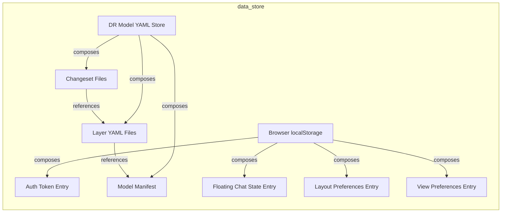
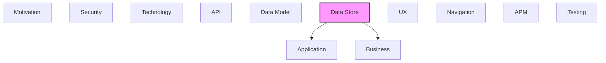

# Data Store

Databases, data stores, and persistence mechanisms.

## Report Index

- [Layer Introduction](#layer-introduction)
- [Intra-Layer Relationships](#intra-layer-relationships)
- [Inter-Layer Dependencies](#inter-layer-dependencies)
- [Inter-Layer Relationships Table](#inter-layer-relationships-table)
- [Element Reference](#element-reference)

## Layer Introduction

| Metric                    | Count |
| ------------------------- | ----- |
| Elements                  | 9     |
| Intra-Layer Relationships | 9     |
| Inter-Layer Relationships | 5     |
| Inbound Relationships     | 0     |
| Outbound Relationships    | 5     |

**Cross-Layer References**:

- **Downstream layers**: [Application](./04-application-layer-report.md), [Business](./02-business-layer-report.md)

## Intra-Layer Relationships

## Inter-Layer Dependencies

## Inter-Layer Relationships Table

| Relationship ID                                                 | Source Node                              | Dest Node                                       | Dest Layer    | Predicate  | Cardinality  | Strength |
| --------------------------------------------------------------- | ---------------------------------------- | ----------------------------------------------- | ------------- | ---------- | ------------ | -------- |
| `data-store.collection.serves.application.applicationcomponent` | `data-store.collection.auth-token-entry` | `application.applicationcomponent.graph-viewer` | `application` | `serves`   | many-to-many | medium   |
| `data-store.collection.realizes.business.businessobject`        | `data-store.collection.changeset-files`  | `business.businessobject.changeset`             | `business`    | `realizes` | many-to-many | medium   |
| `data-store.collection.serves.application.applicationcomponent` | `data-store.collection.layer-yaml-files` | `application.applicationcomponent.graph-viewer` | `application` | `serves`   | many-to-many | medium   |
| `data-store.collection.realizes.business.businessobject`        | `data-store.collection.model-manifest`   | `business.businessobject.architecture-model`    | `business`    | `realizes` | many-to-many | medium   |
| `data-store.collection.serves.application.applicationcomponent` | `data-store.collection.model-manifest`   | `application.applicationcomponent.graph-viewer` | `application` | `serves`   | many-to-many | medium   |

## Element Reference

### Auth Token Entry {#auth-token-entry}

**ID**: `data-store.collection.auth-token-entry`

**Type**: `collection`

localStorage key storing the DR CLI bearer auth token extracted from the magic link URL; read on startup, cleared on logout or invalid token response.

#### Attributes

| Name           | Value |
| -------------- | ----- |
| collectionType | HASH  |

#### Relationships

| Type        | Related Element                                 | Predicate  | Direction |
| ----------- | ----------------------------------------------- | ---------- | --------- |
| inter-layer | `application.applicationcomponent.graph-viewer` | `serves`   | outbound  |
| intra-layer | `data-store.database.browser-local-storage`     | `composes` | inbound   |

### Changeset Files {#changeset-files}

**ID**: `data-store.collection.changeset-files`

**Type**: `collection`

YAML files in documentation-robotics/changesets/; each file represents a named changeset with metadata, status (active/applied/abandoned), and list of element changes with before/after states.

#### Attributes

| Name           | Value      |
| -------------- | ---------- |
| collectionType | COLLECTION |

#### Relationships

| Type        | Related Element                           | Predicate    | Direction |
| ----------- | ----------------------------------------- | ------------ | --------- |
| inter-layer | `business.businessobject.changeset`       | `realizes`   | outbound  |
| intra-layer | `data-store.collection.layer-yaml-files`  | `references` | outbound  |
| intra-layer | `data-store.database.dr-model-yaml-store` | `composes`   | inbound   |

### Floating Chat State Entry {#floating-chat-state-entry}

**ID**: `data-store.collection.floating-chat-state-entry`

**Type**: `collection`

localStorage key persisting the floating chat panel's open/closed state and panel position across sessions.

#### Attributes

| Name           | Value |
| -------------- | ----- |
| collectionType | HASH  |

#### Relationships

| Type        | Related Element                             | Predicate  | Direction |
| ----------- | ------------------------------------------- | ---------- | --------- |
| intra-layer | `data-store.database.browser-local-storage` | `composes` | inbound   |

### Layer YAML Files {#layer-yaml-files}

**ID**: `data-store.collection.layer-yaml-files`

**Type**: `collection`

Per-layer YAML files (e.g., 05_technology/systemsoftware.yaml) containing element definitions keyed by element name; multiple files may contribute elements to a single layer.

#### Attributes

| Name           | Value      |
| -------------- | ---------- |
| collectionType | COLLECTION |

#### Relationships

| Type        | Related Element                                 | Predicate    | Direction |
| ----------- | ----------------------------------------------- | ------------ | --------- |
| inter-layer | `application.applicationcomponent.graph-viewer` | `serves`     | outbound  |
| intra-layer | `data-store.collection.changeset-files`         | `references` | inbound   |
| intra-layer | `data-store.collection.model-manifest`          | `references` | outbound  |
| intra-layer | `data-store.database.dr-model-yaml-store`       | `composes`   | inbound   |

### Layout Preferences Entry {#layout-preferences-entry}

**ID**: `data-store.collection.layout-preferences-entry`

**Type**: `collection`

localStorage key persisting the user's selected layout algorithm and layout configuration options (spacing, direction, etc.) across sessions via Zustand persist middleware.

#### Attributes

| Name           | Value |
| -------------- | ----- |
| collectionType | HASH  |

#### Relationships

| Type        | Related Element                             | Predicate  | Direction |
| ----------- | ------------------------------------------- | ---------- | --------- |
| intra-layer | `data-store.database.browser-local-storage` | `composes` | inbound   |

### Model Manifest {#model-manifest}

**ID**: `data-store.collection.model-manifest`

**Type**: `collection`

Single manifest.yaml file at the model root; contains model version, project info, layer registry with file paths and element counts, cross-reference totals, and validation statistics.

#### Attributes

| Name           | Value      |
| -------------- | ---------- |
| collectionType | COLLECTION |

#### Relationships

| Type        | Related Element                                 | Predicate    | Direction |
| ----------- | ----------------------------------------------- | ------------ | --------- |
| inter-layer | `business.businessobject.architecture-model`    | `realizes`   | outbound  |
| inter-layer | `application.applicationcomponent.graph-viewer` | `serves`     | outbound  |
| intra-layer | `data-store.collection.layer-yaml-files`        | `references` | inbound   |
| intra-layer | `data-store.database.dr-model-yaml-store`       | `composes`   | inbound   |

### View Preferences Entry {#view-preferences-entry}

**ID**: `data-store.collection.view-preferences-entry`

**Type**: `collection`

localStorage key persisting view mode choices (graph vs. details, sidebar collapsed state, zoom level) via Zustand persist middleware.

#### Attributes

| Name           | Value |
| -------------- | ----- |
| collectionType | HASH  |

#### Relationships

| Type        | Related Element                             | Predicate  | Direction |
| ----------- | ------------------------------------------- | ---------- | --------- |
| intra-layer | `data-store.database.browser-local-storage` | `composes` | inbound   |

### Browser localStorage {#browser-localstorage}

**ID**: `data-store.database.browser-local-storage`

**Type**: `database`

Browser Web Storage API used for client-side persistence of auth tokens, layout preferences, view state, and floating chat position; survives page reloads but not browser profile deletion.

#### Attributes

| Name            | Value                |
| --------------- | -------------------- |
| deploymentModel | EMBEDDED             |
| engine          | browser-localstorage |
| paradigm        | KEY_VALUE            |

#### Relationships

| Type        | Related Element                                   | Predicate  | Direction |
| ----------- | ------------------------------------------------- | ---------- | --------- |
| intra-layer | `data-store.collection.auth-token-entry`          | `composes` | outbound  |
| intra-layer | `data-store.collection.floating-chat-state-entry` | `composes` | outbound  |
| intra-layer | `data-store.collection.layout-preferences-entry`  | `composes` | outbound  |
| intra-layer | `data-store.collection.view-preferences-entry`    | `composes` | outbound  |

### DR Model YAML Store {#dr-model-yaml-store}

**ID**: `data-store.database.dr-model-yaml-store`

**Type**: `database`

File-based document store holding the architecture model as YAML files under documentation-robotics/model/; organized into per-layer subdirectories with a root manifest.yaml. Read by dataLoader via DR CLI REST API (GET /api/model).

#### Attributes

| Name            | Value      |
| --------------- | ---------- |
| deploymentModel | EMBEDDED   |
| engine          | yaml-files |
| paradigm        | DOCUMENT   |

#### Relationships

| Type        | Related Element                          | Predicate  | Direction |
| ----------- | ---------------------------------------- | ---------- | --------- |
| intra-layer | `data-store.collection.changeset-files`  | `composes` | outbound  |
| intra-layer | `data-store.collection.layer-yaml-files` | `composes` | outbound  |
| intra-layer | `data-store.collection.model-manifest`   | `composes` | outbound  |

---

Generated: 2026-04-23T10:48:00.903Z | Model Version: 0.1.0
