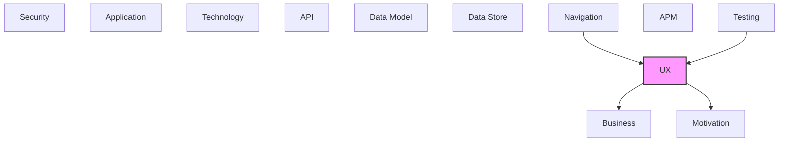

# UX

User interface components, screens, and user experience elements.

## Report Index

- [Layer Introduction](#layer-introduction)
- [Intra-Layer Relationships](#intra-layer-relationships)
- [Inter-Layer Dependencies](#inter-layer-dependencies)
- [Inter-Layer Relationships Table](#inter-layer-relationships-table)
- [Element Reference](#element-reference)

## Layer Introduction

| Metric                    | Count |
| ------------------------- | ----- |
| Elements                  | 41    |
| Intra-Layer Relationships | 19    |
| Inter-Layer Relationships | 26    |
| Inbound Relationships     | 5     |
| Outbound Relationships    | 21    |

**Cross-Layer References**:

- **Upstream layers**: [Navigation](./10-navigation-layer-report.md), [Testing](./12-testing-layer-report.md)
- **Downstream layers**: [Business](./02-business-layer-report.md), [Motivation](./01-motivation-layer-report.md)

## Intra-Layer Relationships

*This layer has >30 elements. Summary table shown instead of diagram.*

| Element                                           | Type               | Relationships |
| ------------------------------------------------- | ------------------ | ------------- |
| `ux.librarycomponent.changeset-list`              | `librarycomponent` | 0             |
| `ux.librarycomponent.connection-status-indicator` | `librarycomponent` | 1             |
| `ux.librarycomponent.cross-layer-filter-panel`    | `librarycomponent` | 0             |
| `ux.librarycomponent.export-button-group`         | `librarycomponent` | 1             |
| `ux.librarycomponent.graph-statistics-panel`      | `librarycomponent` | 0             |
| `ux.librarycomponent.graph-toolbar`               | `librarycomponent` | 1             |
| `ux.librarycomponent.layout-preferences-panel`    | `librarycomponent` | 0             |
| `ux.librarycomponent.mini-map`                    | `librarycomponent` | 0             |
| `ux.librarycomponent.model-details-viewer`        | `librarycomponent` | 1             |
| `ux.librarycomponent.spec-viewer`                 | `librarycomponent` | 0             |
| `ux.librarycomponent.sub-tab-navigation`          | `librarycomponent` | 0             |
| `ux.librarysubview.breadcrumb-navigation`         | `librarysubview`   | 1             |
| `ux.librarysubview.empty-state`                   | `librarysubview`   | 1             |
| `ux.librarysubview.error-state`                   | `librarysubview`   | 1             |
| `ux.librarysubview.highlighted-path-panel`        | `librarysubview`   | 1             |
| `ux.librarysubview.loading-state`                 | `librarysubview`   | 1             |
| `ux.librarysubview.node-context-menu`             | `librarysubview`   | 1             |
| `ux.statepattern.authentication-flow-pattern`     | `statepattern`     | 1             |
| `ux.statepattern.data-loading-pattern`            | `statepattern`     | 3             |
| `ux.subview.annotation-panel`                     | `subview`          | 1             |
| `ux.subview.changeset-viewer`                     | `subview`          | 1             |
| `ux.subview.chat-panel`                           | `subview`          | 1             |
| `ux.subview.cross-layer-panel`                    | `subview`          | 1             |
| `ux.subview.embedded-layout`                      | `subview`          | 1             |
| `ux.subview.floating-chat-panel`                  | `subview`          | 1             |
| `ux.subview.graph-view-sidebar`                   | `subview`          | 1             |
| `ux.subview.model-layers-sidebar`                 | `subview`          | 1             |
| `ux.subview.node-details-panel`                   | `subview`          | 1             |
| `ux.subview.shared-layout`                        | `subview`          | 1             |
| `ux.uxapplication.embedded-architecture-viewer`   | `uxapplication`    | 1             |
| `ux.uxspec.authentication-spec`                   | `uxspec`           | 1             |
| `ux.uxspec.changeset-review-spec`                 | `uxspec`           | 1             |
| `ux.uxspec.model-visualization-spec`              | `uxspec`           | 2             |
| `ux.uxspec.schema-spec-browser-spec`              | `uxspec`           | 1             |
| `ux.view.auth-view`                               | `view`             | 1             |
| `ux.view.changeset-graph-view`                    | `view`             | 1             |
| `ux.view.changeset-list-view`                     | `view`             | 1             |
| `ux.view.model-details-view`                      | `view`             | 1             |
| `ux.view.model-graph-view`                        | `view`             | 3             |
| `ux.view.spec-details-view`                       | `view`             | 0             |
| `ux.view.spec-graph-view`                         | `view`             | 1             |

## Inter-Layer Dependencies

## Inter-Layer Relationships Table

| Relationship ID                                        | Source Node                                                       | Dest Node                                                  | Dest Layer   | Predicate   | Cardinality  | Strength |
| ------------------------------------------------------ | ----------------------------------------------------------------- | ---------------------------------------------------------- | ------------ | ----------- | ------------ | -------- |
| `navigation.route.maps-to.ux.view`                     | `navigation.route.changesets-view-route`                          | `ux.view.changeset-list-view`                              | `ux`         | `maps-to`   | many-to-many | medium   |
| `navigation.route.maps-to.ux.view`                     | `navigation.route.model-view-route`                               | `ux.view.model-graph-view`                                 | `ux`         | `maps-to`   | many-to-many | medium   |
| `navigation.route.maps-to.ux.view`                     | `navigation.route.spec-view-route`                                | `ux.view.spec-graph-view`                                  | `ux`         | `maps-to`   | many-to-many | medium   |
| `testing.testcoveragetarget.covers.ux.view`            | `testing.testcoveragetarget.storybook-story-render-test-coverage` | `ux.view.model-graph-view`                                 | `ux`         | `covers`    | many-to-many | medium   |
| `testing.testcoveragetarget.covers.ux.view`            | `testing.testcoveragetarget.wcag-21-accessibility-test-coverage`  | `ux.view.model-graph-view`                                 | `ux`         | `covers`    | many-to-many | medium   |
| `ux.librarycomponent.satisfies.motivation.requirement` | `ux.librarycomponent.changeset-list`                              | `motivation.requirement.dr-cli-server-integration`         | `motivation` | `satisfies` | many-to-many | medium   |
| `ux.librarycomponent.satisfies.motivation.requirement` | `ux.librarycomponent.cross-layer-filter-panel`                    | `motivation.requirement.multi-layout-engine-support`       | `motivation` | `satisfies` | many-to-many | medium   |
| `ux.librarycomponent.satisfies.motivation.requirement` | `ux.librarycomponent.graph-statistics-panel`                      | `motivation.requirement.embedded-deployment-mode`          | `motivation` | `satisfies` | many-to-many | medium   |
| `ux.librarycomponent.satisfies.motivation.requirement` | `ux.librarycomponent.layout-preferences-panel`                    | `motivation.requirement.multi-layout-engine-support`       | `motivation` | `satisfies` | many-to-many | medium   |
| `ux.librarycomponent.satisfies.motivation.requirement` | `ux.librarycomponent.mini-map`                                    | `motivation.requirement.embedded-deployment-mode`          | `motivation` | `satisfies` | many-to-many | medium   |
| `ux.librarycomponent.satisfies.motivation.requirement` | `ux.librarycomponent.spec-viewer`                                 | `motivation.requirement.dr-cli-server-integration`         | `motivation` | `satisfies` | many-to-many | medium   |
| `ux.librarycomponent.satisfies.motivation.requirement` | `ux.librarycomponent.sub-tab-navigation`                          | `motivation.requirement.embedded-deployment-mode`          | `motivation` | `satisfies` | many-to-many | medium   |
| `ux.subview.realizes.business.businessprocess`         | `ux.subview.chat-panel`                                           | `business.businessprocess.real-time-model-synchronization` | `business`   | `realizes`  | many-to-many | medium   |
| `ux.subview.realizes.business.businessprocess`         | `ux.subview.embedded-layout`                                      | `business.businessprocess.model-loading-and-rendering`     | `business`   | `realizes`  | many-to-many | medium   |
| `ux.subview.realizes.business.businessprocess`         | `ux.subview.floating-chat-panel`                                  | `business.businessprocess.real-time-model-synchronization` | `business`   | `realizes`  | many-to-many | medium   |
| `ux.subview.realizes.business.businessprocess`         | `ux.subview.model-layers-sidebar`                                 | `business.businessprocess.model-loading-and-rendering`     | `business`   | `realizes`  | many-to-many | medium   |
| `ux.subview.realizes.business.businessprocess`         | `ux.subview.node-details-panel`                                   | `business.businessprocess.model-loading-and-rendering`     | `business`   | `realizes`  | many-to-many | medium   |
| `ux.subview.realizes.business.businessprocess`         | `ux.subview.shared-layout`                                        | `business.businessprocess.model-loading-and-rendering`     | `business`   | `realizes`  | many-to-many | medium   |
| `ux.uxspec.satisfies.motivation.requirement`           | `ux.uxspec.authentication-spec`                                   | `motivation.requirement.dr-cli-server-integration`         | `motivation` | `satisfies` | many-to-many | medium   |
| `ux.uxspec.satisfies.motivation.requirement`           | `ux.uxspec.changeset-review-spec`                                 | `motivation.requirement.embedded-deployment-mode`          | `motivation` | `satisfies` | many-to-many | medium   |
| `ux.uxspec.satisfies.motivation.requirement`           | `ux.uxspec.model-visualization-spec`                              | `motivation.requirement.multi-layout-engine-support`       | `motivation` | `satisfies` | many-to-many | medium   |
| `ux.uxspec.satisfies.motivation.requirement`           | `ux.uxspec.schema-spec-browser-spec`                              | `motivation.requirement.dr-cli-server-integration`         | `motivation` | `satisfies` | many-to-many | medium   |
| `ux.view.realizes.business.businessprocess`            | `ux.view.auth-view`                                               | `business.businessprocess.authentication-flow`             | `business`   | `realizes`  | many-to-many | medium   |
| `ux.view.realizes.business.businessprocess`            | `ux.view.changeset-list-view`                                     | `business.businessprocess.changeset-review-flow`           | `business`   | `realizes`  | many-to-many | medium   |
| `ux.view.realizes.business.businessprocess`            | `ux.view.model-graph-view`                                        | `business.businessprocess.model-loading-and-rendering`     | `business`   | `realizes`  | many-to-many | medium   |
| `ux.view.realizes.business.businessprocess`            | `ux.view.spec-details-view`                                       | `business.businessprocess.model-loading-and-rendering`     | `business`   | `realizes`  | many-to-many | medium   |

## Element Reference

### Changeset List {#changeset-list}

**ID**: `ux.librarycomponent.changeset-list`

**Type**: `librarycomponent`

Scrollable list component showing all available changesets with status badges (active/applied/abandoned), change counts, and creation timestamps.

#### Attributes

| Name | Value |
| ---- | ----- |
| type | table |

#### Relationships

| Type        | Related Element                                    | Predicate   | Direction |
| ----------- | -------------------------------------------------- | ----------- | --------- |
| inter-layer | `motivation.requirement.dr-cli-server-integration` | `satisfies` | outbound  |

### Connection Status Indicator {#connection-status-indicator}

**ID**: `ux.librarycomponent.connection-status-indicator`

**Type**: `librarycomponent`

Badge component showing live DR CLI WebSocket connection state (connected/reconnecting/disconnected/rest-mode) in the top bar; links to the auth route on failure.

#### Attributes

| Name | Value    |
| ---- | -------- |
| type | feedback |

#### Relationships

| Type        | Related Element                        | Predicate | Direction |
| ----------- | -------------------------------------- | --------- | --------- |
| intra-layer | `ux.statepattern.data-loading-pattern` | `uses`    | outbound  |

### Cross-Layer Filter Panel {#cross-layer-filter-panel}

**ID**: `ux.librarycomponent.cross-layer-filter-panel`

**Type**: `librarycomponent`

Filter control panel for selecting which cross-layer reference types to display as edges in the graph; grouped by relationship category with toggle switches.

#### Attributes

| Name | Value  |
| ---- | ------ |
| type | layout |

#### Relationships

| Type        | Related Element                                      | Predicate   | Direction |
| ----------- | ---------------------------------------------------- | ----------- | --------- |
| inter-layer | `motivation.requirement.multi-layout-engine-support` | `satisfies` | outbound  |

### Export Button Group {#export-button-group}

**ID**: `ux.librarycomponent.export-button-group`

**Type**: `librarycomponent`

Button group for exporting the current graph view as PNG or SVG, and downloading the full model as a ZIP archive.

#### Attributes

| Name | Value |
| ---- | ----- |
| type | input |

#### Relationships

| Type        | Related Element                     | Predicate | Direction |
| ----------- | ----------------------------------- | --------- | --------- |
| intra-layer | `ux.librarycomponent.graph-toolbar` | `renders` | inbound   |

### Graph Statistics Panel {#graph-statistics-panel}

**ID**: `ux.librarycomponent.graph-statistics-panel`

**Type**: `librarycomponent`

Summary panel showing element counts by layer, relationship counts, cross-layer reference statistics, and model completeness indicators.

#### Attributes

| Name | Value   |
| ---- | ------- |
| type | display |

#### Relationships

| Type        | Related Element                                   | Predicate   | Direction |
| ----------- | ------------------------------------------------- | ----------- | --------- |
| inter-layer | `motivation.requirement.embedded-deployment-mode` | `satisfies` | outbound  |

### Graph Toolbar {#graph-toolbar}

**ID**: `ux.librarycomponent.graph-toolbar`

**Type**: `librarycomponent`

Top toolbar overlay on the React Flow canvas; provides layout algorithm selector, zoom controls, export button group, minimap toggle, and field visibility toggle.

#### Attributes

| Name | Value      |
| ---- | ---------- |
| type | navigation |

#### Relationships

| Type        | Related Element                           | Predicate | Direction |
| ----------- | ----------------------------------------- | --------- | --------- |
| intra-layer | `ux.librarycomponent.export-button-group` | `renders` | outbound  |

### Layout Preferences Panel {#layout-preferences-panel}

**ID**: `ux.librarycomponent.layout-preferences-panel`

**Type**: `librarycomponent`

Control panel for selecting the active graph layout algorithm (Dagre/ELK/D3-Force/Graphviz) and configuring layout-specific parameters (direction, spacing, algorithm variant).

#### Attributes

| Name | Value  |
| ---- | ------ |
| type | layout |

#### Relationships

| Type        | Related Element                                      | Predicate   | Direction |
| ----------- | ---------------------------------------------------- | ----------- | --------- |
| inter-layer | `motivation.requirement.multi-layout-engine-support` | `satisfies` | outbound  |

### Mini Map {#mini-map}

**ID**: `ux.librarycomponent.mini-map`

**Type**: `librarycomponent`

React Flow MiniMap component providing a zoomed-out overview of the full graph canvas with a viewport indicator rectangle for navigation awareness.

#### Attributes

| Name | Value      |
| ---- | ---------- |
| type | navigation |

#### Relationships

| Type        | Related Element                                   | Predicate   | Direction |
| ----------- | ------------------------------------------------- | ----------- | --------- |
| inter-layer | `motivation.requirement.embedded-deployment-mode` | `satisfies` | outbound  |

### Model Details Viewer {#model-details-viewer}

**ID**: `ux.librarycomponent.model-details-viewer`

**Type**: `librarycomponent`

Tabular display component listing all visible model elements with type, layer, and property columns; supports sorting and row selection for element inspection.

#### Attributes

| Name | Value |
| ---- | ----- |
| type | table |

#### Relationships

| Type        | Related Element                        | Predicate | Direction |
| ----------- | -------------------------------------- | --------- | --------- |
| intra-layer | `ux.statepattern.data-loading-pattern` | `uses`    | outbound  |

### Spec Viewer {#spec-viewer}

**ID**: `ux.librarycomponent.spec-viewer`

**Type**: `librarycomponent`

JSON Schema specification display component; renders schema type trees, property listings, required field indicators, and $ref resolution for the DR CLI spec schemas.

#### Attributes

| Name | Value   |
| ---- | ------- |
| type | display |

#### Relationships

| Type        | Related Element                                    | Predicate   | Direction |
| ----------- | -------------------------------------------------- | ----------- | --------- |
| inter-layer | `motivation.requirement.dr-cli-server-integration` | `satisfies` | outbound  |

### Sub-Tab Navigation {#sub-tab-navigation}

**ID**: `ux.librarycomponent.sub-tab-navigation`

**Type**: `librarycomponent`

Secondary tab bar shown within each main section (graph/details for model and spec; graph/list for changesets); triggers route changes to sub-view paths.

#### Attributes

| Name | Value      |
| ---- | ---------- |
| type | navigation |

#### Relationships

| Type        | Related Element                                   | Predicate   | Direction |
| ----------- | ------------------------------------------------- | ----------- | --------- |
| inter-layer | `motivation.requirement.embedded-deployment-mode` | `satisfies` | outbound  |

### Breadcrumb Navigation {#breadcrumb-navigation}

**ID**: `ux.librarysubview.breadcrumb-navigation`

**Type**: `librarysubview`

Cross-layer navigation breadcrumb showing the path from the currently selected element back through its cross-layer reference chain; enables hierarchical model traversal.

#### Relationships

| Type        | Related Element                   | Predicate | Direction |
| ----------- | --------------------------------- | --------- | --------- |
| intra-layer | `ux.subview.model-layers-sidebar` | `uses`    | inbound   |

### Empty State {#empty-state}

**ID**: `ux.librarysubview.empty-state`

**Type**: `librarysubview`

Standardized empty content placeholder with icon, heading, and optional action button; used across model, spec, and changeset views when no data is available.

#### Relationships

| Type        | Related Element              | Predicate | Direction |
| ----------- | ---------------------------- | --------- | --------- |
| intra-layer | `ux.subview.embedded-layout` | `uses`    | inbound   |

### Error State {#error-state}

**ID**: `ux.librarysubview.error-state`

**Type**: `librarysubview`

Standardized error display fragment with error message, icon, and retry action; used by ErrorBoundary components and failed data load states.

#### Relationships

| Type        | Related Element                 | Predicate | Direction |
| ----------- | ------------------------------- | --------- | --------- |
| intra-layer | `ux.subview.node-details-panel` | `uses`    | inbound   |

### Highlighted Path Panel {#highlighted-path-panel}

**ID**: `ux.librarysubview.highlighted-path-panel`

**Type**: `librarysubview`

Overlay panel showing the dependency path between two selected nodes; lists the intermediate nodes and relationship types along the shortest cross-layer path.

#### Relationships

| Type        | Related Element                  | Predicate | Direction |
| ----------- | -------------------------------- | --------- | --------- |
| intra-layer | `ux.subview.floating-chat-panel` | `uses`    | inbound   |

### Loading State {#loading-state}

**ID**: `ux.librarysubview.loading-state`

**Type**: `librarysubview`

Standardized loading spinner fragment with optional message; shown during data fetch, layout computation, and WebSocket reconnection.

#### Relationships

| Type        | Related Element            | Predicate | Direction |
| ----------- | -------------------------- | --------- | --------- |
| intra-layer | `ux.subview.shared-layout` | `uses`    | inbound   |

### Node Context Menu {#node-context-menu}

**ID**: `ux.librarysubview.node-context-menu`

**Type**: `librarysubview`

Right-click context menu for graph nodes; offers actions: focus element, copy element ID, view details, and expand/collapse cross-layer references.

#### Relationships

| Type        | Related Element         | Predicate | Direction |
| ----------- | ----------------------- | --------- | --------- |
| intra-layer | `ux.subview.chat-panel` | `uses`    | inbound   |

### Authentication Flow Pattern {#authentication-flow-pattern}

**ID**: `ux.statepattern.authentication-flow-pattern`

**Type**: `statepattern`

Multi-step UX state machine for the token-based authentication flow; states: unauthenticated → extracting-token → validating → authenticated; handles invalid token rejection.

#### Attributes

| Name     | Value          |
| -------- | -------------- |
| category | authentication |

#### Relationships

| Type        | Related Element                        | Predicate     | Direction |
| ----------- | -------------------------------------- | ------------- | --------- |
| intra-layer | `ux.statepattern.data-loading-pattern` | `specializes` | outbound  |

### Data Loading Pattern {#data-loading-pattern}

**ID**: `ux.statepattern.data-loading-pattern`

**Type**: `statepattern`

Standard data-loading state pattern used across all views; states: idle → loading → loaded/error; with optional retry action on error state.

#### Attributes

| Name     | Value        |
| -------- | ------------ |
| category | data-loading |

#### Relationships

| Type        | Related Element                                   | Predicate     | Direction |
| ----------- | ------------------------------------------------- | ------------- | --------- |
| intra-layer | `ux.librarycomponent.connection-status-indicator` | `uses`        | inbound   |
| intra-layer | `ux.librarycomponent.model-details-viewer`        | `uses`        | inbound   |
| intra-layer | `ux.statepattern.authentication-flow-pattern`     | `specializes` | inbound   |

### Annotation Panel {#annotation-panel}

**ID**: `ux.subview.annotation-panel`

**Type**: `subview`

Panel for viewing and creating user annotations on selected model elements; shows threaded comment list with resolve/unresolve actions; syncs with DR CLI annotation API.

#### Relationships

| Type        | Related Element              | Predicate    | Direction |
| ----------- | ---------------------------- | ------------ | --------- |
| intra-layer | `ux.view.model-details-view` | `aggregates` | inbound   |

### Changeset Viewer {#changeset-viewer}

**ID**: `ux.subview.changeset-viewer`

**Type**: `subview`

Detail panel for a selected changeset; shows metadata (status, timestamps, change counts) and the list of individual element add/update/delete operations.

#### Relationships

| Type        | Related Element                | Predicate    | Direction |
| ----------- | ------------------------------ | ------------ | --------- |
| intra-layer | `ux.view.changeset-graph-view` | `aggregates` | inbound   |

### Chat Panel {#chat-panel}

**ID**: `ux.subview.chat-panel`

**Type**: `subview`

Docked AI assistant chat panel showing conversation history with multi-part messages (text, thinking blocks, tool invocations, usage stats); includes streaming input.

#### Relationships

| Type        | Related Element                                            | Predicate  | Direction |
| ----------- | ---------------------------------------------------------- | ---------- | --------- |
| inter-layer | `business.businessprocess.real-time-model-synchronization` | `realizes` | outbound  |
| intra-layer | `ux.librarysubview.node-context-menu`                      | `uses`     | outbound  |

### Cross-Layer Panel {#cross-layer-panel}

**ID**: `ux.subview.cross-layer-panel`

**Type**: `subview`

Side panel visualizing cross-layer reference connections for a selected element; shows inbound and outbound references grouped by target layer with navigation links.

#### Relationships

| Type        | Related Element            | Predicate  | Direction |
| ----------- | -------------------------- | ---------- | --------- |
| intra-layer | `ux.view.model-graph-view` | `composes` | inbound   |

### Embedded Layout {#embedded-layout}

**ID**: `ux.subview.embedded-layout`

**Type**: `subview`

Root application shell wrapping all routes; provides the top-level tab bar (Spec/Model/Changesets), sub-tab navigation, connection status indicator, and floating chat button.

#### Relationships

| Type        | Related Element                                        | Predicate  | Direction |
| ----------- | ------------------------------------------------------ | ---------- | --------- |
| inter-layer | `business.businessprocess.model-loading-and-rendering` | `realizes` | outbound  |
| intra-layer | `ux.librarysubview.empty-state`                        | `uses`     | outbound  |

### Floating Chat Panel {#floating-chat-panel}

**ID**: `ux.subview.floating-chat-panel`

**Type**: `subview`

Overlay floating chat panel accessible from the chat button in the top bar; can be opened without leaving the current view; persists position to localStorage.

#### Relationships

| Type        | Related Element                                            | Predicate  | Direction |
| ----------- | ---------------------------------------------------------- | ---------- | --------- |
| inter-layer | `business.businessprocess.real-time-model-synchronization` | `realizes` | outbound  |
| intra-layer | `ux.librarysubview.highlighted-path-panel`                 | `uses`     | outbound  |

### Graph View Sidebar {#graph-view-sidebar}

**ID**: `ux.subview.graph-view-sidebar`

**Type**: `subview`

Right-side sidebar panel composing filter panel, control panel, inspector panel, and optional annotation panel in a fixed render order; collapsible.

#### Relationships

| Type        | Related Element            | Predicate    | Direction |
| ----------- | -------------------------- | ------------ | --------- |
| intra-layer | `ux.view.model-graph-view` | `aggregates` | inbound   |

### Model Layers Sidebar {#model-layers-sidebar}

**ID**: `ux.subview.model-layers-sidebar`

**Type**: `subview`

Left sidebar listing all architecture layers with visibility toggles, element counts, and active layer selection; drives layer filtering in the graph viewer.

#### Relationships

| Type        | Related Element                                        | Predicate  | Direction |
| ----------- | ------------------------------------------------------ | ---------- | --------- |
| inter-layer | `business.businessprocess.model-loading-and-rendering` | `realizes` | outbound  |
| intra-layer | `ux.librarysubview.breadcrumb-navigation`              | `uses`     | outbound  |

### Node Details Panel {#node-details-panel}

**ID**: `ux.subview.node-details-panel`

**Type**: `subview`

Inspector panel showing full properties, attributes, relationships, and cross-layer references for the currently selected graph node.

#### Relationships

| Type        | Related Element                                        | Predicate  | Direction |
| ----------- | ------------------------------------------------------ | ---------- | --------- |
| inter-layer | `business.businessprocess.model-loading-and-rendering` | `realizes` | outbound  |
| intra-layer | `ux.librarysubview.error-state`                        | `uses`     | outbound  |

### Shared Layout {#shared-layout}

**ID**: `ux.subview.shared-layout`

**Type**: `subview`

3-column layout shell used by all route views; composes optional left sidebar, main content area, and optional right sidebar; handles collapsed states.

#### Relationships

| Type        | Related Element                                        | Predicate  | Direction |
| ----------- | ------------------------------------------------------ | ---------- | --------- |
| inter-layer | `business.businessprocess.model-loading-and-rendering` | `realizes` | outbound  |
| intra-layer | `ux.librarysubview.loading-state`                      | `uses`     | outbound  |

### Embedded Architecture Viewer {#embedded-architecture-viewer}

**ID**: `ux.uxapplication.embedded-architecture-viewer`

**Type**: `uxapplication`

Single-page web application (hash-based SPA) for visualizing multi-layer architecture documentation models; embeds in an iframe and connects to the DR CLI visualization server.

#### Attributes

| Name    | Value |
| ------- | ----- |
| channel | web   |

#### Relationships

| Type        | Related Element                      | Predicate    | Direction |
| ----------- | ------------------------------------ | ------------ | --------- |
| intra-layer | `ux.uxspec.model-visualization-spec` | `aggregates` | outbound  |

### Authentication Spec {#authentication-spec}

**ID**: `ux.uxspec.authentication-spec`

**Type**: `uxspec`

UX specification for token-based authentication flow; extracts bearer token from magic link URL query parameter and redirects to the model view on success.

#### Attributes

| Name       | Value  |
| ---------- | ------ |
| experience | visual |

#### Relationships

| Type        | Related Element                                    | Predicate    | Direction |
| ----------- | -------------------------------------------------- | ------------ | --------- |
| inter-layer | `motivation.requirement.dr-cli-server-integration` | `satisfies`  | outbound  |
| intra-layer | `ux.view.auth-view`                                | `aggregates` | outbound  |

### Changeset Review Spec {#changeset-review-spec}

**ID**: `ux.uxspec.changeset-review-spec`

**Type**: `uxspec`

UX specification for reviewing architecture model changesets; supports graph-based diff visualization and list view of all staged/applied/abandoned changesets.

#### Attributes

| Name       | Value  |
| ---------- | ------ |
| experience | visual |

#### Relationships

| Type        | Related Element                                   | Predicate    | Direction |
| ----------- | ------------------------------------------------- | ------------ | --------- |
| inter-layer | `motivation.requirement.embedded-deployment-mode` | `satisfies`  | outbound  |
| intra-layer | `ux.view.changeset-list-view`                     | `aggregates` | outbound  |

### Model Visualization Spec {#model-visualization-spec}

**ID**: `ux.uxspec.model-visualization-spec`

**Type**: `uxspec`

UX specification for the architecture model visualization area; covers graph and table detail views, layer filtering, cross-layer relationship exploration, and element selection interactions.

#### Attributes

| Name       | Value  |
| ---------- | ------ |
| experience | visual |

#### Relationships

| Type        | Related Element                                      | Predicate    | Direction |
| ----------- | ---------------------------------------------------- | ------------ | --------- |
| inter-layer | `motivation.requirement.multi-layout-engine-support` | `satisfies`  | outbound  |
| intra-layer | `ux.uxapplication.embedded-architecture-viewer`      | `aggregates` | inbound   |
| intra-layer | `ux.view.model-graph-view`                           | `aggregates` | outbound  |

### Schema Spec Browser Spec {#schema-spec-browser-spec}

**ID**: `ux.uxspec.schema-spec-browser-spec`

**Type**: `uxspec`

UX specification for the DR CLI JSON Schema specification browser; allows users to inspect layer schemas, relationship catalogs, and link registry in graph and detail views.

#### Attributes

| Name       | Value  |
| ---------- | ------ |
| experience | visual |

#### Relationships

| Type        | Related Element                                    | Predicate    | Direction |
| ----------- | -------------------------------------------------- | ------------ | --------- |
| inter-layer | `motivation.requirement.dr-cli-server-integration` | `satisfies`  | outbound  |
| intra-layer | `ux.view.spec-graph-view`                          | `aggregates` | outbound  |

### Auth View {#auth-view}

**ID**: `ux.view.auth-view`

**Type**: `view`

Landing view at route /#/; extracts the DR CLI bearer token from the ?token= URL query parameter, persists it to localStorage, and redirects to the model view.

#### Attributes

| Name | Value    |
| ---- | -------- |
| type | embedded |

#### Relationships

| Type        | Related Element                                | Predicate    | Direction |
| ----------- | ---------------------------------------------- | ------------ | --------- |
| inter-layer | `business.businessprocess.authentication-flow` | `realizes`   | outbound  |
| intra-layer | `ux.uxspec.authentication-spec`                | `aggregates` | inbound   |

### Changeset Graph View {#changeset-graph-view}

**ID**: `ux.view.changeset-graph-view`

**Type**: `view`

Changeset diff visualization view at /#/changesets/graph; renders added/updated/deleted model elements as a color-coded React Flow graph using changesetGraphBuilder.

#### Attributes

| Name | Value |
| ---- | ----- |
| type | page  |

#### Relationships

| Type        | Related Element               | Predicate    | Direction |
| ----------- | ----------------------------- | ------------ | --------- |
| intra-layer | `ux.subview.changeset-viewer` | `aggregates` | outbound  |

### Changeset List View {#changeset-list-view}

**ID**: `ux.view.changeset-list-view`

**Type**: `view`

Changeset history list view at /#/changesets/list; shows all changesets with status badges, timestamps, and element change counts; allows selecting a changeset to inspect.

#### Attributes

| Name | Value |
| ---- | ----- |
| type | page  |

#### Relationships

| Type        | Related Element                                  | Predicate    | Direction |
| ----------- | ------------------------------------------------ | ------------ | --------- |
| inter-layer | `navigation.route.changesets-view-route`         | `maps-to`    | inbound   |
| inter-layer | `business.businessprocess.changeset-review-flow` | `realizes`   | outbound  |
| intra-layer | `ux.uxspec.changeset-review-spec`                | `aggregates` | inbound   |

### Model Details View {#model-details-view}

**ID**: `ux.view.model-details-view`

**Type**: `view`

Tabular model element detail view at /#/model/details; presents element properties, relationships, and cross-layer references in an accessible table format.

#### Attributes

| Name | Value |
| ---- | ----- |
| type | page  |

#### Relationships

| Type        | Related Element               | Predicate    | Direction |
| ----------- | ----------------------------- | ------------ | --------- |
| intra-layer | `ux.subview.annotation-panel` | `aggregates` | outbound  |

### Model Graph View {#model-graph-view}

**ID**: `ux.view.model-graph-view`

**Type**: `view`

Primary architecture model view at /#/model/graph; renders the interactive React Flow graph canvas with layer swimlanes, cross-layer edges, semantic zoom, and element focus mode.

#### Attributes

| Name | Value |
| ---- | ----- |
| type | page  |

#### Relationships

| Type        | Related Element                                                   | Predicate    | Direction |
| ----------- | ----------------------------------------------------------------- | ------------ | --------- |
| inter-layer | `navigation.route.model-view-route`                               | `maps-to`    | inbound   |
| inter-layer | `testing.testcoveragetarget.storybook-story-render-test-coverage` | `covers`     | inbound   |
| inter-layer | `testing.testcoveragetarget.wcag-21-accessibility-test-coverage`  | `covers`     | inbound   |
| inter-layer | `business.businessprocess.model-loading-and-rendering`            | `realizes`   | outbound  |
| intra-layer | `ux.uxspec.model-visualization-spec`                              | `aggregates` | inbound   |
| intra-layer | `ux.subview.graph-view-sidebar`                                   | `aggregates` | outbound  |
| intra-layer | `ux.subview.cross-layer-panel`                                    | `composes`   | outbound  |

### Spec Details View {#spec-details-view}

**ID**: `ux.view.spec-details-view`

**Type**: `view`

Schema specification detail view at /#/spec/details; shows full JSON Schema property listings and type information in a structured panel.

#### Attributes

| Name | Value |
| ---- | ----- |
| type | page  |

#### Relationships

| Type        | Related Element                                        | Predicate  | Direction |
| ----------- | ------------------------------------------------------ | ---------- | --------- |
| inter-layer | `business.businessprocess.model-loading-and-rendering` | `realizes` | outbound  |

### Spec Graph View {#spec-graph-view}

**ID**: `ux.view.spec-graph-view`

**Type**: `view`

Schema specification graph view at /#/spec/graph; visualizes the JSON Schema definitions from the DR CLI spec as a navigable graph of schema nodes.

#### Attributes

| Name | Value |
| ---- | ----- |
| type | page  |

#### Relationships

| Type        | Related Element                      | Predicate    | Direction |
| ----------- | ------------------------------------ | ------------ | --------- |
| inter-layer | `navigation.route.spec-view-route`   | `maps-to`    | inbound   |
| intra-layer | `ux.uxspec.schema-spec-browser-spec` | `aggregates` | inbound   |

---

Generated: 2026-04-23T10:48:00.903Z | Model Version: 0.1.0
