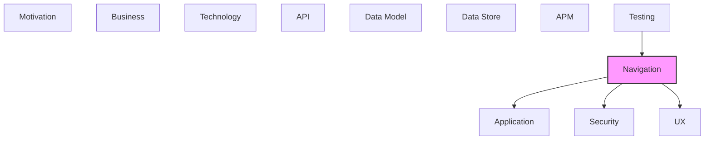

# Navigation

Application routing, navigation flows, and page structures.

## Report Index

- [Layer Introduction](#layer-introduction)
- [Intra-Layer Relationships](#intra-layer-relationships)
- [Inter-Layer Dependencies](#inter-layer-dependencies)
- [Inter-Layer Relationships Table](#inter-layer-relationships-table)
- [Element Reference](#element-reference)

## Layer Introduction

| Metric                    | Count |
| ------------------------- | ----- |
| Elements                  | 17    |
| Intra-Layer Relationships | 17    |
| Inter-Layer Relationships | 7     |
| Inbound Relationships     | 1     |
| Outbound Relationships    | 6     |

**Cross-Layer References**:

- **Upstream layers**: [Testing](./12-testing-layer-report.md)
- **Downstream layers**: [Application](./04-application-layer-report.md), [Security](./03-security-layer-report.md), [UX](./09-ux-layer-report.md)

## Intra-Layer Relationships

```mermaid
flowchart LR
  subgraph navigation
    navigation_breadcrumbconfig_cross_layer_breadcrumb["Cross-Layer Breadcrumb"]
    navigation_flowstep_post_auth_model_entry_step["Post-Auth Model Entry Step"]
    navigation_flowstep_token_extraction_step["Token Extraction Step"]
    navigation_navigationflow_authentication_to_model_flow["Authentication to Model Flow"]
    navigation_navigationgraph_embedded_app_navigation_graph["Embedded App Navigation Graph"]
    navigation_navigationguard_authentication_guard["Authentication Guard"]
    navigation_navigationtransition_auth_redirect_transition["Auth Redirect Transition"]
    navigation_navigationtransition_layer_deep_link_transition["Layer Deep-Link Transition"]
    navigation_navigationtransition_sub_view_switch_transition["Sub-View Switch Transition"]
    navigation_navigationtransition_tab_navigation_transition["Tab Navigation Transition"]
    navigation_route_changesets_redirect_route["Changesets Redirect Route"]
    navigation_route_changesets_view_route["Changesets View Route"]
    navigation_route_index_route["Index Route"]
    navigation_route_model_redirect_route["Model Redirect Route"]
    navigation_route_model_view_route["Model View Route"]
    navigation_route_spec_redirect_route["Spec Redirect Route"]
    navigation_route_spec_view_route["Spec View Route"]
    navigation_breadcrumbconfig_cross_layer_breadcrumb -->|references| navigation_route_model_view_route
    navigation_flowstep_post_auth_model_entry_step -->|navigates-to| navigation_route_model_view_route
    navigation_flowstep_token_extraction_step -->|navigates-to| navigation_route_model_view_route
    navigation_navigationflow_authentication_to_model_flow -->|aggregates| navigation_flowstep_token_extraction_step
    navigation_navigationflow_authentication_to_model_flow -->|flows-to| navigation_navigationtransition_auth_redirect_transition
    navigation_navigationflow_authentication_to_model_flow -->|requires| navigation_navigationguard_authentication_guard
    navigation_navigationgraph_embedded_app_navigation_graph -->|aggregates| navigation_route_model_view_route
    navigation_navigationguard_authentication_guard -->|protects| navigation_route_model_view_route
    navigation_navigationtransition_auth_redirect_transition -->|flows-to| navigation_route_model_view_route
    navigation_navigationtransition_auth_redirect_transition -->|requires| navigation_navigationguard_authentication_guard
    navigation_navigationtransition_layer_deep_link_transition -->|navigates-to| navigation_route_model_view_route
    navigation_navigationtransition_sub_view_switch_transition -->|navigates-to| navigation_route_model_view_route
    navigation_navigationtransition_tab_navigation_transition -->|flows-to| navigation_route_spec_view_route
    navigation_route_changesets_redirect_route -->|navigates-to| navigation_route_changesets_view_route
    navigation_route_index_route -->|navigates-to| navigation_route_model_redirect_route
    navigation_route_model_redirect_route -->|navigates-to| navigation_route_model_view_route
    navigation_route_spec_redirect_route -->|navigates-to| navigation_route_spec_view_route
  end
```

## Inter-Layer Dependencies

## Inter-Layer Relationships Table

| Relationship ID                                                     | Source Node                                                         | Dest Node                                         | Dest Layer    | Predicate    | Cardinality  | Strength |
| ------------------------------------------------------------------- | ------------------------------------------------------------------- | ------------------------------------------------- | ------------- | ------------ | ------------ | -------- |
| `navigation.navigationflow.realizes.application.applicationprocess` | `navigation.navigationflow.authentication-to-model-flow`            | `application.applicationprocess.auth-route`       | `application` | `realizes`   | many-to-many | medium   |
| `navigation.navigationguard.implements.security.securitypolicy`     | `navigation.navigationguard.authentication-guard`                   | `security.securitypolicy.bearer-token-policy`     | `security`    | `implements` | many-to-many | medium   |
| `navigation.navigationguard.requires.security.role`                 | `navigation.navigationguard.authentication-guard`                   | `security.role.authenticated-viewer`              | `security`    | `requires`   | many-to-many | medium   |
| `navigation.route.maps-to.ux.view`                                  | `navigation.route.changesets-view-route`                            | `ux.view.changeset-list-view`                     | `ux`          | `maps-to`    | many-to-many | medium   |
| `navigation.route.maps-to.ux.view`                                  | `navigation.route.model-view-route`                                 | `ux.view.model-graph-view`                        | `ux`          | `maps-to`    | many-to-many | medium   |
| `navigation.route.maps-to.ux.view`                                  | `navigation.route.spec-view-route`                                  | `ux.view.spec-graph-view`                         | `ux`          | `maps-to`    | many-to-many | medium   |
| `testing.coveragerequirement.covers.navigation.navigationguard`     | `testing.coveragerequirement.boundary-values-auth-test-requirement` | `navigation.navigationguard.authentication-guard` | `navigation`  | `covers`     | many-to-many | medium   |

## Element Reference

### Cross-Layer Breadcrumb {#cross-layer-breadcrumb}

**ID**: `navigation.breadcrumbconfig.cross-layer-breadcrumb`

**Type**: `breadcrumbconfig`

Breadcrumb configuration for cross-layer element navigation; labels show element name + layer prefix (e.g., application / Graph Viewer); enables back-navigation through reference chains.

#### Attributes

| Name  | Value                  |
| ----- | ---------------------- |
| label | Cross-Layer Navigation |

#### Relationships

| Type        | Related Element                     | Predicate    | Direction |
| ----------- | ----------------------------------- | ------------ | --------- |
| intra-layer | `navigation.route.model-view-route` | `references` | outbound  |

### Post-Auth Model Entry Step {#post-auth-model-entry-step}

**ID**: `navigation.flowstep.post-auth-model-entry-step`

**Type**: `flowstep`

Second step in the auth flow; the destination after successful token extraction; navigates to /model/graph with optional layer query param.

#### Attributes

| Name     | Value            |
| -------- | ---------------- |
| route    | model-view-route |
| sequence | 2                |

#### Relationships

| Type        | Related Element                     | Predicate      | Direction |
| ----------- | ----------------------------------- | -------------- | --------- |
| intra-layer | `navigation.route.model-view-route` | `navigates-to` | outbound  |

### Token Extraction Step {#token-extraction-step}

**ID**: `navigation.flowstep.token-extraction-step`

**Type**: `flowstep`

First step in the auth flow; renders on the index route, reads ?token= from URL, stores token, then triggers programmatic redirect.

#### Attributes

| Name     | Value       |
| -------- | ----------- |
| route    | index-route |
| sequence | 1           |

#### Relationships

| Type        | Related Element                                          | Predicate      | Direction |
| ----------- | -------------------------------------------------------- | -------------- | --------- |
| intra-layer | `navigation.route.model-view-route`                      | `navigates-to` | outbound  |
| intra-layer | `navigation.navigationflow.authentication-to-model-flow` | `aggregates`   | inbound   |

### Authentication to Model Flow {#authentication-to-model-flow}

**ID**: `navigation.navigationflow.authentication-to-model-flow`

**Type**: `navigationflow`

Two-step navigation flow for first-time access: step 1 lands on the index route to extract the magic link token; step 2 navigates programmatically to the model graph view after token validation.

#### Relationships

| Type        | Related Element                                            | Predicate    | Direction |
| ----------- | ---------------------------------------------------------- | ------------ | --------- |
| inter-layer | `application.applicationprocess.auth-route`                | `realizes`   | outbound  |
| intra-layer | `navigation.flowstep.token-extraction-step`                | `aggregates` | outbound  |
| intra-layer | `navigation.navigationtransition.auth-redirect-transition` | `flows-to`   | outbound  |
| intra-layer | `navigation.navigationguard.authentication-guard`          | `requires`   | outbound  |

### Embedded App Navigation Graph {#embedded-app-navigation-graph}

**ID**: `navigation.navigationgraph.embedded-app-navigation-graph`

**Type**: `navigationgraph`

Root routing container for the hash-based SPA; uses TanStack Router with createHashHistory(); defines the complete route tree with parent-child relationships.

#### Attributes

| Name        | Value                         |
| ----------- | ----------------------------- |
| application | documentation-robotics-viewer |
| version     | 1.0                           |

#### Relationships

| Type        | Related Element                     | Predicate    | Direction |
| ----------- | ----------------------------------- | ------------ | --------- |
| intra-layer | `navigation.route.model-view-route` | `aggregates` | outbound  |

### Authentication Guard {#authentication-guard}

**ID**: `navigation.navigationguard.authentication-guard`

**Type**: `navigationguard`

Auth guard that intercepts navigation to protected routes (model, spec, changesets); checks authStore for a valid bearer token; redirects to /#/ index route if token is absent.

#### Attributes

| Name  | Value |
| ----- | ----- |
| order | 1     |
| type  | auth  |

#### Relationships

| Type        | Related Element                                                     | Predicate    | Direction |
| ----------- | ------------------------------------------------------------------- | ------------ | --------- |
| inter-layer | `security.securitypolicy.bearer-token-policy`                       | `implements` | outbound  |
| inter-layer | `security.role.authenticated-viewer`                                | `requires`   | outbound  |
| inter-layer | `testing.coveragerequirement.boundary-values-auth-test-requirement` | `covers`     | inbound   |
| intra-layer | `navigation.navigationflow.authentication-to-model-flow`            | `requires`   | inbound   |
| intra-layer | `navigation.route.model-view-route`                                 | `protects`   | outbound  |
| intra-layer | `navigation.navigationtransition.auth-redirect-transition`          | `requires`   | inbound   |

### Auth Redirect Transition {#auth-redirect-transition}

**ID**: `navigation.navigationtransition.auth-redirect-transition`

**Type**: `navigationtransition`

Programmatic redirect from the index route to the model graph view after successful token extraction; triggered by the AuthRoute on token validation success.

#### Attributes

| Name    | Value            |
| ------- | ---------------- |
| from    | index-route      |
| to      | model-view-route |
| trigger | redirect         |

#### Relationships

| Type        | Related Element                                          | Predicate  | Direction |
| ----------- | -------------------------------------------------------- | ---------- | --------- |
| intra-layer | `navigation.navigationflow.authentication-to-model-flow` | `flows-to` | inbound   |
| intra-layer | `navigation.route.model-view-route`                      | `flows-to` | outbound  |
| intra-layer | `navigation.navigationguard.authentication-guard`        | `requires` | outbound  |

### Layer Deep-Link Transition {#layer-deep-link-transition}

**ID**: `navigation.navigationtransition.layer-deep-link-transition`

**Type**: `navigationtransition`

Programmatic navigation to a specific layer in the model graph by setting the ?layer= search parameter; triggered by cross-layer panel element clicks and breadcrumb navigation.

#### Attributes

| Name    | Value            |
| ------- | ---------------- |
| from    | model-graph-view |
| to      | model-graph-view |
| trigger | programmatic     |

#### Relationships

| Type        | Related Element                     | Predicate      | Direction |
| ----------- | ----------------------------------- | -------------- | --------- |
| intra-layer | `navigation.route.model-view-route` | `navigates-to` | outbound  |

### Sub-View Switch Transition {#sub-view-switch-transition}

**ID**: `navigation.navigationtransition.sub-view-switch-transition`

**Type**: `navigationtransition`

User-triggered switch between graph and details (or graph and list) sub-views within a section; fires when the user clicks a sub-tab; updates the :view route parameter.

#### Attributes

| Name    | Value        |
| ------- | ------------ |
| from    | section-view |
| to      | section-view |
| trigger | user-click   |

#### Relationships

| Type        | Related Element                     | Predicate      | Direction |
| ----------- | ----------------------------------- | -------------- | --------- |
| intra-layer | `navigation.route.model-view-route` | `navigates-to` | outbound  |

### Tab Navigation Transition {#tab-navigation-transition}

**ID**: `navigation.navigationtransition.tab-navigation-transition`

**Type**: `navigationtransition`

User-triggered tab switch between main sections (Spec, Model, Changesets); fires when the user clicks a top-level tab in EmbeddedLayout; persists last-used sub-view.

#### Attributes

| Name    | Value        |
| ------- | ------------ |
| from    | any-route    |
| to      | section-root |
| trigger | user-click   |

#### Relationships

| Type        | Related Element                    | Predicate  | Direction |
| ----------- | ---------------------------------- | ---------- | --------- |
| intra-layer | `navigation.route.spec-view-route` | `flows-to` | outbound  |

### Changesets Redirect Route {#changesets-redirect-route}

**ID**: `navigation.route.changesets-redirect-route`

**Type**: `route`

Redirect route at /#/changesets; immediately navigates to /#/changesets/graph.

#### Attributes

| Name | Value    |
| ---- | -------- |
| type | redirect |

#### Relationships

| Type        | Related Element                          | Predicate      | Direction |
| ----------- | ---------------------------------------- | -------------- | --------- |
| intra-layer | `navigation.route.changesets-view-route` | `navigates-to` | outbound  |

### Changesets View Route {#changesets-view-route}

**ID**: `navigation.route.changesets-view-route`

**Type**: `route`

Parameterized changesets route at /#/changesets/:view (graph or list); renders ChangesetRoute component; protected — requires valid auth token.

#### Attributes

| Name | Value     |
| ---- | --------- |
| type | protected |

#### Relationships

| Type        | Related Element                              | Predicate      | Direction |
| ----------- | -------------------------------------------- | -------------- | --------- |
| inter-layer | `ux.view.changeset-list-view`                | `maps-to`      | outbound  |
| intra-layer | `navigation.route.changesets-redirect-route` | `navigates-to` | inbound   |

### Index Route {#index-route}

**ID**: `navigation.route.index-route`

**Type**: `route`

Landing route at path /#/; accepts optional ?token= search parameter; renders AuthRoute component that extracts the magic link token and redirects to the model view.

#### Attributes

| Name | Value  |
| ---- | ------ |
| type | public |

#### Relationships

| Type        | Related Element                         | Predicate      | Direction |
| ----------- | --------------------------------------- | -------------- | --------- |
| intra-layer | `navigation.route.model-redirect-route` | `navigates-to` | outbound  |

### Model Redirect Route {#model-redirect-route}

**ID**: `navigation.route.model-redirect-route`

**Type**: `route`

Redirect route at /#/model; immediately navigates to /#/model/graph as the default model view; provides a stable short URL for the model section.

#### Attributes

| Name | Value    |
| ---- | -------- |
| type | redirect |

#### Relationships

| Type        | Related Element                     | Predicate      | Direction |
| ----------- | ----------------------------------- | -------------- | --------- |
| intra-layer | `navigation.route.index-route`      | `navigates-to` | inbound   |
| intra-layer | `navigation.route.model-view-route` | `navigates-to` | outbound  |

### Model View Route {#model-view-route}

**ID**: `navigation.route.model-view-route`

**Type**: `route`

Parameterized model view route at /#/model/:view (graph or details); accepts optional ?layer= search param for direct layer selection; protected — requires valid auth token.

#### Attributes

| Name | Value     |
| ---- | --------- |
| type | protected |

#### Relationships

| Type        | Related Element                                              | Predicate      | Direction |
| ----------- | ------------------------------------------------------------ | -------------- | --------- |
| inter-layer | `ux.view.model-graph-view`                                   | `maps-to`      | outbound  |
| intra-layer | `navigation.breadcrumbconfig.cross-layer-breadcrumb`         | `references`   | inbound   |
| intra-layer | `navigation.flowstep.post-auth-model-entry-step`             | `navigates-to` | inbound   |
| intra-layer | `navigation.flowstep.token-extraction-step`                  | `navigates-to` | inbound   |
| intra-layer | `navigation.navigationgraph.embedded-app-navigation-graph`   | `aggregates`   | inbound   |
| intra-layer | `navigation.navigationguard.authentication-guard`            | `protects`     | inbound   |
| intra-layer | `navigation.navigationtransition.auth-redirect-transition`   | `flows-to`     | inbound   |
| intra-layer | `navigation.navigationtransition.layer-deep-link-transition` | `navigates-to` | inbound   |
| intra-layer | `navigation.navigationtransition.sub-view-switch-transition` | `navigates-to` | inbound   |
| intra-layer | `navigation.route.model-redirect-route`                      | `navigates-to` | inbound   |

### Spec Redirect Route {#spec-redirect-route}

**ID**: `navigation.route.spec-redirect-route`

**Type**: `route`

Redirect route at /#/spec; immediately navigates to /#/spec/graph as the default spec view.

#### Attributes

| Name | Value    |
| ---- | -------- |
| type | redirect |

#### Relationships

| Type        | Related Element                    | Predicate      | Direction |
| ----------- | ---------------------------------- | -------------- | --------- |
| intra-layer | `navigation.route.spec-view-route` | `navigates-to` | outbound  |

### Spec View Route {#spec-view-route}

**ID**: `navigation.route.spec-view-route`

**Type**: `route`

Parameterized spec browser route at /#/spec/:view (graph or details); renders SpecRoute component with JSON Schema visualization; protected — requires valid auth token.

#### Attributes

| Name | Value     |
| ---- | --------- |
| type | protected |

#### Relationships

| Type        | Related Element                                             | Predicate      | Direction |
| ----------- | ----------------------------------------------------------- | -------------- | --------- |
| inter-layer | `ux.view.spec-graph-view`                                   | `maps-to`      | outbound  |
| intra-layer | `navigation.navigationtransition.tab-navigation-transition` | `flows-to`     | inbound   |
| intra-layer | `navigation.route.spec-redirect-route`                      | `navigates-to` | inbound   |

---

Generated: 2026-04-23T10:48:00.903Z | Model Version: 0.1.0
