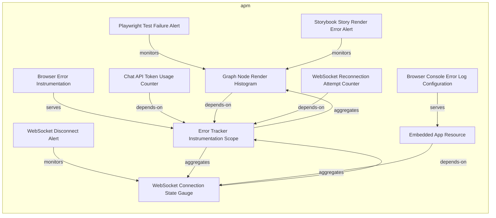
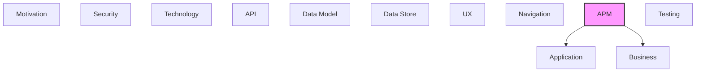

# APM

Observability, monitoring, metrics, logging, and tracing.

## Report Index

- [Layer Introduction](#layer-introduction)
- [Intra-Layer Relationships](#intra-layer-relationships)
- [Inter-Layer Dependencies](#inter-layer-dependencies)
- [Inter-Layer Relationships Table](#inter-layer-relationships-table)
- [Element Reference](#element-reference)

## Layer Introduction

| Metric                    | Count |
| ------------------------- | ----- |
| Elements                  | 11    |
| Intra-Layer Relationships | 12    |
| Inter-Layer Relationships | 5     |
| Inbound Relationships     | 0     |
| Outbound Relationships    | 5     |

**Cross-Layer References**:

- **Downstream layers**: [Application](./04-application-layer-report.md), [Business](./02-business-layer-report.md)

## Intra-Layer Relationships

## Inter-Layer Dependencies

## Inter-Layer Relationships Table

| Relationship ID                                                       | Source Node                                                    | Dest Node                                                   | Dest Layer    | Predicate  | Cardinality  | Strength |
| --------------------------------------------------------------------- | -------------------------------------------------------------- | ----------------------------------------------------------- | ------------- | ---------- | ------------ | -------- |
| `apm.instrumentationconfig.monitors.application.applicationcomponent` | `apm.instrumentationconfig.browser-error-instrumentation`      | `application.applicationcomponent.graph-viewer`             | `application` | `monitors` | many-to-many | medium   |
| `apm.logconfiguration.monitors.business.businessservice`              | `apm.logconfiguration.browser-console-error-log-configuration` | `business.businessservice.architecture-model-visualization` | `business`    | `monitors` | many-to-many | medium   |
| `apm.metricinstrument.monitors.application.applicationservice`        | `apm.metricinstrument.chat-api-token-usage-counter`            | `application.applicationservice.chat-service`               | `application` | `monitors` | many-to-many | medium   |
| `apm.metricinstrument.monitors.application.applicationcomponent`      | `apm.metricinstrument.graph-node-render-histogram`             | `application.applicationcomponent.graph-viewer`             | `application` | `monitors` | many-to-many | medium   |
| `apm.metricinstrument.monitors.application.applicationservice`        | `apm.metricinstrument.web-socket-reconnection-attempt-counter` | `application.applicationservice.web-socket-client`          | `application` | `monitors` | many-to-many | medium   |

## Element Reference

### Playwright Test Failure Alert {#playwright-test-failure-alert}

**ID**: `apm.alert.playwright-test-failure-alert`

**Type**: `alert`

Critical alert triggered when any Playwright test suite exits with failures; covers unit, integration, E2E, and auth test configs; indicates regression in core functionality.

#### Attributes

| Name      | Value                                  |
| --------- | -------------------------------------- |
| condition | playwright test exit code not equals 0 |
| severity  | critical                               |

#### Relationships

| Type        | Related Element                                    | Predicate  | Direction |
| ----------- | -------------------------------------------------- | ---------- | --------- |
| intra-layer | `apm.metricinstrument.graph-node-render-histogram` | `monitors` | outbound  |

### Storybook Story Render Error Alert {#storybook-story-render-error-alert}

**ID**: `apm.alert.storybook-story-render-error-alert`

**Type**: `alert`

Warning alert triggered when a Storybook story renders with console errors not in the approved filter list; detected by the test-runner storyErrorFilters.ts during CI story validation.

#### Attributes

| Name      | Value                                                  |
| --------- | ------------------------------------------------------ |
| condition | story console error not in storyErrorFilters allowlist |
| severity  | warning                                                |

#### Relationships

| Type        | Related Element                                    | Predicate  | Direction |
| ----------- | -------------------------------------------------- | ---------- | --------- |
| intra-layer | `apm.metricinstrument.graph-node-render-histogram` | `monitors` | outbound  |

### WebSocket Disconnect Alert {#websocket-disconnect-alert}

**ID**: `apm.alert.web-socket-disconnect-alert`

**Type**: `alert`

Warning alert triggered when the DR CLI WebSocket connection drops and falls back to REST-only polling mode; indicates the real-time model update channel is unavailable.

#### Attributes

| Name      | Value                                  |
| --------- | -------------------------------------- |
| condition | connectionStore.status === 'rest-mode' |
| severity  | warning                                |

#### Relationships

| Type        | Related Element                                          | Predicate  | Direction |
| ----------- | -------------------------------------------------------- | ---------- | --------- |
| intra-layer | `apm.metricinstrument.web-socket-connection-state-gauge` | `monitors` | outbound  |

### Browser Error Instrumentation {#browser-error-instrumentation}

**ID**: `apm.instrumentationconfig.browser-error-instrumentation`

**Type**: `instrumentationconfig`

Manual browser error instrumentation configuration for the embedded viewer; the errorTracker service captures runtime exceptions, classifies them by category (network, rendering, data, auth), and logs structured error records.

#### Attributes

| Name                | Value                  |
| ------------------- | ---------------------- |
| instrumentationType | manual                 |
| type                | browser-error-tracking |

#### Relationships

| Type        | Related Element                                                | Predicate  | Direction |
| ----------- | -------------------------------------------------------------- | ---------- | --------- |
| inter-layer | `application.applicationcomponent.graph-viewer`                | `monitors` | outbound  |
| intra-layer | `apm.instrumentationscope.error-tracker-instrumentation-scope` | `serves`   | outbound  |

### Error Tracker Instrumentation Scope {#error-tracker-instrumentation-scope}

**ID**: `apm.instrumentationscope.error-tracker-instrumentation-scope`

**Type**: `instrumentationscope`

Named instrumentation scope for the errorTracker and exceptionClassifier services; groups all error/exception signals produced by the frontend error handling subsystem.

#### Attributes

| Name                   | Value |
| ---------------------- | ----- |
| droppedAttributesCount | 0     |

#### Relationships

| Type        | Related Element                                                | Predicate    | Direction |
| ----------- | -------------------------------------------------------------- | ------------ | --------- |
| intra-layer | `apm.instrumentationconfig.browser-error-instrumentation`      | `serves`     | inbound   |
| intra-layer | `apm.metricinstrument.graph-node-render-histogram`             | `aggregates` | outbound  |
| intra-layer | `apm.metricinstrument.web-socket-connection-state-gauge`       | `aggregates` | outbound  |
| intra-layer | `apm.metricinstrument.chat-api-token-usage-counter`            | `depends-on` | inbound   |
| intra-layer | `apm.metricinstrument.graph-node-render-histogram`             | `depends-on` | inbound   |
| intra-layer | `apm.metricinstrument.web-socket-connection-state-gauge`       | `depends-on` | inbound   |
| intra-layer | `apm.metricinstrument.web-socket-reconnection-attempt-counter` | `depends-on` | inbound   |

### Browser Console Error Log Configuration {#browser-console-error-log-configuration}

**ID**: `apm.logconfiguration.browser-console-error-log-configuration`

**Type**: `logconfiguration`

Log configuration for browser console error capture; the errorTracker service writes structured error records with classification category, stack trace, and context; minimum severity ERROR.

#### Attributes

| Name            | Value                         |
| --------------- | ----------------------------- |
| minimumSeverity | ERROR                         |
| serviceName     | documentation-robotics-viewer |

#### Relationships

| Type        | Related Element                                             | Predicate  | Direction |
| ----------- | ----------------------------------------------------------- | ---------- | --------- |
| inter-layer | `business.businessservice.architecture-model-visualization` | `monitors` | outbound  |
| intra-layer | `apm.resource.embedded-app-resource`                        | `serves`   | outbound  |

### Chat API Token Usage Counter {#chat-api-token-usage-counter}

**ID**: `apm.metricinstrument.chat-api-token-usage-counter`

**Type**: `metricinstrument`

Counter accumulating Anthropic API token consumption (input + output tokens) across chat messages in a session; displayed in the UsageStatsBadge component with cost in USD.

#### Attributes

| Name | Value   |
| ---- | ------- |
| type | Counter |
| unit | tokens  |

#### Relationships

| Type        | Related Element                                                | Predicate    | Direction |
| ----------- | -------------------------------------------------------------- | ------------ | --------- |
| inter-layer | `application.applicationservice.chat-service`                  | `monitors`   | outbound  |
| intra-layer | `apm.instrumentationscope.error-tracker-instrumentation-scope` | `depends-on` | outbound  |

### Graph Node Render Histogram {#graph-node-render-histogram}

**ID**: `apm.metricinstrument.graph-node-render-histogram`

**Type**: `metricinstrument`

Histogram tracking React Flow node render counts per graph view; useful for detecting layout performance degradation as model size grows.

#### Attributes

| Name | Value     |
| ---- | --------- |
| type | Histogram |
| unit | nodes     |

#### Relationships

| Type        | Related Element                                                | Predicate    | Direction |
| ----------- | -------------------------------------------------------------- | ------------ | --------- |
| inter-layer | `application.applicationcomponent.graph-viewer`                | `monitors`   | outbound  |
| intra-layer | `apm.alert.playwright-test-failure-alert`                      | `monitors`   | inbound   |
| intra-layer | `apm.alert.storybook-story-render-error-alert`                 | `monitors`   | inbound   |
| intra-layer | `apm.instrumentationscope.error-tracker-instrumentation-scope` | `aggregates` | inbound   |
| intra-layer | `apm.instrumentationscope.error-tracker-instrumentation-scope` | `depends-on` | outbound  |

### WebSocket Connection State Gauge {#websocket-connection-state-gauge}

**ID**: `apm.metricinstrument.web-socket-connection-state-gauge`

**Type**: `metricinstrument`

Gauge instrument tracking the current DR CLI WebSocket connection state (1=connected, 0=disconnected); sourced from connectionStore connection status transitions; enables alerting on connection loss.

#### Attributes

| Name | Value |
| ---- | ----- |
| type | Gauge |
| unit | state |

#### Relationships

| Type        | Related Element                                                | Predicate    | Direction |
| ----------- | -------------------------------------------------------------- | ------------ | --------- |
| intra-layer | `apm.alert.web-socket-disconnect-alert`                        | `monitors`   | inbound   |
| intra-layer | `apm.instrumentationscope.error-tracker-instrumentation-scope` | `aggregates` | inbound   |
| intra-layer | `apm.instrumentationscope.error-tracker-instrumentation-scope` | `depends-on` | outbound  |
| intra-layer | `apm.resource.embedded-app-resource`                           | `aggregates` | inbound   |

### WebSocket Reconnection Attempt Counter {#websocket-reconnection-attempt-counter}

**ID**: `apm.metricinstrument.web-socket-reconnection-attempt-counter`

**Type**: `metricinstrument`

Counter tracking cumulative WebSocket reconnection attempts; incremented by the websocketClient reconnect loop; measures connection stability over a session.

#### Attributes

| Name | Value    |
| ---- | -------- |
| type | Counter  |
| unit | attempts |

#### Relationships

| Type        | Related Element                                                | Predicate    | Direction |
| ----------- | -------------------------------------------------------------- | ------------ | --------- |
| inter-layer | `application.applicationservice.web-socket-client`             | `monitors`   | outbound  |
| intra-layer | `apm.instrumentationscope.error-tracker-instrumentation-scope` | `depends-on` | outbound  |

### Embedded App Resource {#embedded-app-resource}

**ID**: `apm.resource.embedded-app-resource`

**Type**: `resource`

OpenTelemetry-style resource identity for the browser-based embedded architecture viewer; identifies the frontend service unit producing all observability signals.

#### Attributes

| Name                   | Value |
| ---------------------- | ----- |
| droppedAttributesCount | 0     |

#### Relationships

| Type        | Related Element                                                | Predicate    | Direction |
| ----------- | -------------------------------------------------------------- | ------------ | --------- |
| intra-layer | `apm.logconfiguration.browser-console-error-log-configuration` | `serves`     | inbound   |
| intra-layer | `apm.metricinstrument.web-socket-connection-state-gauge`       | `aggregates` | outbound  |

---

Generated: 2026-04-23T10:48:00.903Z | Model Version: 0.1.0
