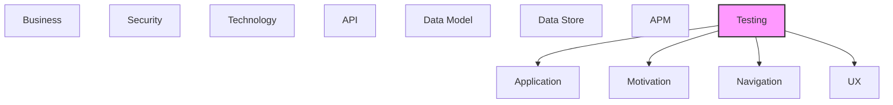

# Testing

Test strategies, test cases, test data, and test coverage.

## Report Index

- [Layer Introduction](#layer-introduction)
- [Intra-Layer Relationships](#intra-layer-relationships)
- [Inter-Layer Dependencies](#inter-layer-dependencies)
- [Inter-Layer Relationships Table](#inter-layer-relationships-table)
- [Element Reference](#element-reference)

## Layer Introduction

| Metric                    | Count |
| ------------------------- | ----- |
| Elements                  | 17    |
| Intra-Layer Relationships | 14    |
| Inter-Layer Relationships | 33    |
| Inbound Relationships     | 0     |
| Outbound Relationships    | 33    |

**Cross-Layer References**:

- **Downstream layers**: [Application](./04-application-layer-report.md), [Motivation](./01-motivation-layer-report.md), [Navigation](./10-navigation-layer-report.md), [UX](./09-ux-layer-report.md)

## Intra-Layer Relationships

```mermaid
flowchart LR
  subgraph testing
    testing_contextvariation_functional_unit_test_context["Functional Unit Test Context"]
    testing_contextvariation_regression_e2e_test_context["Regression E2E Test Context"]
    testing_contextvariation_smoke_story_test_context["Smoke Story Test Context"]
    testing_coveragegap_code_line_coverage_gap["Code Line Coverage Gap"]
    testing_coveragegap_load_test_coverage_gap["Load Test Coverage Gap"]
    testing_coveragerequirement_all_partitions_unit_test_requirement["All-Partitions Unit Test Requirement"]
    testing_coveragerequirement_boundary_values_auth_test_requirement["Boundary Values Auth Test Requirement"]
    testing_coveragerequirement_each_choice_story_coverage_requirement["Each-Choice Story Coverage Requirement"]
    testing_coveragesummary_overall_test_coverage_summary["Overall Test Coverage Summary"]
    testing_testcoveragemodel_viewer_test_coverage_model["Viewer Test Coverage Model"]
    testing_testcoveragetarget_auth_flow_e2e_test_coverage["Auth Flow E2E Test Coverage"]
    testing_testcoveragetarget_cross_component_integration_test_coverage["Cross-Component Integration Test Coverage"]
    testing_testcoveragetarget_embedded_app_e2e_test_coverage["Embedded App E2E Test Coverage"]
    testing_testcoveragetarget_service_and_store_unit_test_coverage["Service and Store Unit Test Coverage"]
    testing_testcoveragetarget_storybook_story_render_test_coverage["Storybook Story Render Test Coverage"]
    testing_testcoveragetarget_wcag_21_accessibility_test_coverage["WCAG 2.1 Accessibility Test Coverage"]
    testing_testcoveragetarget_web_socket_recovery_test_coverage["WebSocket Recovery Test Coverage"]
    testing_contextvariation_regression_e2e_test_context -->|serves| testing_testcoveragetarget_embedded_app_e2e_test_coverage
    testing_contextvariation_smoke_story_test_context -->|serves| testing_testcoveragetarget_storybook_story_render_test_coverage
    testing_coveragegap_code_line_coverage_gap -->|references| testing_testcoveragetarget_service_and_store_unit_test_coverage
    testing_coveragegap_code_line_coverage_gap -->|triggers| testing_coveragerequirement_all_partitions_unit_test_requirement
    testing_coveragegap_load_test_coverage_gap -->|references| testing_testcoveragetarget_embedded_app_e2e_test_coverage
    testing_coveragerequirement_all_partitions_unit_test_requirement -->|composes| testing_testcoveragetarget_service_and_store_unit_test_coverage
    testing_coveragerequirement_boundary_values_auth_test_requirement -->|composes| testing_testcoveragetarget_auth_flow_e2e_test_coverage
    testing_coveragerequirement_each_choice_story_coverage_requirement -->|composes| testing_testcoveragetarget_storybook_story_render_test_coverage
    testing_coveragesummary_overall_test_coverage_summary -->|aggregates| testing_testcoveragemodel_viewer_test_coverage_model
    testing_testcoveragemodel_viewer_test_coverage_model -->|aggregates| testing_contextvariation_functional_unit_test_context
    testing_testcoveragemodel_viewer_test_coverage_model -->|composes| testing_coveragesummary_overall_test_coverage_summary
    testing_testcoveragetarget_auth_flow_e2e_test_coverage -->|flows-to| testing_coveragerequirement_boundary_values_auth_test_requirement
    testing_testcoveragetarget_service_and_store_unit_test_coverage -->|flows-to| testing_coveragerequirement_all_partitions_unit_test_requirement
    testing_testcoveragetarget_storybook_story_render_test_coverage -->|flows-to| testing_coveragerequirement_each_choice_story_coverage_requirement
  end
```

## Inter-Layer Dependencies

## Inter-Layer Relationships Table

| Relationship ID                                                                                    | Source Node                                                            | Dest Node                                                        | Dest Layer    | Predicate                | Cardinality  | Strength |
| -------------------------------------------------------------------------------------------------- | ---------------------------------------------------------------------- | ---------------------------------------------------------------- | ------------- | ------------------------ | ------------ | -------- |
| `29043f3a-16fd-4cb7-af1c-660b3aaa63c6-supports-goals-ef84b64d-883c-4471-9b56-a58574bac2b9`         | `29043f3a-16fd-4cb7-af1c-660b3aaa63c6`                                 | `ef84b64d-883c-4471-9b56-a58574bac2b9`                           | `motivation`  | `supports-goals`         | unknown      | unknown  |
| `37a7eff0-e17f-40f8-ac76-ea230513fc63-fulfills-requirements-9df37bbd-8ffd-4d80-899f-9437aa03282a`  | `37a7eff0-e17f-40f8-ac76-ea230513fc63`                                 | `9df37bbd-8ffd-4d80-899f-9437aa03282a`                           | `motivation`  | `fulfills-requirements`  | unknown      | unknown  |
| `37a7eff0-e17f-40f8-ac76-ea230513fc63-supports-goals-ef84b64d-883c-4471-9b56-a58574bac2b9`         | `37a7eff0-e17f-40f8-ac76-ea230513fc63`                                 | `ef84b64d-883c-4471-9b56-a58574bac2b9`                           | `motivation`  | `supports-goals`         | unknown      | unknown  |
| `4e86c557-9c8e-435f-a770-651c0e238306-supports-goals-462e2931-4c7c-4051-a9ac-8817c270d650`         | `4e86c557-9c8e-435f-a770-651c0e238306`                                 | `462e2931-4c7c-4051-a9ac-8817c270d650`                           | `motivation`  | `supports-goals`         | unknown      | unknown  |
| `52cfa9de-541d-44a0-9c21-34539c2e616c-fulfills-requirements-e748118c-b989-43fe-b0d2-9121e931fcd2`  | `52cfa9de-541d-44a0-9c21-34539c2e616c`                                 | `e748118c-b989-43fe-b0d2-9121e931fcd2`                           | `motivation`  | `fulfills-requirements`  | unknown      | unknown  |
| `52cfa9de-541d-44a0-9c21-34539c2e616c-supports-goals-731285cc-dc15-4c64-a342-a933ce00bd61`         | `52cfa9de-541d-44a0-9c21-34539c2e616c`                                 | `731285cc-dc15-4c64-a342-a933ce00bd61`                           | `motivation`  | `supports-goals`         | unknown      | unknown  |
| `cee7be5d-f0f9-4291-a2ae-cf5011a61c2f-fulfills-requirements-9df37bbd-8ffd-4d80-899f-9437aa03282a`  | `cee7be5d-f0f9-4291-a2ae-cf5011a61c2f`                                 | `9df37bbd-8ffd-4d80-899f-9437aa03282a`                           | `motivation`  | `fulfills-requirements`  | unknown      | unknown  |
| `de956804-eabb-4548-8389-73cb6c63ef2f-constrained-by-6ffaff00-8bf8-4580-98ff-8d2a612a9021`         | `de956804-eabb-4548-8389-73cb6c63ef2f`                                 | `6ffaff00-8bf8-4580-98ff-8d2a612a9021`                           | `motivation`  | `constrained-by`         | unknown      | unknown  |
| `de956804-eabb-4548-8389-73cb6c63ef2f-constrained-by-9fe1281a-2547-416f-872f-38e1b066db15`         | `de956804-eabb-4548-8389-73cb6c63ef2f`                                 | `9fe1281a-2547-416f-872f-38e1b066db15`                           | `motivation`  | `constrained-by`         | unknown      | unknown  |
| `de956804-eabb-4548-8389-73cb6c63ef2f-fulfills-requirements-9df37bbd-8ffd-4d80-899f-9437aa03282a`  | `de956804-eabb-4548-8389-73cb6c63ef2f`                                 | `9df37bbd-8ffd-4d80-899f-9437aa03282a`                           | `motivation`  | `fulfills-requirements`  | unknown      | unknown  |
| `de956804-eabb-4548-8389-73cb6c63ef2f-fulfills-requirements-e748118c-b989-43fe-b0d2-9121e931fcd2`  | `de956804-eabb-4548-8389-73cb6c63ef2f`                                 | `e748118c-b989-43fe-b0d2-9121e931fcd2`                           | `motivation`  | `fulfills-requirements`  | unknown      | unknown  |
| `de956804-eabb-4548-8389-73cb6c63ef2f-governed-by-principles-53fad2bb-e97d-44a2-83cf-61201e992163` | `de956804-eabb-4548-8389-73cb6c63ef2f`                                 | `53fad2bb-e97d-44a2-83cf-61201e992163`                           | `motivation`  | `governed-by-principles` | unknown      | unknown  |
| `de956804-eabb-4548-8389-73cb6c63ef2f-governed-by-principles-b3d7f834-dc3f-49fd-8044-8b6aca045dbe` | `de956804-eabb-4548-8389-73cb6c63ef2f`                                 | `b3d7f834-dc3f-49fd-8044-8b6aca045dbe`                           | `motivation`  | `governed-by-principles` | unknown      | unknown  |
| `de956804-eabb-4548-8389-73cb6c63ef2f-supports-goals-462e2931-4c7c-4051-a9ac-8817c270d650`         | `de956804-eabb-4548-8389-73cb6c63ef2f`                                 | `462e2931-4c7c-4051-a9ac-8817c270d650`                           | `motivation`  | `supports-goals`         | unknown      | unknown  |
| `de956804-eabb-4548-8389-73cb6c63ef2f-supports-goals-ef84b64d-883c-4471-9b56-a58574bac2b9`         | `de956804-eabb-4548-8389-73cb6c63ef2f`                                 | `ef84b64d-883c-4471-9b56-a58574bac2b9`                           | `motivation`  | `supports-goals`         | unknown      | unknown  |
| `testing.coveragerequirement.covers.navigation.navigationguard`                                    | `testing.coveragerequirement.boundary-values-auth-test-requirement`    | `navigation.navigationguard.authentication-guard`                | `navigation`  | `covers`                 | many-to-many | medium   |
| `testing.coveragesummary.fulfills-requirements.motivation.requirement`                             | `testing.coveragesummary.overall-test-coverage-summary`                | `motivation.requirement.wcag-21-aa-compliance`                   | `motivation`  | `fulfills-requirements`  | many-to-many | medium   |
| `testing.testcoveragetarget.fulfills-requirements.motivation.requirement`                          | `testing.testcoveragetarget.auth-flow-e2e-test-coverage`               | `motivation.requirement.dr-cli-server-integration`               | `motivation`  | `fulfills-requirements`  | many-to-many | medium   |
| `testing.testcoveragetarget.tests.application.applicationcomponent`                                | `testing.testcoveragetarget.auth-flow-e2e-test-coverage`               | `application.applicationcomponent.graph-viewer`                  | `application` | `tests`                  | many-to-many | medium   |
| `testing.testcoveragetarget.covers.application.applicationservice`                                 | `testing.testcoveragetarget.cross-component-integration-test-coverage` | `application.applicationservice.cross-layer-reference-extractor` | `application` | `covers`                 | many-to-many | medium   |
| `testing.testcoveragetarget.fulfills-requirements.motivation.requirement`                          | `testing.testcoveragetarget.cross-component-integration-test-coverage` | `motivation.requirement.multi-layout-engine-support`             | `motivation`  | `fulfills-requirements`  | many-to-many | medium   |
| `testing.testcoveragetarget.fulfills-requirements.motivation.requirement`                          | `testing.testcoveragetarget.embedded-app-e2e-test-coverage`            | `motivation.requirement.dr-cli-server-integration`               | `motivation`  | `fulfills-requirements`  | many-to-many | medium   |
| `testing.testcoveragetarget.supports-goals.motivation.goal`                                        | `testing.testcoveragetarget.embedded-app-e2e-test-coverage`            | `motivation.goal.accelerate-architecture-documentation`          | `motivation`  | `supports-goals`         | many-to-many | medium   |
| `testing.testcoveragetarget.tests.application.applicationcomponent`                                | `testing.testcoveragetarget.embedded-app-e2e-test-coverage`            | `application.applicationcomponent.graph-viewer`                  | `application` | `tests`                  | many-to-many | medium   |
| `testing.testcoveragetarget.covers.application.applicationservice`                                 | `testing.testcoveragetarget.service-and-store-unit-test-coverage`      | `application.applicationservice.data-loader`                     | `application` | `covers`                 | many-to-many | medium   |
| `testing.testcoveragetarget.fulfills-requirements.motivation.requirement`                          | `testing.testcoveragetarget.service-and-store-unit-test-coverage`      | `motivation.requirement.dr-cli-server-integration`               | `motivation`  | `fulfills-requirements`  | many-to-many | medium   |
| `testing.testcoveragetarget.covers.ux.view`                                                        | `testing.testcoveragetarget.storybook-story-render-test-coverage`      | `ux.view.model-graph-view`                                       | `ux`          | `covers`                 | many-to-many | medium   |
| `testing.testcoveragetarget.fulfills-requirements.motivation.requirement`                          | `testing.testcoveragetarget.storybook-story-render-test-coverage`      | `motivation.requirement.wcag-21-aa-compliance`                   | `motivation`  | `fulfills-requirements`  | many-to-many | medium   |
| `testing.testcoveragetarget.covers.ux.view`                                                        | `testing.testcoveragetarget.wcag-21-accessibility-test-coverage`       | `ux.view.model-graph-view`                                       | `ux`          | `covers`                 | many-to-many | medium   |
| `testing.testcoveragetarget.fulfills-requirements.motivation.requirement`                          | `testing.testcoveragetarget.wcag-21-accessibility-test-coverage`       | `motivation.requirement.wcag-21-aa-compliance`                   | `motivation`  | `fulfills-requirements`  | many-to-many | medium   |
| `testing.testcoveragetarget.supports-goals.motivation.goal`                                        | `testing.testcoveragetarget.wcag-21-accessibility-test-coverage`       | `motivation.goal.ensure-accessible-architecture-views`           | `motivation`  | `supports-goals`         | many-to-many | medium   |
| `testing.testcoveragetarget.covers.application.applicationservice`                                 | `testing.testcoveragetarget.web-socket-recovery-test-coverage`         | `application.applicationservice.web-socket-client`               | `application` | `covers`                 | many-to-many | medium   |
| `testing.testcoveragetarget.fulfills-requirements.motivation.requirement`                          | `testing.testcoveragetarget.web-socket-recovery-test-coverage`         | `motivation.requirement.dr-cli-server-integration`               | `motivation`  | `fulfills-requirements`  | many-to-many | medium   |

## Element Reference

### Functional Unit Test Context {#functional-unit-test-context}

**ID**: `testing.contextvariation.functional-unit-test-context`

**Type**: `contextvariation`

Standard functional test context for unit and integration tests; runs in Playwright's browser environment (Chromium) against mock data via MSW; fastest feedback loop.

#### Attributes

| Name        | Value      |
| ----------- | ---------- |
| contextType | functional |

#### Relationships

| Type        | Related Element                                        | Predicate    | Direction |
| ----------- | ------------------------------------------------------ | ------------ | --------- |
| intra-layer | `testing.testcoveragemodel.viewer-test-coverage-model` | `aggregates` | inbound   |

### Regression E2E Test Context {#regression-e2e-test-context}

**ID**: `testing.contextvariation.regression-e2e-test-context`

**Type**: `contextvariation`

Regression test context for full E2E and auth tests; runs against a live Vite dev server and DR CLI server; catches integration regressions between the viewer and the CLI server API.

#### Attributes

| Name        | Value      |
| ----------- | ---------- |
| contextType | regression |

#### Relationships

| Type        | Related Element                                             | Predicate | Direction |
| ----------- | ----------------------------------------------------------- | --------- | --------- |
| intra-layer | `testing.testcoveragetarget.embedded-app-e2e-test-coverage` | `serves`  | outbound  |

### Smoke Story Test Context {#smoke-story-test-context}

**ID**: `testing.contextvariation.smoke-story-test-context`

**Type**: `contextvariation`

Smoke test context for Storybook story validation; runs test-storybook against the built or dev Storybook server on port 61001; quick visual regression smoke check.

#### Attributes

| Name        | Value |
| ----------- | ----- |
| contextType | smoke |

#### Relationships

| Type        | Related Element                                                   | Predicate | Direction |
| ----------- | ----------------------------------------------------------------- | --------- | --------- |
| intra-layer | `testing.testcoveragetarget.storybook-story-render-test-coverage` | `serves`  | outbound  |

### Code Line Coverage Gap {#code-line-coverage-gap}

**ID**: `testing.coveragegap.code-line-coverage-gap`

**Type**: `coveragegap`

No code line/branch coverage instrumentation (Istanbul/c8/V8) is configured; test pass/fail is tracked but percentage line coverage is unknown; impacts confidence in dead-code identification.

#### Attributes

| Name                 | Value                                |
| -------------------- | ------------------------------------ |
| affectedRequirements | all-partitions-unit-test-requirement |
| severity             | medium                               |

#### Relationships

| Type        | Related Element                                                    | Predicate    | Direction |
| ----------- | ------------------------------------------------------------------ | ------------ | --------- |
| intra-layer | `testing.testcoveragetarget.service-and-store-unit-test-coverage`  | `references` | outbound  |
| intra-layer | `testing.coveragerequirement.all-partitions-unit-test-requirement` | `triggers`   | outbound  |

### Load Test Coverage Gap {#load-test-coverage-gap}

**ID**: `testing.coveragegap.load-test-coverage-gap`

**Type**: `coveragegap`

No load or performance tests exist for graph rendering with large models (100+ nodes); layout engine performance under stress is untested; risk area given 4 layout engines with different complexity profiles.

#### Attributes

| Name                 | Value                          |
| -------------------- | ------------------------------ |
| affectedRequirements | embedded-app-e2e-test-coverage |
| severity             | low                            |

#### Relationships

| Type        | Related Element                                             | Predicate    | Direction |
| ----------- | ----------------------------------------------------------- | ------------ | --------- |
| intra-layer | `testing.testcoveragetarget.embedded-app-e2e-test-coverage` | `references` | outbound  |

### All-Partitions Unit Test Requirement {#all-partitions-unit-test-requirement}

**ID**: `testing.coveragerequirement.all-partitions-unit-test-requirement`

**Type**: `coveragerequirement`

Requirement that all public service methods and store actions have at least one test covering each logical partition; all-partitions criteria applied to dataLoader, nodeTransformer, crossLayerProcessor, and all store methods.

#### Attributes

| Name             | Value          |
| ---------------- | -------------- |
| coverageCriteria | all-partitions |
| priority         | high           |

#### Relationships

| Type        | Related Element                                                   | Predicate  | Direction |
| ----------- | ----------------------------------------------------------------- | ---------- | --------- |
| intra-layer | `testing.coveragegap.code-line-coverage-gap`                      | `triggers` | inbound   |
| intra-layer | `testing.testcoveragetarget.service-and-store-unit-test-coverage` | `composes` | outbound  |
| intra-layer | `testing.testcoveragetarget.service-and-store-unit-test-coverage` | `flows-to` | inbound   |

### Boundary Values Auth Test Requirement {#boundary-values-auth-test-requirement}

**ID**: `testing.coveragerequirement.boundary-values-auth-test-requirement`

**Type**: `coveragerequirement`

Requirement that token extraction tests exercise boundary cases: valid token, missing token, malformed token, expired token, and race condition between multiple rapid navigations.

#### Attributes

| Name             | Value           |
| ---------------- | --------------- |
| coverageCriteria | boundary-values |
| priority         | critical        |

#### Relationships

| Type        | Related Element                                          | Predicate  | Direction |
| ----------- | -------------------------------------------------------- | ---------- | --------- |
| inter-layer | `navigation.navigationguard.authentication-guard`        | `covers`   | outbound  |
| intra-layer | `testing.testcoveragetarget.auth-flow-e2e-test-coverage` | `composes` | outbound  |
| intra-layer | `testing.testcoveragetarget.auth-flow-e2e-test-coverage` | `flows-to` | inbound   |

### Each-Choice Story Coverage Requirement {#each-choice-story-coverage-requirement}

**ID**: `testing.coveragerequirement.each-choice-story-coverage-requirement`

**Type**: `coveragerequirement`

Requirement that every Storybook story renders at least once without console errors; each-choice criteria ensures no component story is skipped; enforced by the Storybook test runner on all 578 stories.

#### Attributes

| Name             | Value       |
| ---------------- | ----------- |
| coverageCriteria | each-choice |
| priority         | high        |

#### Relationships

| Type        | Related Element                                                   | Predicate  | Direction |
| ----------- | ----------------------------------------------------------------- | ---------- | --------- |
| intra-layer | `testing.testcoveragetarget.storybook-story-render-test-coverage` | `composes` | outbound  |
| intra-layer | `testing.testcoveragetarget.storybook-story-render-test-coverage` | `flows-to` | inbound   |

### Overall Test Coverage Summary {#overall-test-coverage-summary}

**ID**: `testing.coveragesummary.overall-test-coverage-summary`

**Type**: `coveragesummary`

Aggregate coverage status across the full test suite: 8 coverage targets, 3 coverage requirements. Total Playwright tests: 1170. Storybook stories: 578. Automated coverage: 100% of unit and integration targets. Missing: code line coverage metrics (no Istanbul/c8 configured).

#### Attributes

| Name              | Value |
| ----------------- | ----- |
| totalRequirements | 3     |
| totalSketches     | 0     |
| totalTargets      | 8     |

#### Relationships

| Type        | Related Element                                        | Predicate               | Direction |
| ----------- | ------------------------------------------------------ | ----------------------- | --------- |
| inter-layer | `motivation.requirement.wcag-21-aa-compliance`         | `fulfills-requirements` | outbound  |
| intra-layer | `testing.testcoveragemodel.viewer-test-coverage-model` | `aggregates`            | outbound  |
| intra-layer | `testing.testcoveragemodel.viewer-test-coverage-model` | `composes`              | inbound   |

### Viewer Test Coverage Model {#viewer-test-coverage-model}

**ID**: `testing.testcoveragemodel.viewer-test-coverage-model`

**Type**: `testcoveragemodel`

Root IEEE 829-style test coverage model for the documentation_robotics_viewer application; spans unit, integration, E2E, Storybook story, and accessibility test types run via Playwright.

#### Attributes

| Name        | Value                         |
| ----------- | ----------------------------- |
| application | documentation-robotics-viewer |
| version     | 1.0                           |

#### Relationships

| Type        | Related Element                                         | Predicate    | Direction |
| ----------- | ------------------------------------------------------- | ------------ | --------- |
| intra-layer | `testing.coveragesummary.overall-test-coverage-summary` | `aggregates` | inbound   |
| intra-layer | `testing.contextvariation.functional-unit-test-context` | `aggregates` | outbound  |
| intra-layer | `testing.coveragesummary.overall-test-coverage-summary` | `composes`   | outbound  |

### Auth Flow E2E Test Coverage {#auth-flow-e2e-test-coverage}

**ID**: `testing.testcoveragetarget.auth-flow-e2e-test-coverage`

**Type**: `testcoveragetarget`

Coverage target for bearer token authentication tests including race conditions, magic link token extraction, and localStorage persistence; dedicated playwright.auth.config.ts; covers embedded-auth-race-condition.spec.ts.

#### Attributes

| Name       | Value             |
| ---------- | ----------------- |
| priority   | critical          |
| targetType | business-workflow |

#### Relationships

| Type        | Related Element                                                     | Predicate               | Direction |
| ----------- | ------------------------------------------------------------------- | ----------------------- | --------- |
| inter-layer | `motivation.requirement.dr-cli-server-integration`                  | `fulfills-requirements` | outbound  |
| inter-layer | `application.applicationcomponent.graph-viewer`                     | `tests`                 | outbound  |
| intra-layer | `testing.coveragerequirement.boundary-values-auth-test-requirement` | `composes`              | inbound   |
| intra-layer | `testing.coveragerequirement.boundary-values-auth-test-requirement` | `flows-to`              | outbound  |

### Cross-Component Integration Test Coverage {#cross-component-integration-test-coverage}

**ID**: `testing.testcoveragetarget.cross-component-integration-test-coverage`

**Type**: `testcoveragetarget`

Coverage target for integration tests verifying cross-component data flows: node transformer pipeline, cross-layer worker integration, libavoid routing, chat service, and preference persistence; 7 files under tests/integration/.

#### Attributes

| Name       | Value            |
| ---------- | ---------------- |
| priority   | high             |
| targetType | integration-flow |

#### Relationships

| Type        | Related Element                                                  | Predicate               | Direction |
| ----------- | ---------------------------------------------------------------- | ----------------------- | --------- |
| inter-layer | `application.applicationservice.cross-layer-reference-extractor` | `covers`                | outbound  |
| inter-layer | `motivation.requirement.multi-layout-engine-support`             | `fulfills-requirements` | outbound  |

### Embedded App E2E Test Coverage {#embedded-app-e2e-test-coverage}

**ID**: `testing.testcoveragetarget.embedded-app-e2e-test-coverage`

**Type**: `testcoveragetarget`

Coverage target for E2E tests of the full embedded application: app rendering, auth flow, graph rendering, dual-view, websocket recovery, zoom-to-layer, and sidebar consolidation; run via playwright.e2e.config.ts with a live DR CLI server.

#### Attributes

| Name       | Value             |
| ---------- | ----------------- |
| priority   | critical          |
| targetType | business-workflow |

#### Relationships

| Type        | Related Element                                         | Predicate               | Direction |
| ----------- | ------------------------------------------------------- | ----------------------- | --------- |
| inter-layer | `motivation.requirement.dr-cli-server-integration`      | `fulfills-requirements` | outbound  |
| inter-layer | `motivation.goal.accelerate-architecture-documentation` | `supports-goals`        | outbound  |
| inter-layer | `application.applicationcomponent.graph-viewer`         | `tests`                 | outbound  |
| intra-layer | `testing.contextvariation.regression-e2e-test-context`  | `serves`                | inbound   |
| intra-layer | `testing.coveragegap.load-test-coverage-gap`            | `references`            | inbound   |

### Service and Store Unit Test Coverage {#service-and-store-unit-test-coverage}

**ID**: `testing.testcoveragetarget.service-and-store-unit-test-coverage`

**Type**: `testcoveragetarget`

Coverage target for unit testing of all core services (dataLoader, nodeTransformer, yamlParser, crossLayerProcessor, etc.) and Zustand stores; ~40 spec files under tests/unit/; 1170 total tests via playwright.config.ts.

#### Attributes

| Name       | Value        |
| ---------- | ------------ |
| priority   | high         |
| targetType | ui-component |

#### Relationships

| Type        | Related Element                                                    | Predicate               | Direction |
| ----------- | ------------------------------------------------------------------ | ----------------------- | --------- |
| inter-layer | `application.applicationservice.data-loader`                       | `covers`                | outbound  |
| inter-layer | `motivation.requirement.dr-cli-server-integration`                 | `fulfills-requirements` | outbound  |
| intra-layer | `testing.coveragegap.code-line-coverage-gap`                       | `references`            | inbound   |
| intra-layer | `testing.coveragerequirement.all-partitions-unit-test-requirement` | `composes`              | inbound   |
| intra-layer | `testing.coveragerequirement.all-partitions-unit-test-requirement` | `flows-to`              | outbound  |

### Storybook Story Render Test Coverage {#storybook-story-render-test-coverage}

**ID**: `testing.testcoveragetarget.storybook-story-render-test-coverage`

**Type**: `testcoveragetarget`

Coverage target for Storybook component story validation; 578 stories across 97 story files tested via test-storybook runner; validates all node types, layout engines, panels, graph views, and chat components render without errors.

#### Attributes

| Name       | Value        |
| ---------- | ------------ |
| priority   | high         |
| targetType | ui-component |

#### Relationships

| Type        | Related Element                                                      | Predicate               | Direction |
| ----------- | -------------------------------------------------------------------- | ----------------------- | --------- |
| inter-layer | `ux.view.model-graph-view`                                           | `covers`                | outbound  |
| inter-layer | `motivation.requirement.wcag-21-aa-compliance`                       | `fulfills-requirements` | outbound  |
| intra-layer | `testing.contextvariation.smoke-story-test-context`                  | `serves`                | inbound   |
| intra-layer | `testing.coveragerequirement.each-choice-story-coverage-requirement` | `composes`              | inbound   |
| intra-layer | `testing.coveragerequirement.each-choice-story-coverage-requirement` | `flows-to`              | outbound  |

### WCAG 2.1 Accessibility Test Coverage {#wcag-2-1-accessibility-test-coverage}

**ID**: `testing.testcoveragetarget.wcag-21-accessibility-test-coverage`

**Type**: `testcoveragetarget`

Coverage target for WCAG 2.1 Level AA accessibility compliance; axe-core automated tests via @axe-core/playwright run against all Storybook stories; dedicated tests/stories/accessibility.spec.ts; covers all interactive components.

#### Attributes

| Name       | Value        |
| ---------- | ------------ |
| priority   | high         |
| targetType | ui-component |

#### Relationships

| Type        | Related Element                                        | Predicate               | Direction |
| ----------- | ------------------------------------------------------ | ----------------------- | --------- |
| inter-layer | `ux.view.model-graph-view`                             | `covers`                | outbound  |
| inter-layer | `motivation.requirement.wcag-21-aa-compliance`         | `fulfills-requirements` | outbound  |
| inter-layer | `motivation.goal.ensure-accessible-architecture-views` | `supports-goals`        | outbound  |

### WebSocket Recovery Test Coverage {#websocket-recovery-test-coverage}

**ID**: `testing.testcoveragetarget.web-socket-recovery-test-coverage`

**Type**: `testcoveragetarget`

Coverage target for WebSocket connection failure, reconnection, and REST fallback mode scenarios; tests/websocket-recovery.spec.ts; ensures graceful degradation when DR CLI server is unavailable.

#### Attributes

| Name       | Value            |
| ---------- | ---------------- |
| priority   | high             |
| targetType | integration-flow |

#### Relationships

| Type        | Related Element                                    | Predicate               | Direction |
| ----------- | -------------------------------------------------- | ----------------------- | --------- |
| inter-layer | `application.applicationservice.web-socket-client` | `covers`                | outbound  |
| inter-layer | `motivation.requirement.dr-cli-server-integration` | `fulfills-requirements` | outbound  |

---

Generated: 2026-04-23T10:48:00.903Z | Model Version: 0.1.0
